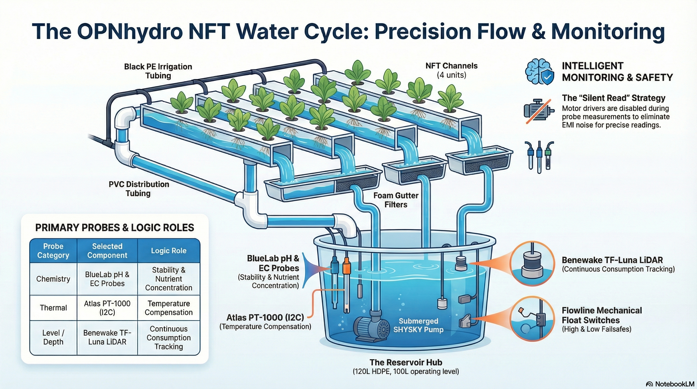
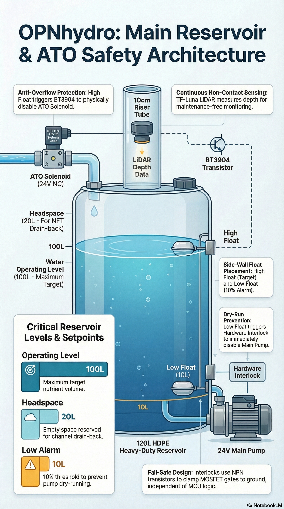

# OPNhydroponics - Hardware Architecture

The OPNhydro project builds a highly resilient, industrial-grade control system for a 50-plant Nutrient Film Technique (NFT) setup, centered on the principle of chemical and thermal stability through precise measurements of pH and EC and high-precision dosing.

This document describes the design trade-offs for the **OPNhydro** architecture. It answers **"Why?"** questions, explaining the rationale for actuator and probe selection, rail topology, and peak load reasoning.

---

[TOC]

---

## TL;DR

The design utilizes a **120L reservoir** with a **100L operating level**. This volume is calculated based on the "Rule of Thumb" that leafy greens require 2L (conservative end of 1.5–2L guideline) of buffering per plant.
- **Chemical Inertia:** The 100L volume acts as a low-pass filter, preventing "jittery" sensor readings or erratic PID responses when small doses of nutrients or acid are added.
- **Mixing Ratio:** The system targets a 100:1 mixing ratio, which is the "sweet spot" for ensuring sensors detect changes without triggering chemical instability or oscillation.
- **Operational Safety:** The 120L capacity provides a 15-20% headspace to accommodate "drain-back" from the NFT channels when the main pump stops, preventing overflows.

To manage **pH and Nutrient Levels**, the architecture shifts away from standard DC pumps in favor of ANKO A200SX stepper-based peristaltic pumps driven by Trinamic TMC2209 drivers.
- **Micro-Dosing:** Stepper motors allow for µL range precision, which is critical because 100L of soft water may require as little as 0.2 mL of acid to shift the pH by 0.1 points in soft water.
- **The "Silent Read" Strategy:** To protect sensitive probes from the electromagnetic interference (EMI) generated by stepper PWM switching, the controller disables motor drivers (ENN = HIGH) before requesting data from sensors.
- **Current Management:** Drivers are configured to limit current to 60–70% of the motor's rating (approx. 1A RMS), which further reduces heat and EMI while maintaining sufficient torque.

The system **prioritizes longevity** in harsh, mineral-heavy environments by selecting industry-standard probes and advanced isolation techniques.
- **Probe Selection:** The BlueLab PROBPH features a double junction to prevent "poisoning" of the internal reference wire by nutrient salts, while the BlueLab PROBPCEC is chosen for its easy-to-clean design compared to lab-grade cavity sensors.
- **Ground Loop Prevention:** Because water is conductive, multiple probes can distort each other's readings. The architecture uses Isolated I2C via the ADM3260 chip, providing a physical air gap to eliminate these loops.
- **Level Sensing:** A Benewake TF-Luna LiDAR provides continuous non-contact depth monitoring, while Flowline LH25-1101 mechanical float switches serve as hardware failsafes to protect the pump from running dry or the reservoir overflowing.

The architecture is built around a **24V rail**, which was chosen specifically to accommodate a wide variety of main circulation pumps and solenoid valves. The Mean Well LRS-150-24 PSU was chosen to accommodate voltage-sensitive brushless pumps, stepper dosing pumps and solenoid valve. The system operates within a comfortable margin on this 6.5A supply.
- 3.3V Logic: ~100 mA (Typ) / **~150 mA (Peak)**, managed by an AZ1117-3.3.
- 5V Peripheral: 240 mA (Typ) / **750 mA (Peak)**, managed by a TPS62933.
- 24V Actuators: Peak draw of **~4.7A** (Peak) with main pump + two nutrient pumps + reflected logic load, leaving nearly 20% headroom on the supply.

The **ESP32-C6** was chosen for its modern connectivity options.
- **Microcontroller:** While the chip offers modern connectivity (Matter/Thread), the ESP32-C6 is single-core, so task concurrency is managed via RTOS.
- **Standalone Reliability:** While integrated with Home Assistant (and Matter/Thread in the future), the controller remains autonomous, performing daily pH corrections (specifically at 10:00 AM to avoid temperature-induced fluctuations) and EC checks every 10 minutes.

The system uses industrial-grade components to ensure reliability in a continuous hydroponic environment.

Component              | Selected Part      | Key Reason for Selection
-----------------------|--------------------|-------------------------
Microcontroller        | ESP32-C6-DevKitC   | Integrated USB-C, PCB antenna, and support for Matter/Thread.
Main Pump              | SHYSKY DC40F-2460  | Brushless, 30,000-hour lifespan, and weak acid/alkaline resistance.
Dosing Pumps           | ANKO A200SX        | Stepper-based for precision (µL range) and high torque.
Stepper Drivers        | Trinamic TMC2209   | Supports 2.0A RMS current and offers near-silent operation.
pH Probe               | BlueLab PROBPH     | Double junction prevents reference poisoning; no fragile glass bulb.
EC Probe               | BlueLab PROBPCEC   | Easier to clean than laboratory cavity-style designs.
Temp Probe             | Atlas PT-1000      | Direct I2C interface via EZO-RTD and long lifespan.
Isolation Chip         | ADM3260            | Provides a physical air gap to eliminate ground loops between probes.
Reservoir Level Sensor | Benewake TF-Luna   | LiDAR technology stays dry and requires no maintenance.
Float Switch           | Flowline LH25-1101 | Acts as an industrial-grade hardware failsafe.
ATO Valve              | DIGITEN DC 24V NC  | Normally Closed (NC) design.

---

## 1. Introduction

In Nutrient Film Technique (NFT) channel hydroponic systems, the roots are suspended in a channel where a shallow stream of nutrient solution is recirculated through. A thick root mass develops inside the channel and remains moist from the nutrient film.

The main advantage of NFT hydroponics is the capability of producing very high yields in a minimal footprint of space. Water and nutrient waste is also minimized due to the recirculating system.

The system implements a Nutrient Film Technique (NFT) controller for a 50 leafy greens / herbs setup.

A 24V rail is used because it enables a broader selection of main pumps and ATO solenoid valves, which are voltage-sensitive (unlike current-regulated stepper drivers).

The controller connects to Home Assistant or Matter/Thread, but is fully able to operate independently:
- Doses pH Down only — pH creep is always upward; no pH Up pump fitted.
- Local pH control: Doses pH Down when pH drops below threshold.
- Local EC control: Doses nutrients when EC drops below threshold.
- Safety interlocks: Float switch protection always active.
- ATO: Requires user confirmation
- Data logging: Buffers readings until HA reconnects.

---

## 2. Circulation System

In a Nutrient Film Technique (NFT) system, the channels function as the primary growing area where the plants are housed:
- **Nutrient Delivery:** The channels facilitate the flow of a thin "film" of nutrient solution directly across the plant roots to provide constant hydration and nourishment.
- **Gravity-Fed Recirculation:** They act as a conduit in a closed-loop system, where gravity returns the nutrient solution from the plants back to the main reservoir. This reservoir then serves as the collection and filtration point for the entire operation.
- **Drain-Back Management:** When the main circulation pump stops, the liquid film remaining in the channels drains back into the reservoir.

### 2.1. Channel Selection

The channels act as the interface between the plants and the recirculating nutrient bank. They ensure that the solution is continuously delivered while allowing the central reservoir to function as the sensor hub for stable pH and EC monitoring.

Per conversation with Bob E.:
 - Use **4 channels**, but add **shutoff valves** to close the ones not in use.
 - Make the **slope adjustable** (1.75° is a good start).
 - Use **Foam Gutter Filter** material to filter egress.

**The candidates:**

Feature      | [AmHydro](https://shop.amhydro.com/products/amhydro-groclean-finishing-channel-144-inch) | [Gutter downspout](https://www.homedepot.com/p/Amerimax-Home-Products-2-in-x-3-in-x-10-ft-White-Vinyl-Downspout-M0593/100095267) | [CropKing](https://cropking.com/collections/nft-channel-components-1) | [Grow-Tech](https://www.farmtek.com/prod/ft-hydroponic-nft-channel-systems/pg117077.html)
-------------|------------------|-------------------|-----------------------|------------------
Length       | 12'              | 10"               | 10'                   | 10'
Width        | 4"               | 4"                | 3.75"                 | 4"
Height       | 2"               | 3"                | 1-1/4"                | 1-1/2"
Hole size    | ❌1-3/4" round  | DYI               | 1" square             | 1" square
Holes        | 18               | DYI               | 16                    | 16
Material     | HDPE             | UV-stabilized PCV | UV-stabilized PVC     | UV-stabilized recycled plastics
Approved     | FDA              | No                | FDA                   | NSF
Bottom       | Flat with ridges | Flat              | Slight V with grooves | Flat with ridges
Lid removable| ❌No             | ❌No             | Yes                   | Yes
End caps     |                  |                   | Available             | Available
Price        | \$47             | $13               | \$34                  | \$40

**✅Selected: CropKing**, or Grow-Tech depending on total price including shipping.

---

### 2.2. Tubing Selection

Standard "Schedule 40" or "Schedule 80" PVC pipe is widely used in hydroponics and is generally considered safe once the specialized PVC primer and cement have fully cured. Flexible PVC tubing (often clear vinyl) can sometimes contain phthalates or plasticizers that may leach into the nutrient solution over time.

Requirements:
- **Resist mineral buildup**.
- **Opaque**: To prevent algae growth that can clog the system and destabilize pH.
- **Supports the flow rate**: The distribution must handle the 400–600 L/hr required for a 50-plant NFT setup.

**✅Selected: Black Polyethylene (PE) irrigation tubing** or Black Vinyl (PVC) that is specifically rated as **NSF-61** or **Food Grade**.

---

### 2.3. Main Reservoir Selection

In a Nutrient Film Technique (NFT) system, the reservoir acts as a nutrient bank for the entire closed-loop operation. In a PID-controlled system, the reservoir's most critical function is providing chemical and thermal buffering to ensure the sensors and pumps have a stable environment to operate within:
- **Chemical Buffering:** A larger reservoir volume acts as a buffer against rapid pH and EC fluctuations. For the PID loop this is vital; a small reservoir would cause "jittery" sensor readings, making it difficult for the system to learn gain without overshooting.
- **Thermal Stability:** Water has a high heat capacity, so the reservoir helps regulate the temperature of the nutrient solution. This protects roots from rapid temperature swings that could lead to stress or dissolved oxygen issues.
- **Recirculation & Filtration Point:** It serves as the collection point where gravity returns the nutrient film from the channels. Place filters here to prevent debris from reaching the pumps, and air stones to maintain high dissolved oxygen levels.
- **Sensor Hub:** In an automated system, the reservoir is the ideal location for the pH and EC probes. It provides a "mixed" sample of the entire system's chemistry, ensuring the PID loop makes decisions based on the average state of the solution rather than localized channel data.

**Requirements:**

- **PID Stability:** A 100L+ volume provides enough chemical inertia so that a 1 mL dose from the stepper pump doesn't cause a massive pH spike. This makes Integral (I) tuning much easier to stabilize. It acts as a Low-Pass Filter for the chemical concentrations.
- **Evapotranspiration:** On a hot day, 50 mature plants can easily drink 10–15 liters. A 100L reservoir ensures the system does not need refilling every 24 hours.
- **Drain-Back capacity:** In an NFT system, when the pump stops, the "film" in the channels drains back. The reservoir requires roughly 15–20% extra headspace to catch this volume without overflow.
- **Light proofing:** The reservoir must be fully opaque. Any light penetration drives algae growth, which consumes nutrients, clogs the system, and destabilises pH. Black HDPE tanks or IBC totes with an opaque cover are preferred.
- **Tight fit:** Use a tight-fitting lid at all times to reduce evaporation (slowing EC drift), block ambient light, and prevent insects and debris from entering the solution. Keep cutouts for plumbing and sensor cables as small and sealed as practical.

**Rule of Thumb:**

Leafy greens (lettuce, herbs, kale) typically require **1.5 to 2 liters** (0.5 gallons) of **buffering per plant**. Fruiting crops (tomatoes, peppers) require about twice that. The rationale is that fruiting crops have higher and more variable water and nutrient uptake, so a larger buffer per plant is needed to prevent rapid EC and pH swings between dosing events.

Type of crop | Buffering per plant | Buffering for 50 plants
-----|-----------|--------------
Leafy greens (lettuce, herbs, kale) | 2 L/plant | 100 L
Fruiting crops (tomatoes, peppers)  | 4 L/plant | 200 L

**Mixing Ratio:**

The Mixing Ratio refers to the relationship between the total reservoir volume and the maximum volume of a single dosing event. This ratio is the "sweet spot" for ensuring that sensors can detect a change without the system becoming chemically unstable or "oscillating".
- *High Ratio (e.g., 500:1):* Very stable, but slow to correct.
- *Low Ratio (e.g., 20:1):* Very fast, but high risk of "jitter".

Metric           | Recommendation
-----------------|---------------
Total Volume     | 120 Liters (Standard heavy-duty tote size)
Operating Level  | 100 Liters (Leaves room for drain-back)
Daily Water Loss | ~10% (10 Liters/day during peak growth)
Mixing Ratio     | 100:1 (Ideal for 1mL/min to 100mL/min pump range)

**✅Selected: 120L HDPE Reservoir**, with an operating level of 100 liters, so it leaves room for drain-back. HDPE is chosen because it is opaque (blocking light to prevent algae growth) and provides the necessary chemical buffering for the system's stability.

---

### 2.4. A few notes to help get you started

Even though these suggestions do not affect the design decisions, a few product recommendations from the conversation with Bob E. are noted here:
- [pH Down Adjustment Solution (10%, 1G)](https://www.amazon.com/General-Hydroponics-Liquid-Fertilizer-1-Gallon/dp/B000FG0F9U)
- [AmHydro Lettuce Nutrients](https://shop.amhydro.com/products/amhydro-lettuce-nutrients)
- [Oasis Horticubes Grow Cubes 162ct Sheet](https://www.harrisseeds.com/products/41659-oasis-horticubes-grow-cubes-162ct)
- [Johnnyseeds Hydroponic Seeds](https://www.johnnyseeds.com/featured/hydroponic-performers/), such as
   - [Rex](https://www.johnnyseeds.com/vegetables/lettuce/butterhead-lettuce-boston/rex-pelleted-lettuce-seed-2967JP.html)
   - [Nancy](https://www.johnnyseeds.com/vegetables/lettuce/butterhead-lettuce-boston/nancy-organic-pelleted-lettuce-seed-438GP.html)
   - [Red Oakleaf](https://www.johnnyseeds.com/vegetables/lettuce/salanova-lettuce/salanova-hydroponic-red-oakleaf-pelleted-lettuce-seed-4191JP.html)

---

## 3. Main Pump and Reservoir Level System

Tight water level control is about chemical stability:
- When water evaporates, it leaves behind minerals, salts, and nutrients. This can lead to **osmotic shock** and nutrient burn in plants. An Auto Top-Off (ATO) keeps the ratio of water-to-solids constant.
- Smaller volumes of water are more susceptible to rapid **pH swings**. Maintaining a consistent reservoir volume provides a larger "thermal and chemical mass," which acts as a buffer against rapid fluctuations caused by plant uptake or waste breakdown.
- Most pumps are not designed to **run dry**.

Requirements:
- **User confirmation**: System requests approval from user before filling
- **Timeout**: Maximum fill time prevents overflow if sensor fails
- **Safety**: Float switches provide hardware backup cutoff
- **Valve type**: 24V NC (normally closed) solenoid — fails safe (closed)
- **Hysteresis** in driving the ATO valve. If a refill is triggered the moment the water drops 1mm, the valve chatters (rapidly flips on/off).

Solution:
- A **continuous depth sensor** measures the liquid height to track consumption and guide the automatic top-off (ATO) feature.
- Independent sensors for **high and low alarms** provide a safety backup if the ATO system fails. The high alarm disables the auto top-off feature. The low alarm disables the main pump so it cannot run dry.

### 3.1 Continuous Depth Sensor Selection

These sensors provide a real-time measurement of the liquid height, which is ideal for tracking consumption and guiding the auto top-off feature.

**Technologies Considered:**

Feature         | LiDAR            | Capacitive            | Ultrasonic        | Hydrostatic
----------------|------------------|-----------------------|-------------------|------------
Contact         | Non-contact      | ❌Contact             | Non-contact       | ❌Contact
Precision       | Very High (mm)   | High (±0.2%)          | Moderate (±0.25") | High (±0.1%)
Foam/Vapor      | Unaffected       | Unaffected            | Poor              | Unaffected
Blind Spot      | 10 cm            | 0 cm                  | ❌20 cm          | 0 cm
Best For        | Clean liquids    | Viscous/Sticky fluids | General water/Chemicals | Deep tanks/Turbulence
Example Product | Benewake TF-Luna | uFire Capacitive      | JSN-SR04T         | DFRobot Gravity
Interface       | I2C/UART         | I2C                   | GPIO              | ❌Analog
Approx. Price   | \$25 – \$40      | \$35 – \$50           | \$10 – \$15       | ❌\$60 – \$80

**✅Selected: LiDAR** since it stays dry, making it maintenance-free. To cope with the 10cm blind spot, use a riser pipe to ensure the sensor sits at least 10cm above the maximum water level. Capacitance and hydrostatic sensors were rejected because mineral buildup eventually affects accuracy. Ultrasonic was rejected due to its excessive blind spot.

**Parts Considered:**

Feature         | ST VL53L1X[1](https://www.adafruit.com/product/3967) | Benewake TF-Luna[2](https://www.robotshop.com/products/benewake-tf-luna-8m-lidar-distance-sensor) | Benewake TFmini-S[3](https://www.robotshop.com/products/benewake-tfmini-s-micro-lidar-module-i2c-12m)
----------------|------------------|------------------|------------------
Range           | 0.04-4 m         | 0.1-8 m          | 0.1-12 m
Interface       | I2C              | I2C/UART         | I2C/UART
Supply Voltage  | 2.6V – 5.5V      | 5V &pm;0.1V      | 4.5V – 6.0V
I/O Logic Level | 3.3V / 5V        | 3.3V             | 3.3V
Form Factor     | ❌Breakout board | Compact module   | Ruggedized module
Price           | $14.95           | $22.26           | ❌$48.10

**✅Selected: Benewake TF-Luna** because of its housing and price. The ST VL53L1X was rejected as an unhoused breakout board. The Benewake TFmini-S was rejected on price.

### 3.2 High/Low Alarm Sensor Selection

A **low level float switch** prevents the main pump from running dry by disabling the main pump MOSFET.

The **high level float switch** provides a hardware guard against overfilling the reservoir by disabling the valve MOSFET.

**Requirements:**

- The switches must disable the MOSFETs that control the ATO valve and main pump.
- A normally closed switch is less likely to fail.
- Horizontal side-mount, so the top of the reservoir can be opened for inspection. The sensing level is fixed by where the hole is drilled — no float travel calculation, no ambiguity.

**Parts Considered:**

Feature                 | ✅[Flowline LH25-1101](https://www.flowline.com/product/switch-tek-lv20-lh25-mini-float-level-switch/) | [XKC-Y25-NPN](https://naylampmechatronics.com/img/cms/000435/datasheet_XKC-Y25-V.pdf) | [Gravity Digital (SEN0204)](https://mm.digikey.com/Volume0/opasdata/d220001/medias/docus/2264/SEN0204_Web.pdf?_gl=1*o80fkp*_up*MQ..*_gs*MQ..&gclid=Cj0KCQiA2bTNBhDjARIsAK89wlGvFzQZ8EN3CTEC5fXqOzGy8XN0DKhcgYRHx7EEB3FesbBQHIjwfIsaAsi5EALw_wcB&gclsrc=aw.ds&gbraid=0AAAAADrbLljjxZwlpBSKDLTjGW_Nytu5Q)
------------------------|--------------------------|--------------------------|--------------------------
Technology              | Mechanical Float (Reed)  | Capacitive (Non-contact) | Capacitive (Non-contact)
Material                | Polypropylene            | ABS Plastic              | ABS Plastic
Mount                   | 1/2" NPT Hole            | External Adhesive        | External Adhesive
Accuracy                | ±5mm                     | ±3mm                     | ±3mm
IP-Rating               | IP68 (Submersible)       | IP67 (Water resistant)   | IP67 (Water resistant)
Max Wall Thickness      | None                     | ~13mm                    | ~13mm
Sensitivity to Splashes | Moderate                 | ❌High                   | ❌High
Price                   | ~$40                     | ~$11                     | ~$13

**✅Selected: Flowline LH25-1101** — the industrial choice. Since the main reservoir is prone to splashing, a physical float is less likely to give a false positive from condensation on the tank walls. Use a stilling well (a simple piece of 2" PVC pipe with small holes at the bottom) to surround the float and keep the water surface calm.

### 3.3 Main Pump

The main pump serves as the mechanical "heart" of the OPNhydro system, responsible for 24/7 delivery of the nutrient film to 50 mature plants. Any interruption in recirculation can lead to crop failure within minutes.

#### 3.3.1 Main Pump Selection

**Requirements:**

- 400-600 L/hr for NFT (Nutrient Film Technique)
- 2.5m head
- 24V brushless motor for longevity

**The candidates:**

Feature        | ✅[SHYSKY/AUBIG DC40F-2460](https://bldcpump.com/downloads/BLDC%20PUMP%20DC40F.pdf) | [Topsflo TL-B10](https://www.topsflo.com/brushless-dc-pump/tl-b10-brushless-dc-pump.html) |
---------------|--------------------|---------------------|
Voltage        | 24V                | 24V                 |
Current        | 1.2A               | 1.3A                |
Max Head       | 6m                 | 8m                  |
Max Flow       | 960 L/hr           | 720 L/hr            |
Lifespan       | 30,000 hr          | 20,000 hr           |
Materials      | Weak acid/alkaline | FDA approved        |
Noise          | <40dB              | <40dB               |
Self-Priming   | No                 | No                  |
Variable speed | PWM                | PWM                 |
Cost           | \$26 on Amazon     | \$30 on AliExpress  |

**✅Selected: SHYSKY/AUBIG DC40F-2460** for free shipping with Amazon Prime. Note that both are consumer grade pumps with no real datasheet.

#### 3.3.2 Main Pump Driver Selection

The SHYSKY DC40F-2460 pump has internal BLDC electronics to allow for slow start and absorb inductive kickback.

**Requirements for the driver:**
- Vgs &geq; 3.3V
- Id &geq; 1.2A continuous
- Vdss &geq; 24V
- PWM control
- SMD package

**The choices:**

Feature            | ✅IRLR2905 | IRLR3636
-------------------|----------|---------
Vgs     | 2V       | &leq;2.5V
Id      | 42A      | 50A
Vds     | 55V      | 60V
Rds(on) | 27mΩ     | 5.4mΩ
R*Q                | 1.36     | 0.22
Package            | D-PAK    | D-PAK
Price              | \$1.96   | \$2.53

**✅Selected: IRLR2905**. Both devices are massively overspecified for 1.2A. The R×Q metric flatters the IRLR3636 for a capability (low Rds(on)) that is never needed at this current level.

**Integrated Protection:**

The pump is physically interlocked with a low-level float switch via a small NPN transistor, which automatically pulls the MOSFET gate to ground to prevent the pump from dry-running if the reservoir drops below the 10% fill mark.

**✅Selected: BT3904:**
- β ≥ 100, Ic(max) = 200mA, Vce(sat) ≈ 0.2V
- Base resistor: 4.7kΩ → Ib = (3.3V − 0.7V) / 4.7kΩ = 0.55mA
- Worst-case Ic when signal HIGH and NPN ON: (3.3V − 0.2V) / 100Ω = 31mA
- Saturation overdrive: 0.55mA / 0.31mA = 1.8× → fully saturated ✓
- Gate clamped to ≤ 0.2V, well below Vgs(th) = 2.5V of the MOSFET

---

### 3.4 Automatic Top-Off (ATO) Valve

The Automatic Top-Off (ATO) system maintains the chemical and thermal stability of the 100L nutrient bank by ensuring a constant water-to-solids ratio.

As plants consume water and evaporation occurs, mineral concentrations (EC) rise, leading to osmotic shock. The ATO mitigates this by replenishing the reservoir with municipal water to keep the mixing ratio stable.

#### 3.4.1. ATO Valve Selection

**Requirements:**

- 24V to match system power rail
- Normally Closed (NC), so it is fail-safe: valve closes on power loss
- Withstand 40-80 PSI, the typical municipal water pressure
- Brass body, EPDM/NBR seal, so it is food-safe and corrosion resistant
- Fail-safe-off design.

**The Candidates:**

Feature | ✅[DIGITEN DC 24V 1/4" NC](https://www.amazon.com/DIGITEN-Solenoid-Reverse-Osmosis-System/dp/B00X6RAHMU) | [US Solid JFSV00068](https://ussolid.com/products/u-s-solid-electric-solenoid-valve-1-4-24v-dc-solenoid-valve-stainless-steel-body-normally-closed-viton-seal-html?_pos=6&_fid=d5a36750a&_ss=c) | [US Solid MSV00027](https://ussolid.com/products/u-s-solid-motorized-ball-valve-1-4-stainless-steel-electrical-ball-valve-with-full-port-9-24-v-ac-dc-2-wire-auto-return-html)
----------------|-------------------------|-------------------|--------------------
Voltage         | 24V DC                  | 24V DC            | 9-24V AC/DC
Body            | Plastic                 | Stainless steel   | Stainless steel
Default state   | Normally Closed         | Normally Closed   | Normally Closed
Port            | 1/4" Quick Connect      | 1/4" NPT thread   | 1/4" NPT thread
Current         | 200 mA                  | 600 mA            | 200 mA (when moving)
Max pressure    | 0.8 MPa (116 PSI)       | 0.7 MPa (101 PSI) | 1.0 MPa (145 PSI)
Design          | Solenoid orifice        | Solenoid orifice  | Ball valve
Response time   | <1s                     | <1s               | ❌3-5s
Drinking safe   | Yes                     | Yes               | Yes
Cost            | \$10                    | ❌\$30            | $25

**✅Selected: DIGITEN DC 24V 1/4" NC** for response time (compared to a ball valve) and its price.

#### 3.4.2. ATO Valve Driver Selection

**Requirements:**

- Vgs &geq; 3.3V
- Id &geq; 200 mA
- Vdss &geq; 24V
- SMD package

**The Only Candidate**

Feature            | ✅AO3400A
-------------------|----------
Vgs     | 1.45V
Id      | 5.7A
Vds     | 30V
Rds(on) | 45mΩ @Vgs=2.5V
Package            | SOT-23
Price              | \$0.46

**✅Selected: AO3400A**. It is inexpensive and meets all requirements.

**Integrated Protection:**

Similar to the main pump driver, a **BT3904 (T2) safety interlock** is added: the transistor is connected to the `FLOAT_HIGH` signal. If the float switch is triggered, the MOSFET gate is physically pulled to ground, disabling the valve. This keeps the reservoir from overflowing regardless of the ESP32-C6's logic state.

---

## 4. Dosing Pump System

In this NFT system, the dosing pumps act as the "precision injectors" responsible for maintaining a stable chemical environment through the delivery of pH adjusters and nutrient concentrates. This level of control is critical because a 100L reservoir of soft water may require as little as 0.2 mL of acid to shift the pH by 0.1 points.

The architecture uses peristaltic pumps to provide µL-range precision that standard DC pumps cannot achieve. Characteristics of peristaltic pumps:
- **Same volume per revolution** regardless of how much fluid remains in the supply bottle.
- **Self-priming** capability
- **Chemical resistance** (no wetted metal parts)
- **Self-sealing** when stopped (rollers pinch tube; no drip-back)

Because the volume per revolution is constant regardless of how full the supply bottle is, the "gain learning" of a PID control algorithm is more accurate.

Goals:
1. **Micro-Dosing pH Down**: In this recirculating NFT system, the reservoir volume is small relative to the flow. To avoid "pH Yo-yoing," the pump must deliver tiny increments of acid.
2. **Dynamic Nutrient Delivery**: When plants have consumed the nutrients, EC (Electrical Conductivity) drops. The pump needs to ramp up speed to restore concentration quickly.

Before selecting a dosing pump, the required dosing volume must be determined.

### 4.1. Dosing Volumes

In an active NFT system, pH creeps upward between doses due to two mechanisms:

1. **Plant nutrient uptake**: roots preferentially absorb nitrate (NO₃⁻) and release bicarbonate (HCO₃⁻) in exchange, alkalising the solution over hours.
2. **CO₂ offgassing**: carbonic acid (H₂CO₃) from dissolved CO₂ escapes the reservoir, removing a natural acid buffer and allowing pH to rise.

This upward drift is the dominant long-term trend in a healthy system.

#### 4.1.1. Initial Makeup

Initial makeup is needed after filling the reservoir with municipal water. Assumptions:
- Reservoir size: 100L
- Municipal tap water at pH 7.5
- AmHydro Lettuce Nutrients, dosed at 4 mL/L per nutrient.
- Nutrients at pH 2.0 - 4.0
- pH Down Concentration: 10% Phosphoric Acid.
- Target pH 5.9

Nutrients required for a 100 liter reservoir with municipal water:
$$
    100 \rm{\ L} \times \frac{4 \rm{\ mL}}{1\rm{\ L}} = 400 \rm{\ mL\ of\ each\ nutrient}
$$

Concentrated nutrients are formulated to be highly acidic (pH 2.0–4.0) to keep minerals soluble. Adding 800 mL of nutrient concentrate to a 100L reservoir is a massive chemical event. The sheer volume of acid in the concentrate will likely overwhelm even the strongest hard water buffer, leading to a severe pH crash.

The effect of initially filling the reservoir with water and nutrients:

Force            | Action                  | pH in soft water  | pH in hard water
-----------------|-------------------------|-------------------|--------------
Municipal water  | Fill with 100L          | 7.5               | 7.5
Nutrients added  | 400 mL of each nutrient | drop by 2.4       | drop by 1.6
**Total**        |                         | 5.1               | 5.9

Hard water lands right at the target pH. For soft water, if 5.1 is still within range for the crop, no adjustment is needed. Otherwise, a small amount of pH Up may be required.

#### 4.1.2. Daily Makeup

50 mature plants consume about 10 liters of water and nutrients. This biological activity causes pH to drift upward. A 10-liter top-off and nutrient recharge then pulls pH back down.

To maintain the mixing ratio of the nutrients, add:
$$
    10 \rm{\ L} \times \frac{4 \rm{\ mL}}{1\rm{\ L}} = 40 \rm{\ mL\ of\ each\ nutrient}
$$

Force            | Action                  | pH in soft water  | pH in hard water
-----------------|-------------------------|-------------------|--------------
Biological drift | 50 Plants "Eating"      | +0.4 to +0.6      | +0.1 to +0.2
Municipal Water  | 10L baseline refill     | +0.15             | +0.45
Nutrients added  | 40 mL of each nutrient  | -0.6              | -0.2
**Total**        |                         | ~**+0.1**         | ~**+0.4**

To bring the pH back down to 5.9 points:
- For **soft water**, add 0.2 - 0.5 mL pH Down
- For **hard water**, add 8 - 20 mL pH Down

### 4.2. Dosing Pump Selection

**Requirements:**

The dosing pump requirements, based on the dosing volumes above, are:
- **Precision** is essential. The pump must deliver 0.1 mL pulses, since a 100L reservoir of soft water may require only ~0.2 mL of acid to move the pH by 0.1.
- **Dynamic Range** must span **100 mL/min** for initial "bulk" dosing down to **1 mL/min** for fine-tuning without stalling.
- **No pH UP pump**, because besides balancing the pH after an initial fill with soft water, the pH reliably creeps upward. A pH UP pump would fire only if pH somehow fell below target — an unusual condition that indicates a problem requiring manual investigation, not an automated correction.

**Technologies Considered:**

The table below includes EMI (Electromagnetic Interference), because the pH and EC probes are essentially high-impedance antennas. Motor noise can cause sensor readings to "jitter" and affect delicate digital circuitry.

Feature           | Brushed DC    | ✅Stepper      | Brushless DC
------------------|---------------|-----------------|-------------
Flow Control      | ❌Inaccurate  | Highly Precise | Needs Encoder
Min. Dose         | mL range      | µL range       | mL range
Lifespan          |❌ ~1 yr       | ~5 yr          | ~12 yr
Layout Difficulty | Low           | Moderate       | High
EMI Noise         | High (Brush arcing) | Moderate (PWM) | Moderate
Price             | \$10 – \$60   | \$60 – \$170   | ❌\$150 – \$400+

A word about PCB layout challenges:
- **Brushed DC:** While it has the worst noise, layout is simple. The noise comes from the motor and can be mitigated by placing large decoupling capacitors as close to the motor terminals as possible.
- **Stepper:** The challenge here is the high-speed switching frequency of the PWM driver. This requires a solid ground plane and keeping high-current motor traces short and physically isolated from the analog front-end.
- **Brushless DC:** Requires a 3-phase inverter layout. Any slight imbalance in trace length or impedance can lead to timing issues and significantly higher EMI. Managing signal integrity and thermal dissipation simultaneously makes it the most complex board to design.

**✅Selected: Stepper**. Brushed DC is too inaccurate. Brushless DC is very expensive. The stepper is the best balance of precision, cost, and layout complexity.

**Parts Considered**

Part selection for a 1–100 mL/min dosing pump in a hydroponic PID loop requires balancing mechanical torque with electrical noise isolation to protect the sensitive pH/EC sensors.

**Requirements:**
- 24V DC motor
- I2C or UART control
- Continuous flow rate of ~5mL/min for pH down.
- Continuous flow rate of ~50 mL/min for Nutrients.

**The Candidates:**

Feature       | [ANKO A200SX](https://ankoproducts.com/products/a200sx) | [Kamoer KAS-SE](https://www.kamoer.cn/us/product/detail.html?id=9005)
--------------|------------------------|-----------------------
Voltage           | 24V DC                 | 24V DC
Technology        | Stepper motor          | Stepper motor
Rated Current     | 1.7A (RMS)             | 0.4 – 0.8A
Duty Cycle        | 50% (Industrial)       | Intermittent
Acid Tubing       | Norprene               | Bioprene
Max Flow Rate[^1] | 450 mL/min             | ❌maybe 71.5 mL/min
Motor Life        | 5,000+ hr              | 1,000 – 2,000 hr
Tubing Life       | ~1,000 hr              | ~1,000 hr
Driver            | Needs ext. driver      | Needs ext. driver
Control           | I2C to ext. driver     | I2C to ext. driver
EMI noise         | ❌High: 1.7A switching | Moderate 0.8A switching
Price             | \$90 on ANKO Products  | \$95 on AliExpress

[^1]: Maximum flow rate depends on the tubing installed.

Note that the **EZO-PMP is not stepper-based**. The dependence on flow-rate calibration and the "Dose over Time" logic confirm it is a regulated DC motor using tachometer/time-based feedback rather than discrete steps. It achieves ±1% accuracy the same way a Kamoer NKP-DC-B08 would — via calibrated timed runs — not via step counting.

There is no clear winner on raw specs. However, if the ANKO stepper pump is operated below its rated current, it offers the best of both worlds: EMI comparable to lower-current designs, with the longevity and flow range of a 1.7A-rated motor.

Running the motor at 1A RMS (~60% of its 1.7A rating) significantly reduces the electromagnetic field strength and current ripples that contribute to EMI. This also reduces torque, but **40-45% less torque** still meets the requirements.

**✅Selected: ANKO A200SX**, operated with Silent Read (disabling motors before sensor reads) and motor current limited to ~1A RMS. Because sensor readings never occur while pumping, the biggest EMI risk is eliminated. The code disables all motor drivers (ENN = HIGH) before requesting data from the ADM3260 isolation islands.

### 4.3. Step Resolution

Maximum flow 450 mL/min, at 300 RPM => Volume per rotation:
$$
    \bar{V}/\rm{rot} = \frac{450 \rm{\ mL/min}}{300 \rm{\ rot/min}} = 1.5 \rm{\ ml/rot}
$$

Using a standard 200 step motor => Volume per step:
$$
  \bar{V}/\rm{step} = \frac{1.5 \rm{\ ml/rot}}{200 \rm{\ steps/rot}} = 7.5 \rm{\ µL/step}
$$

---

### 4.4. Dosing Reservoir Level Monitoring

Monitoring the dosing reservoir (the small bottles of concentrated Nutrients and pH Down) is just as critical as monitoring the main 100L tank. In a "learning" PID system, an empty dosing bottle is a "silent killer" of the control loop.

At 50 mature plants, the system uses approximately 70 mL of each concentrate daily:
- A 1L bottle will last about 4 weeks.
- Without a level sensor, bottles must be checked manually. A non-contact liquid level sensor on the outside of the dosing bottle can trigger an "Add Nutrients" alert before the system fails.

**Technologies Considered**

Feature          | Level Sensor       | ✅Firmware Tracking
-----------------|--------------------|------------------
User Interaction | Not required       | Tells the volume filled
Accuracy         | ±5mm               | Probably similar [^2]
Price            | ❌\$50 each        | \$0

[^2]: Peristaltic pumps have a known flow rate (mL/s), so remaining volume can be estimated by tracking cumulative dose volume in firmware.

**✅Selected: Firmware Tracking**. The accuracy is expected to be sufficient, and refilling only needs to be done occasionally.

---

### 4.5. Dosing Pump Driver Selection

Requirements:
- 24V pump voltage
- 3.3V I/O voltage
- UART interface, ideally shared between drivers

**Parts Considered**

Feature         | ✅[Trinamic TMC2209](https://www.analog.com/en/products/tmc2209.html) | [Trinamic TMC2225](https://www.analog.com/media/en/technical-documentation/data-sheets/TMC2225_datasheet_rev1.14.pdf)
----------------|---------------------|------------------|
Pump voltage    | 24V supported       | 24V supported    |
I/O voltage     | 3.3V supported      | 3.3V supported   |
Current         | 2.0A RMS max        | ❌1.4A RMS max   |
UART            | Yes (shared)        | Yes (shared)     |
Near-silent op  | StealthChop2        | StealthChop2     |
Fault detection | StallGuard4         | unknown          |

**✅Selected: Trinamic TMC2209** because the TMC2225 is rated for only 1.4A RMS, insufficient for the 1.7A-rated ANKO A200SX.

The target operating range is **60–70% of the pump's rated IRMS** to reduce EMI noise and motor current.

Current is limited in both hardware and firmware:
1. VREF is set to 90% = 1.53 ARMS as the hardware safety ceiling.
2. `IRUN` sets the actual operating current to 60-70% = 1.0-1.2ARMS, corresponding to the operating range of 60-70%.
3. `IHOLD=0` (zero standstill current) is configured via UART, so sense resistors and motor carry no current between dosing events.

**Nutrient A and B Channels**

"Nutrient A" and "Nutrient B" are Nitrate-based and Phosphate-based concentrates that must be kept separate in concentrate form to prevent precipitation. At least initially, they are dosed at a 1:1 ratio in normal operation.

Combining both pump motors on a single TMC2209 was considered and rejected:

| Factor                   | Combined                  | ✅Separate
|--------------------------|---------------------------|-----------
| STEP GPIO cost           | 1 GPIO pin                | 2 GPIO pins
| DIR GPIO cost            | n/a                       | n/a — DIR hardwired to 3.3V on all drivers
| BOM cost                 | Save ~$5 (on TMC2209)     | Keep as-is
| Ratio flexibility        | Locked 1:1                | Any ratio in firmware
| Tubing wear compensation | Not possible per-pump     | Recalibrate each pump independently
| Fault isolation          | One failure disables both | Identify which pump failed

**✅Selected: Nutrient Pumps have a dedicated driver.** Providing dedicated drivers future-proofs the system for independent step-count adjustment, which is the most effective way to handle the differing wear rates of Norprene tubing in Nitrate vs. Phosphate concentrates. The cost delta is one TMC2209 and glue (~$5).

Note: DIR can be hardwired to 3.3V on all drivers — peristaltic pumps are self-sealing and never need direction reversal.

---

## 5. Measurement System

Highly reliable and continuous monitoring is essential for maintaining optimal pH (5.5–6.5) and EC (0.8–2.5 mS/cm) levels. pH and EC readings drift significantly as water temperature changes. Temperature compensation is applied automatically via the EZO-RTD read-then-write loop described in this section.

Temperature compensation is critical for two reasons:
- **pH Drift**: For glass probes, pH readings change by approximately ±0.003 pH per °C (Nernst equation), roughly 0.025 pH per 1°C deviation from the 25°C calibration point.
- **EC Drift**: Conductivity is more sensitive, changing by roughly ±2% per °C (ion mobility changes). A reservoir warming from 18°C to 28°C can produce a 20% error in nutrient concentration if uncompensated.

(**VERIFY!**)

Recommendation: Update the temperature reading every measurement cycle, or whenever temperature changes by more than 0.5°C.

The EZO-RTD links to the pH and EC circuits via a "read-then-write" loop. Atlas EZO circuits do not communicate with each other directly on the I2C bus; the microcontroller acts as the bridge by reading the temperature and forwarding it to the other sensors using `T,n` commands (or `RT,n` on newer circuits).

### 5.1. Probe Selection

Requirements:
- Suited for continuous immersion in a mineral-heavy nutrient solution (high salts/calcium).
- High accuracy and resistance to electrical noise from pumps.
- No custom analog filtering or voltage dividers required.

#### 5.1.1. pH Probe

**Parts Considered:**

Feature     | Atlas Scientific ENV-40-pH (gen3) | DFRobot pH Sensor Kit (v2) | ✅BlueLab PROBPH
------------|-------------------------------|--------------------|------------------------
Class       | Laboratory grade                | Budget-friendly    | Industry grade
Interface   | I2C/UART                        | ❌Analog           | I2C/UART
I/O voltage | 3.3 - 5V                        | 3.3 - 5.5V         | 3.3 - 5V
Range       | 0 – 14 pH                       | 0 – 14 pH          | 0 – 14 pH
Accuracy    | ±0.002 pH (ultra-high)          | ±0.1 pH (standard) | ±0.1 pH (standard)
Lifespan    | ~1-1.5 yr (double junction)     | ❌>0.5 years       | ~1.5 yr (double junction)
Maintenance | ❌Frequent cleaning/calibration | unknown            | set-and-forget
Immersion   | Indefinite                      | ❌Limited          | Indefinite
Price       | \$85 + \$46 for EZO-pH          | \$30 + ADC         | \$99 + \$46 for EZO-pH

A double junction adds an extra physical barrier that prevents nutrient salts and heavy minerals from "poisoning" the internal reference silver wire. This makes it far superior for 24/7 immersion in high-EC water.

**✅Selected: BlueLab PROBPH** because it has no glass bulb and does not require frequent cleaning and re-calibration. The DFRobot probe is engineered for a different level of "continuous" use according to user reports and requires an external ADC, as the ESP32's native ADC is non-linear. Note that while Bluelab states an average lifespan of 18 months, users in 24/7 commercial systems report replacement every 9–12 months despite the 18-month specification.

#### 5.1.2. EC Probe

The nutrient range typical in hydroponics is 0.8 – 2.5 mS/cm.

Feature     | Atlas Scientific EC-K1.0  | DFRobot Gravity (K=1) | ✅BlueLab PROBPCEC
------------|---------------------------|---------------------|------------------------------
Class       | Laboratory grade          | Budget-friendly     | Industry grade
Interface   | I2C/UART                  | ❌Analog            | I2C/UART
I/O voltage | 3.3 - 5V                  | 3.3 - 5.5V          | 3.3 - 5V
Range       | 0.07 – 500,000+ µS/cm     | 1 – 15,000 µS/cm    | 0 – 10,000 µS/cm
Accuracy    | ±2% of reading            | ±5% F.S.            | ±100 µS/cm at 2,770 µS/cm
Lifespan    | ~10 yr                    | >0.5 yr             | High (commercial)
Maintenance | Monthly soak              | Weekly              | Monthly scrub
Immersion   | Indefinite                | ❌Limited           | Indefinite
Price       | ❌\$140 + \$68 for EZO-EC | \$70 + external ADC | $72 + \$68 for EZO-EC

**✅Selected: BlueLab PROBPCEC** because it is cheaper and easier to clean compared to the Atlas, which uses a "sensing cavity design" that is difficult to scrub.

#### 5.1.3. Temperature Probe

*Temperature Probe*

Feature     | ✅Atlas Scientific PT-1000 | DFRobot Gravity PT1000 | BlueLab PROBTEMP
------------|--------------------------|----------------------|-------------------------
Class       | Laboratory grade         | Industry grade       | Industry grade
Sensor type | Class A platinum RTD     | Class A platinum RTD | Thermistor / RTD Hybrid
Interface   | I2C/UART                 | ❌Analog             | ❌Analog
I/O voltage | 3.3 - 5V                 | 3.3 - 5.0V           | 3.3 - 5V
Range       | -200 - 850°C             | -30 - 350°C          | 0 - 50°C (optimized)
Accuracy    | ±(0.15 + 0.002*T)°C      | ±0.3 - 0.6°C         | ±1.0°C
Lifespan    | ~10 yr                   | >0.5 yr              | Industrial grade
Maintenance | Monthly wipe             | Periodic soak        | Set-and-forget
Immersion   | Indefinite               | ❌Limited            | Indefinite
Price       | \$24 + \$36 for EZO-RTD  | ❌\$59 + external ADC | ❌\$60 + external ADC

**✅Selected: Atlas Scientific PT-1000** because the PT-1000 has a long lifespan (~10 years) and integrates seamlessly into the system's I2C architecture via the EZO-RTD module. Because temperature measurements are resistance-based, the PT-1000 is immune to the electrical noise that affects electrochemical probes, meaning it does not require the same isolation strategy as the pH and EC sensors.

### 5.2. Probe Isolation Strategy

In a mineral-heavy reservoir, ground loops are the hidden enemy of probe accuracy. Because water is conductive, multiple probes (pH, EC) in the same tank each develop their own electrochemical potential relative to the nutrient solution. When multiple probes share a common reference ground, small currents circulate between them, biasing readings.

Note that the EZO-RTD does not require isolation; temperature measurements are resistance-based and immune to the electrical noise that affects electrochemical probes.

**Technologies considered:**

Feature      | ✅Isolated I2C (EZO Style)     | TDM / MOSFET Switching
-------------|--------------------------------|-----------------------
Philosophy   | Continuous, simultaneous data  | One sensor at a time (sequential)
Hardware     | I2C and DC/DC isolator         | MOSFETs + ADS1115 (16-bit ADC)
Ground Loops | Eliminated by physical air gap | Reduced, but still risky
Complexity   | Low to moderate                | High (complex wiring & timing)
Accuracy     | Highest (no interference)      | Moderate (switching noise/latency)
Cost         | ~$40–$60 for all channels      | ~$15 for all channels

**✅Selected: Isolated I2C**, because chemical probes (especially pH) require a constant charge to remain stable. Switching them off and on frequently causes "reading drift" and significantly slows down the data refresh rate.

**Parts considered**

The Atlas Scientific ISO-I2C Brand Isolator primarily uses the ADM3260 chip from Analog Devices. Older or USB versions of their isolated carrier boards previously utilized a Silicon Labs SI8600 bidirectional I2C isolator and an RFM-0505 or Mornsun B0505S isolated DC-DC converter.

Feature            | ✅ADM3260        | Atlas ISO-I2C Board | uFire / DFRobot Isolators
-------------------|------------------|---------------------|--------------------------
Footprint          | IC and glue      | Mezzanine board     | Mezzanine board
Galvanic Isolation | 2.5kV            | unknown             | 2.5kV
Difficulty         | Layout sensitive | Plug & play         | Plug & play
Price              | \$8 per channel  | ❌\$32 per channel  | \$20 per channel

**✅Selected: ADM3260**

---

## 6. Control System

### 6.1. Microcontroller Selection

The microcontroller must handle multiple communication protocols simultaneously while maintaining precise timing for dosing events.

**Requirements:**

1. **Communication Protocols**
   - I2C Bus: Required for Atlas Scientific EZO circuits (pH, EC, Temp).
   - UART: Required for TMC2209/TMC2225 drivers.
   - GPIO: Need 1 step pin for each dosing pump (3 total), 2 for water level sensors, 2 for float switches.

2. **Processing and Memory**
   - Single-Core
   - Non-Volatile Memory: Essential for storing calibration data for the pH/EC probes and steps-per-mL pump values so they are not lost during power outages.

3. **Power and Logic Levels**
   - 3.3V Logic: The ESP32 operates at 3.3V.
   - ADC Resolution: If analog sensors are used instead of Atlas Scientific, a 12-bit or 16-bit ADC is required. The ESP32's internal ADC is 12-bit but notoriously non-linear; an external ADS1115 (16-bit) is recommended for stable analog readings.

4. **Connectivity Requirements**
   - WiFi: Enables push alerts to a dashboard (like Home Assistant, Blynk, or Grafana) via MQTT or HTTP.
   - Matter/Thread: be ready for the future of home automation.

**Parts Considered:**

Feature | [ESP32-C6-WROOM-1-N8](https://documentation.espressif.com/esp32-c6-wroom-1_wroom-1u_datasheet_en.pdf) | ✅[ESP32-C6-DevKitC-1-N8](https://docs.espressif.com/projects/esp-dev-kits/en/latest/esp32c6/esp32-c6-devkitc-1/index.html)
----------------|-------------------|----------------------
Core SoC        | ESP32-C6 (RISC-V @ 160MHz) | ESP32-C6 (RISC-V @ 160MHz)
Form Factor     | Surface Mount              | Pin Headers
USB Interface   | ❌None                     | Dual USB-C (UART & Native USB)
Power Input     | 3.0V – 3.6V                | 5V (USB) or 3.3V/5V (Pins)
Onboard I/O     | 28 GPIOs                   | 20 GPIOs
Flash Memory    | 8MB                        | 8MB
Antenna         | ❌Requires trace antenna   | On-board
Voltage Control | External LDO required      | Built-in 3.3V Regulator
Price           | \$9                        | \$11

The ESP32 (WROOM or WROVER modules) is the industry standard for this scale.

**✅Selected: ESP32-C6-DevKitC-1-N8** — the integrated USB-C port and PCB antenna simplify the PCB design. Well worth the price difference.

---

## 7. Power Architecture and EMI

The power architecture forms the essential foundation of the OPNhydro project, bridging the gap between high-power industrial actuators and ultra-sensitive electrochemical sensors. In a recirculating 100L system, any electrical instability directly translates to chemical instability, which can lead to crop failure.

This architecture is critical for the following reasons:

1. **Stability Under High-Current Peak Loads**
The system must manage a peak draw of approximately 4.7A when the 1.2A main pump and two 1.53A nutrient pumps are active simultaneously on top of the amperage demanded by the reflected 5V rail and solenoid valve.
   - Bulk Capacitance: The architecture employs a 1000µF primary reservoir at the power entry and localized capacitors (e.g. the main pump) to act as energy buffers. These capacitors supply instantaneous current surges, preventing "voltage sags" that would otherwise cause the logic rails to fluctuate or the ESP32-C6 to reboot during dosing events.
   - PCB Specifications: To safely handle these loads, the architecture mandates a 4-layer PCB with 2oz copper outer layers. This copper weight is essential for managing the heat and resistance of the 24V power traces under continuous 24/7 operation.

2. **Integration of High-Precision Dosing and EMI Mitigation**
The system uses stepper-based pumps to achieve micro-dosing in the microliter (µL) range, which is necessary because as little as 0.2 mL of acid can shift the pH of 100L of soft water. However, these steppers generate significant Electromagnetic Interference (EMI) through high-speed PWM switching.
   - *Silent Read:* The design uses TMC2209 drivers for the stepper pumps. Their `!EN` pin shuts down the drivers before taking a sensor reading. A `STEP_PDIS` signal allows firmware to disable these drivers before requesting a probe reading.

3. **Maintaining Signal Integrity via Isolation**
In a conductive nutrient solution, multiple probes (pH, EC, RTD) can create ground loops, where small currents leak between probes and distort readings.
   - *Physical Air Gap:* The power architecture uses Isolated I2C via ADM3260 chips, which provide a physical air gap and isolated power for each sensor channel. This ensures that the high-impedance BlueLab probes provide stable data without interference from other sensors or the main system ground.

---

### 7.1. Power Rails

A single 24V rail powers all actuators (pumps, ATO valve) and steps down to 5V and 3.3V for logic and sensors.
- **Protection Features for 24V:** Fused inputs; Reverse polarity protection (P-MOSFET); Overvoltage protection (TVS diode) and ESD protection on all external connections.
- **Switching buck converter for 5V:** A linear regulator dropping 24V to 5V would dissipate P = (24−5) × I watts as heat — over 14W at 750mA, requiring a large heatsink and dominating the PCB thermal budget. A synchronous buck operates at ~90% efficiency: at 750mA load it dissipates only ~(1−0.9) × 24×0.75 = 1.8W. Noise and ripple from the switcher are acceptable on the 5V rail, as sensitive analog/RF loads run on the 3.3V LDO downstream.
- **Linear Voltage Regulator for 3V3:** The ESP32-C6's RF (Wi-Fi 6, BLE 5) is sensitive to supply noise. A Linear Voltage Regulator with Low Dropout (**LDO**) has no switching element. Its output noise floor is limited only by its PSRR and output capacitance, typically <50µVrms. The 1.7V dropout (5V→3.3V) means only P = 1.7 × 0.15 = 0.25W worst case — manageable on a small SOT-223 package without a heatsink.

---

### 7.2. Power Budgets

#### 7.2.1. 3.3V Logic

The EZO-pH and EZO-EC circuits are powered via ADM3260 isoPower on an isolated 3.3V rail. They do not draw directly from the main 3.3V bus — that current is accounted for in the ADM3260 host-side column.

Component           | Typ Current | Peak Current | Notes
--------------------|------------:|-------------:|------
EZO-pH + Isolator   |       37 mA |        60 mA | Includes isoPower to EZO-pH at ~65% DC/DC efficiency
EZO-EC + Isolator   |       42 mA |        62 mA | Includes isoPower to EZO-EC at ~65% DC/DC efficiency
EZO-RTD             |       15 mA |        16 mA | No isolation required
BME280              |        1 mA |         3 mA | Environmental sensor
BH1750              |      0.2 mA |         1 mA | Light sensor
**Total 3.3V Rail** | **~100 mA** |  **~150 mA** |

#### 7.2.2. 5V Peripheral Rail

We selected a switching frequency Fsw = 1MHz to balance efficiency and the footprint required for the inductor. It provides a stable operating environment for the ESP32-C6 (which has its own LDO) and the TF-Luna LiDAR, both powered by the 5V rail.

Component             | Typ Current | Peak Current | Notes
----------------------|------------:|-------------:|------
ESP32-C6-DEVKITC-1    |     70 mA   |     450 mA   | Peak with WiFi active
TF-Luna LiDAR         |     70 mA   |     150 mA   | Continuous level sensing
Reflected 3.3V Rail   |    100 mA   |     150 mA   | Full load of 3.3V Rail
**Total 5V Rail**     |  **240 mA** |   **750 mA** |

#### 7.2.3. 24V Main Power Rail

The 24V rail powers all high-draw components. Dosing pumps are disabled when idle to save power. Per the dosing sequence, nutrients and pH Down never step simultaneously. **Peak case:** The main circulation pump is running while two Nutrients dosing pumps are active.

Component                   | Typ Current  | Peak Current | Notes
----------------------------|-------------:|-------------:|------
SHYSKY DC40F-2460 Main Pump |     1.20 A   |     1.20 A   | Main circulation
ANKO A200SX (pH Down)       |        0 A   |     1.53 A   | EN disabled when idle
ANKO A200SX (Nutrient A)    |        0 A   |     1.53 A   | EN disabled when idle
ANKO A200SX (Nutrient B)    |        0 A   |     1.53 A   | EN disabled when idle
DIGITEN ATO Solenoid Valve  |        0 A   |     0.20 A   | Energized only during fill
Reflected 5V Rail           |    ~0.06 A   |    ~0.18 A   | Assuming Buck at 90% efficiency
**Total 24V Rail**          |   **~1.3 A** |   **~4.7 A** | [^3]

#### 7.2.4. Parts Selected

The main requirement is a PSU with built-in soft-start. Generic PSUs may trip overcurrent during capacitor charging combined with motor startup. A UPS or battery backup for the main pump is worth considering to prevent plant stress during **power outages**.

Rail | Model                              | Current | Notes
----:|------------------------------------|--------:|------
 24V | ✅**Mean Well LRS-150-24**        |    6.5A | For comfortable headroom, and soft start
  5V | ✅**TPS62933 buck converter**     |    3.0A | For efficiency, and soft start
3.3V | ✅**AZ1117-3.3 linear regulator** |    1.0A | For low ripple
