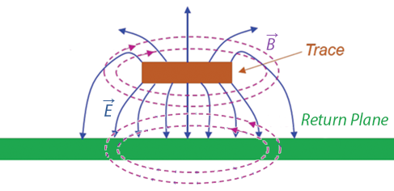
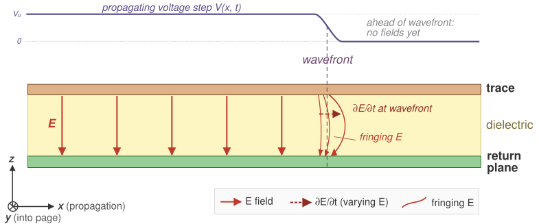
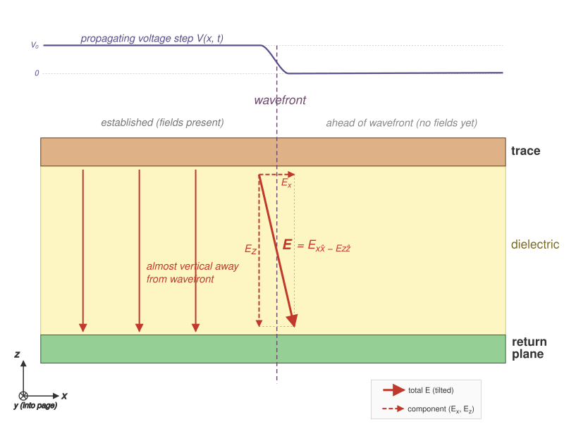
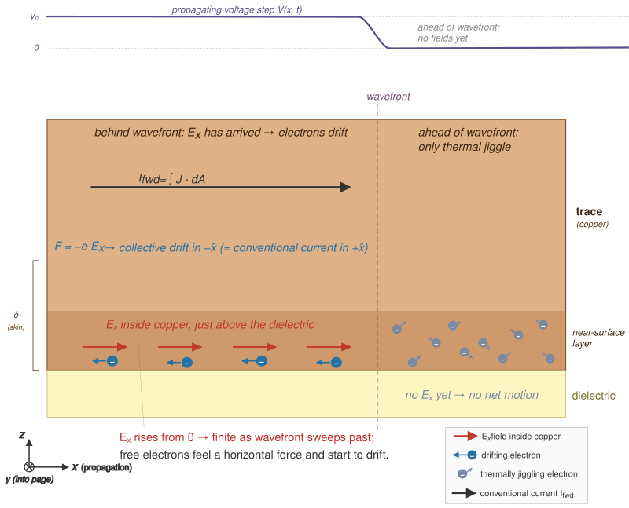
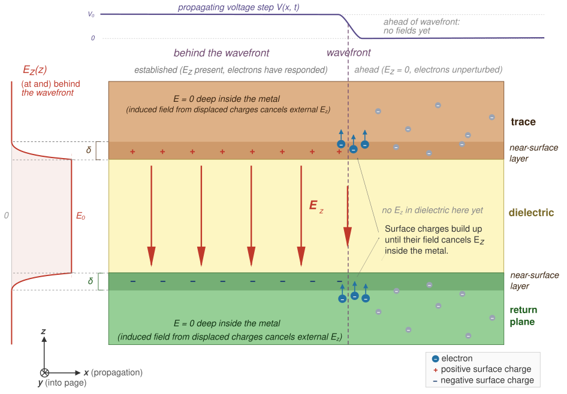
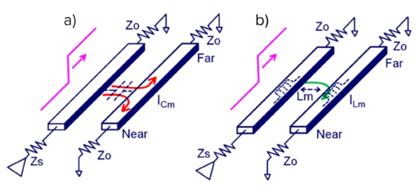
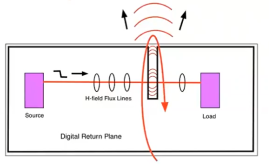
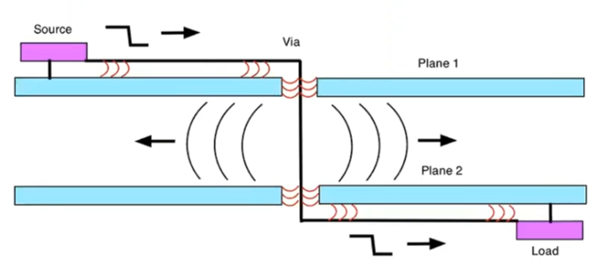
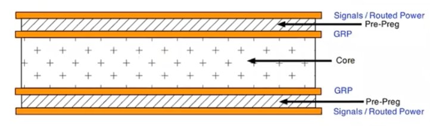
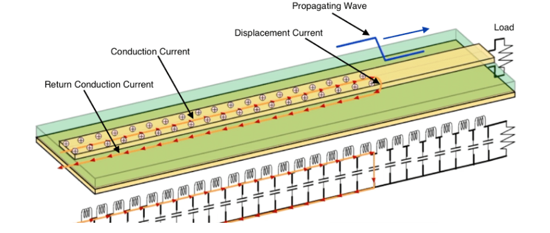

# Board Design Guide

This is the second document that answers **"How?"** — the companion to the Architecture document, and follow-up to the Schematic Design document. It covers the Printed Circuit Board (PCB) selection and layout rules for **OPNhydro**.

As in the Schematic Design document, the central problem remains **coexistence**.
- On one side: a pH probe measuring millivolt-level electrochemical potentials, an EC probe, and an ESP32 — all of which need a clean, quiet supply.
- On the other: three stepper drivers chopping current at 20–50 kHz, a buck converter switching at 1 MHz, and a solenoid valve.

After the PCB selection and general layout rules, the document covers the different sections of the schematic.

Rather than presenting layout rules as a checklist to memorise, this guide starts from the underlying electromagnetic theory and derives the rules as consequences. It serves as a bridge between the high-level Architecture goals and the specific Schematic Design requirements.

Consider a puzzle. You flip a light switch, and the bulb lights up almost instantly. But if you could tag a single electron at the switch and watch it, you would find it drifting toward the bulb at roughly one meter per hour — the speed of a snail. At that rate it would take days to arrive. So what turned the light on?

Not the electrons. The electromagnetic field did. And once you understand that, PCB layout starts making intuitive sense.

---

## 1. Field Theory

**Circuit Theory**, as we learned as undergrads, is a simplified, low-frequency approximation of field theory. It assumes that the physical size of components is much smaller than the wavelength of the signal, so we can ignore wave propagation and use simple circuit laws — Ohm's Law, Kirchhoff's laws. Before the mid-1990s, a typical device might output signals with 10 ns rise times at 10 MHz — and the circuits worked with the crudest of interconnects.

This chapter builds up the field-theory picture from first principles:

- **§1.1** — how a voltage step becomes an EM wave, and where its energy actually flows.
- **§1.2** — what the copper does in response: sustained currents and surface-charge confinement.
- **§1.3** — what happens when the power distribution network cannot supply current fast enough (rail noise).
- **§1.4** — how the fields of one trace leak into another (crosstalk).
- **§1.5** — what happens when the field escapes the board entirely (EMI).
 

### 1.1. EM Wave in the Dielectric

> "Energy and signals travel in the spaces not the traces"  -- Ralph Morrison

As clock frequencies increase, rise times shorten — as a rule of thumb, the rise time $t_r$ is roughly 10% of the clock period:
$$
  t_r \approx \frac{1}{10\,f_{clk}}
$$

A 100 MHz clock demands 1 ns. At these short rise times, the wavelength of the signal's frequency content becomes comparable to (within ~10×) the physical dimensions of the PCB traces, and the circuit-theory assumptions fail. **Field Theory** is now required to account for radiation, retardation and wave propagation. 

PCB design shifts from drawing paths for current to designing transmission lines that contain EM fields, manage parasitic inductance and capacitance, and control radiated emissions. Those physics classes about electromagnetic fields and transmission lines are no longer reserved for RF engineers — they become practical for anyone designing a fast PCB.

A microstrip has two regions: the dielectric between the conductors, and the copper itself. §1.1 looks at the dielectric — that is where the wave lives and where the energy flows. §1.2 then turns to the copper, where the free electrons respond.
 

#### From Voltage to EM Wave

> "Electromagnetic (EM) field theory, based on [Maxwell's equations](https://coertvonk.com/physics/electromagnetism/magnetism/materials-and-maxwells-equations-30453), is the fundamental description of electrical phenomena (fields, waves, radiation)."  -- Dr. Eric Bogatin [^BOGATIN] and Kenneth Wyatt [^WYATT].

[^BOGATIN]: [Signal and Power Integrity, simplified 2nd (2010) - Eric Bogatin](https://www.oldfriend.url.tw/article/SI_PI_book/Signal%20and%20Power%20Integrity%20-%20simplified_2nd_Eric%20Bogatin_Prentice%20Hall%20PTR_2010.pdf)
[^WYATT]: [PCB Design for Low EMI - Kenneth Wyatt](https://www.protoexpress.com/webinars/pcb-design-for-low-emi/?watch-now)

<figure>
  

  
  <figcaption><i>Cross-section view of Microstrip fields. (Courtesy: Patrick André)</i></figcaption>
  

</figure>

> **A note on field lines.** Textbook diagrams show fields as lines with arrows. These *field lines* are a visualization invented by Faraday, not physical objects. They are drawn by stepping from point to point in the direction the field vector points, with line density representing field strength. The field itself exists at *every* point in space — between the lines too. Where this document says "the $\mathbf E$ field points downward" or "the $\mathbf B$ field curls around the trace," it is shorthand for: the field vector at each point in that region has that direction and magnitude.

 

##### Two of Maxwell's Equations

As we will see, Maxwell's equations tell the full story in four lines, but the key insight is in two of them — [Faraday's Law](https://coertvonk.com/physics/electromagnetism/magnetism/electromagnetic-induction-30157) and the [Ampère-Maxwell's Law](https://coertvonk.com/physics/electromagnetism/magnetism/displacement-current-30269) — with Gauss's law providing the source-free boundary condition.
$$  
  \begin{align}  
    \nabla \times \mathbf B &=
    \underbrace{\cancel{\mu_0 \ \mathbf J}}_{\substack{\text{conduction} \\ \text{current}}}
    +\ 
    \underbrace{\mu_0\,\varepsilon_0\, \frac{\partial \mathbf E}{\partial t}}_{\substack{\text{displacement}\\ \text{current}}}
    \tag{\text{Ampère-Maxwell}} 
    \\
    \nabla \times \mathbf E &= -\frac{\partial \mathbf B}{\partial t}
    \tag{\text{Faraday}}
  \end{align}
$$

The **displacement current** term in the Ampère-Maxwell law is not a real current — no charge crosses the gap. A changing electric field acts as a source of magnetic field, just as a real current does. This is what allows $\mathbf{B}$ to be continuous across the copper-dielectric boundary, and it is what sustains the wave in the dielectric where $\mathbf{J} = 0$. In a material dielectric like FR-4, bound-charge polarization ($\partial \mathbf{P}/\partial t$) adds a second contribution, but the mechanism works in pure vacuum too.

##### Microstrip Geometry

Consider a signal trace running above a ground return plane, separated by a thin dielectric — the basic microstrip geometry of every PCB. In the dielectric region ($\rho = 0, \mathbf J = \mathbf 0$ — no free charges between the conductors), the fields evolve as follows.

<figure>
  

  
  <figcaption><i>Side view of microstrip <b>E</b> and <b>B</b> fields along the propagation direction.</i></figcaption>
  

</figure>

When a **voltage step** is applied at one end, the following chain of events unfolds:

1. The sudden voltage change creates an **electric field** $\mathbf{E}$ between trace and return plane, pointing vertically (from trace down to return plane). This electric field exists only at the very beginning of the microstrip. $\mathbf{E}$ is called a vector field because it has an intensity and direction at every point in space. This field cannot remain localised. 
 

2. The moment $\mathbf E$ appears, it is rising from zero — i.e. **changing in time**. Since the dielectric carries no conduction current ($\mathbf J = \mathbf 0$), Ampère-Maxwell's Law reduces to the displacement-current term — a time-changing electric field $\mathbf E$ (right side) **forces the magnetic field $\mathbf B$ to vary spatially** (left side).
 

3. The $\mathbf B$ field created in step 2 is also rising from zero — i.e. **changing in time** (right side). According to Faraday's Law this time-changing magnetic field **forces the electric field $\mathbf E$ to vary spatially** (left side) — extending $\mathbf E$ slightly ahead of where it began.

The electric field $\mathbf E$ points vertically (trace to return plane), but its magnitude changes as you move horizontally along the trace — field direction and variation are perpendicular. That is a wave front advancing.

**Changing in time vs. changing in space.** These two phrases carry the whole argument, so it is worth pausing on them.
- *Changing in time* ($\partial / \partial t$) — stand still at one point and watch the field rise, fall, or oscillate as the clock ticks. Units: [field] per second.
- *Changing in space* ($\nabla\times$) — freeze time and walk to a neighbouring point; ask how the value here differs from the value just over there. Units: [field] per meter.

Maxwell's curl equations link the two: a time change *here* forces a spatial difference *here*, which means the neighbouring point has a different value, which forces *it* to change in time, and so on. A field that changed only in time would just pulse in place; one that changed only in space would be a frozen pattern. It is the coupling — time-derivative on one side, spatial-derivative on the other — that makes the disturbance *move*.

**To summarize:** once the electric field appears, a magnetic field arises alongside it. That changing magnetic field extends the electric field slightly ahead, which in turn extends the magnetic field further still. **Each field regenerates the other**. The wave is self-sustaining — it needs no electrons to carry it forward.

##### In other words

Here is how Feynman might have explained it. Chalk in one hand, no notes.

Now look — you've got a copper trace, and underneath it a big sheet of copper called the return plane. Between them, a thin slab of plastic. That's it. That's the whole apparatus. And I want to tell you what happens when you flip a switch at one end and connect a battery.

The instant you close the switch, there's a voltage between the trace and the plane. And whenever you have a voltage between two pieces of metal, there's an **electric field** between them. Bang — the field is just there, pointing from the trace down to the plane. Not in all of space, mind you — only right near the switch, because the rest of the trace hasn't heard the news yet.

Now, here is where it gets interesting. The electric field went from zero to something. That's a change. And it turns out — and this is one of the most marvelous things in physics — that **a changing electric field makes a magnetic field**. Not "has a magnetic field associated with it." Makes one. Maxwell figured this out. The electric field changes in time, and a magnetic field curls up around it, right there in the plastic.

OK, so now we have a magnetic field. And it is also going from zero to something. It's changing in time too. And Faraday — long before Maxwell — figured out the other half of the story: **a changing magnetic field makes an electric field**. So the magnetic field we just made, by changing, makes another electric field — a little bit further along the trace than the one we started with.

You see what's happening? The electric field made a magnetic field. The magnetic field made an electric field. The new electric field is further down the line. And now it is changing, so it makes another magnetic field, which makes another electric field, and off we go. The two fields are playing leapfrog, and they're heading down the trace at an enormous speed.

So when you flipped that switch — the light turned on because a little piece of light, essentially, rushed down the trace. Not the electrons. The field. The electrons are just sitting there wiggling; they're the audience, not the performers. The show is in the plastic, between the conductors, where the fields are doing their dance.

And that, really, is what every trace on every PCB is doing. It's not carrying electrons to some destination. It's guiding a little wave of light. Isn't that something?

 

#### Propagation

Steps 1–3 showed the first cycle. The same coupling, applied repeatedly, guarantees indefinite propagation. 

As we have seen, in the source-free dielectric, the two laws simplify to:

$$
  \begin{align}
    \nabla \times \mathbf{B} = \mu_0\varepsilon_0 \frac{\partial \mathbf{E}}{\partial t}
    \tag{\text{Ampère-Maxwell}} \\
    \nabla \times \mathbf{E} = -\frac{\partial \mathbf{B}}{\partial t}
    \tag{\text{Faraday}}
  \end{align}
$$

These two equations couple time variation to spatial variation — and that coupling is what makes propagation inevitable. If $\mathbf E$ is changing in time at some point, the first equation forces $\mathbf B$ to have a spatial gradient there — so $\mathbf B$ at the neighbouring point is different. At that neighbouring point, $\mathbf B$ is now changing in time, and by the second equation this forces spatial variation in $\mathbf E$ — so $\mathbf E$ at the *next* point is different. And so on.

No mechanism "pushes" the wave forward. A time change here forces a spatial difference here, which means a different value there, which forces a time change there. The disturbance has no choice but to spread. The wave propagates because the mathematics forbid a localised disturbance from remaining localised.

How fast the electric and magnetic fields can build up is what sets the signal's propagation speed. The propagation and interaction of these fields is described by Maxwell’s Equations.

  
Expand to see the math.

  Take the curl of Faraday's law
  $$
      \nabla \times (\nabla \times \mathbf E) = -\frac{\partial}{\partial t}(\nabla \times \mathbf B)
  $$

  Substitute the simplified Ampère–Maxwell into the right side
  $$
      \nabla \times (\nabla \times \mathbf E) = -\mu_0\varepsilon_0 \frac{\partial^2 \mathbf E}{\partial t^2}
  $$

  Recall the vector identity
  $$
      \nabla \times (\nabla \times \mathbf E) = \nabla(\nabla \cdot \mathbf E) - \nabla^2\mathbf E
      \tag{\text{vector identity}}
  $$

  Expand the left side using this vector identity
  $$
      \nabla(\nabla \cdot \mathbf E) - \nabla^2\mathbf E = -\mu_0\varepsilon_0 \frac{\partial^2 \mathbf E}{\partial t^2}
  $$

  Apply Gauss's law:
  $$
      \nabla \cdot \mathbf E = \frac{\rho}{\varepsilon_0}
      \tag{\text{Gauss's law}}
  $$

  In the source-free dielectric there are no charges ($\rho = 0$), so this becomes $\nabla \cdot \mathbf E = 0$. The first term vanishes:
  $$
      \nabla^2 \mathbf E = \underbrace{\mu_0\,\varepsilon_0}_{1/v^2} \frac{\partial^2 \mathbf E}{\partial t^2}
  $$

  Recognize the standard wave equation for any quantity propagating at speed $v$:
  $$
      \nabla^2 f = \frac{1}{v^2} \frac{\partial^2 f}{\partial t^2}
      \tag{\text{standard wave equation}}
  $$

  Comparing the two, term by term, gives the speed of the wave propagation:
  $$
      \frac{1}{v^2} = \mu_0 \varepsilon_0
      \quad \Rightarrow \quad
      v = \frac{1}{\sqrt{\mu_0 \varepsilon_0}}
  $$

 

**Takeaway:** combining Faraday and Ampère-Maxwell yields the standard wave equation with speed $v$. This speed of the EM wave follows directly from the constants for permeability ($\mu_0$) and permittivity ($\varepsilon_0$):
$$
    v = \frac{1}{\sqrt{\mu_0 \varepsilon_0}}
$$

The constants $\mu_0$ and $\varepsilon_0$ follow from independent magnetic and electric experiments, respectively — neither involving light.

$$
  \left.
    \begin{align*}
      \mu_0 &= 4\pi \times 10^{-7} \text{ H/m} \\
      \varepsilon_0 &= 8.854 \times 10^{-12} \text{ F/m}
    \end{align*}
  \right\}
$$

Substituting the constants:
$$
    v = \frac{1}{\sqrt{4\pi \times 10^{-7} \times 8.854 \times 10^{-12}}} \approx 299.8 \times 10^6 \text{ m/s}
$$

That is the speed of light $c$ — derived entirely from electric and magnetic constants.

This was Maxwell's 1865 result. He started with two equations about how electric and magnetic fields change in space and time, combined them, and out fell the speed of light. That is one of the most remarkable results in all of physics.

To find the propagation speed ($v'$) for a typical PCB dielectric glass epoxy (FR-4), we need to replace $\varepsilon_0$ with $\varepsilon_r \varepsilon_0$, where $\varepsilon_r \approx 4.2$.
$$
    v' = \frac{1}{\sqrt{4\pi \times 10^{-7} \times 4.2 \times 8.854 \times 10^{-12}}} \approx 146.3 \times 10^6 \text{ m/s}
$$

The wave **propagation speed in FR-4** is therefore **~15 cm/ns**. To be precise, this is the bulk-FR-4 (or stripline) speed. On a microstrip, part of the field is in air above the trace, so the effective permittivity is a bit lower and the speed rises to ~17–18 cm/ns.

##### In other words

Once more in Feynman's words:

If you write down Faraday's and Maxwell's laws, and you do a little algebra (which I'll spare you), out pops a speed. And the speed is $1/\sqrt{\mu_0 \varepsilon_0}$, where $\mu_0$ and $\varepsilon_0$ are just numbers you measured in a laboratory with magnets and charges, nothing to do with light at all. And when you plug them in, the speed is three hundred thousand kilometers per second. Which is the speed of light. Maxwell looked at this and said, my goodness, light is just this game of leapfrog between electric and magnetic fields.

 

---

 

### 1.2. Conductors as Waveguides

§1.1 looked at the dielectric — the wave, the energy, the propagation. Here we turn our attention to the trace and return plane. Inside the copper, there are free electrons, and they are not passive bystanders.

#### Components of the Electric Field

The observant reader might have noticed that the electric field between trace and return plane is not perfectly vertical — for example, at the wavefront near the trace, it tilts slightly forward in the direction of propagation. That tilt decomposes into two components:
$$
    \mathbf E = \hat x \, E_x - \hat z \, E_z
$$

where $\hat x$ points along the trace (the propagation direction) and $-\hat z$ points from the trace to the return plane.

<figure>
  

  
  <figcaption><i>Microstrip electric field components.</i></figcaption>
  

</figure>

The **free electrons** in the copper respond to each component differently:

- **Horizontal component $E_x$** (small) arises from the fact that the wave is *travelling*. The voltage is not the same everywhere along the trace at the same instant: the wave has arrived here but not yet at the next point down the line. That spatial gradient in voltage is a horizontal electric field: $E_x = -\frac{\partial V}{\partial x}$. It drives a sustained current that we measure with instruments, and converts a small fraction of the field energy into heat.

- **Vertical component $E_z$** (dominant) drives a transient surface-charge redistribution, in the copper, that **confines** the wave to the dielectric. It comes from the charge separation across the dielectric. The wave deposits positive charge on the trace and negative charge on the return plane (or vice versa half a cycle later). These opposite surface charges create an electric field pointing from one conductor to the other, just like a parallel-plate capacitor.

The two subsections below unpack each component in detail, starting with the horizontal.

##### Horizontal component $E_x$ → sustained current

As the wave front reaches a section of the conductor, $E_x$ there rises from zero to some value. The free electrons — previously drifting only thermally, with no net motion — feel a force and begin to move horizontally:
$$
  F_x = q \, E_x
  \tag{\text{Lorentz force law}}
$$

> Note: physics uses the vector **current density** $\mathbf J$ — how charge moves through a specific area at a specific point — rather than the scalar current $I$, which is just the total charge flow in a wire.

<figure>
  

  
  <figcaption><i>Microstrip Ex current.</i></figcaption>
  

</figure>

At the leading edge of the wave, this current charges the distributed capacitance of the line.

This collective drift of many electrons is what we measure as current density $\mathbf J$, and in a linear conductor it is proportional to $\mathbf E$:
$$
    \mathbf J = \sigma \mathbf E
$$

where $\sigma$ is the conductivity (~$5.8 \times 10^7$ S/m for copper). This is Ohm's law in its field form. A larger $\mathbf E$ means more force, more drift, more current.

In other words: the field arrives first; the **current is the electrons' response to the electric field**. This is backwards from how most of us learned it. We were taught "apply a voltage, current flows." That is not wrong, but it hides what is actually happening. The voltage is just a way of describing the strength of the electric field. The "current flowing" is the electrons reacting to that field. The energy is not being transported by the electrons — it is in the field, described by the Poynting vector $\mathbf E \times \mathbf B$, which points from the source toward the load, through the dielectric between the conductors.

##### Vertical component $E_z$ → transient redistribution of surface charge → confines the wave

As the wave front reaches a section of the conductor, $E_z$ there rises from zero to some value. The force on an electron is $-q\mathbf E.$ With $E_z$ pointing from trace down to return plane, electrons in *both* conductors are pushed *upward*: in the trace, they move away from the dielectric-facing surface, leaving it positively charged; in the return plane, they move toward the dielectric-facing surface, making it negatively charged. By moving, these electrons create their own electric field that opposes the one that pushed them. The electrons keep moving until their self-generated field exactly cancels the incoming field inside the conductor.

<figure>
  

  
  <figcaption><i>Microstrip Ez confinement.</i></figcaption>
  

</figure>

So, the electrons rearrange themselves to **cancel the electric field** inside the metal. These electrons respond so quickly that $E_z$ at the surface is nearly cancelled. What little field penetrates the metal decays within one skin depth calculated as $\delta = \sqrt{2/(\omega \mu \sigma)}$ (~66 µm at 1 MHz, ~2 µm at 1 GHz).

This cancellation is what **confines the wave**. The field cannot penetrate the copper, so it is forced to exist only in the dielectric between the trace and the return plane. Without this electron response, the field would not be confined — the wave would radiate away instead of propagating along the line.
 

##### In other words

Here is how Feynman might walk us through it.

All right, so we've got this wave zipping down the trace, and the energy is really out there in the plastic — the fields are doing the heavy lifting. But now somebody in the back says, **"Now wait a minute, Professor. What about the electrons? What are they doing?"**

Good question. Let's look.

Here's the trick. That electric field in the dielectric — it's *almost* pointing straight down, from the trace to the plane. But not quite. It's tilted, just a little, forward — in the direction the wave is moving. Why? Because the wave is *going somewhere*. The voltage on the trace right here is a little different from the voltage a millimeter ahead, because the wave hasn't quite gotten there yet. And wherever the voltage changes from one place to another, there's an electric field pointing from high to low. So you get a small horizontal piece of the field along with the big vertical piece.

So — two components. Let's call them the **down-field** (the big one) and the **along-field** (the tiny one). And the electrons in the copper feel both of them, but they do completely different things about each.

**First, the along-field.** You've got free electrons in the copper — just sitting there, jiggling around from heat, but no net motion. Now the wave arrives, and suddenly there's a little electric field pushing them along the trace. They feel the force, they start to drift — very slowly, mind you, but they all drift together — and that is what we call a **current**. Now here's what I want you to notice: the current didn't cause anything. The field caused the current. The field shows up first, the electrons react. When your textbook says "apply a voltage, current flows," it makes it sound like the voltage pushes the electrons through the wire like water through a hose. That's not what's happening. The voltage is a bookkeeper's description of the field. The field is the real thing. The electrons are just reacting to it.

**Now the down-field.** This one's bigger, and it's doing something much more dramatic. It's pointing from the trace down through the plastic to the return plane. So it's *pulling* the electrons in the trace — which are negative — *upward*, away from the bottom surface of the trace. And in the return plane, same field, same upward pull: electrons pile up against the top surface. You've got a pileup of negative charges on one surface and a corresponding deficit (meaning positive) on the other. A little capacitor, in effect, right where the wave front is sitting.

And here's the marvelous thing. Those electrons don't stop moving until they've *cancelled* the field. They keep shoving themselves around until the extra field they create, from being piled up, exactly cancels the field that pushed them in the first place — so that inside the copper itself, the net field is zero. That's what conductors always do, in equilibrium. They arrange their electrons so the field inside is zero.

And *that* is the thing I want you to appreciate, because it's what makes the whole PCB work. The electrons in the copper are throwing up a wall. They won't let the field into the metal. The field is forced to stay where the electrons aren't — in the dielectric, between the conductors. The wave can't escape. It's trapped. It has no choice but to go along the line, from the switch to the bulb, because the electrons in the copper refuse to let it go anywhere else.

Somebody says, **"How fast do the electrons do that?"** And the answer is: very, very fast. Much faster than the wave is moving. If you try to push a little bit of field into the copper, it makes it in maybe 2 microns at a gigahertz before the electrons have shoved it back out. Two microns! In a piece of copper that's tens or hundreds of microns thick, the field barely gets in the door.

So put it all together:
- The wave is in the plastic.
- The *down-field* from the wave shoves electrons around on the copper surfaces. Those electrons build a wall that keeps the wave trapped in the plastic.
- The *along-field* from the wave pushes other electrons along the trace, giving you the little current you measure with your ammeter.

The wave is the boss. The electrons are the help. And what the electrons do — the thing we call "current" — is not how the energy gets from here to there. The energy is out in the dielectric, in the fields. The current is just the electrons reacting to the field, the same way a line of dominoes reacts to the first push. The dominoes aren't transporting the energy down the line — the *falling pattern* is. And on a PCB, the falling pattern is the field.

And that's really all there is to it. The hard part is believing it.

#### Sources of the Magnetic Field

The horizontal current $\mathbf J$ in the trace creates a $\mathbf B$ field curling around it. A natural question: is this a separate magnetic field competing with the wave's own $\mathbf B$? No — it is the *same* field. Ampère–Maxwell makes this explicit:

$$
    \nabla \times \mathbf B =
    \underbrace{\mu_0 \, \mathbf J}_{\substack{\text{conduction current}\\ \text{in the copper}}} 
    \;+\;
    \underbrace{\mu_0\,\varepsilon_0\, \frac{\partial \mathbf E}{\partial t}}_{\substack{\text{displacement current} \\ \text{in the dielectric}}}
$$

There is one continuous $\mathbf B$ field, but it has two sources depending on where you are. Inside the copper, the conduction term ($\mu_0 \mathbf J$) dominates — free electrons are moving, and their motion sustains $\mathbf B$. In the dielectric, there are no free electrons ($\mathbf J = 0$), so the displacement term takes over — the changing $\mathbf E$ field sustains $\mathbf B$ just the same. At the copper-dielectric boundary, the two sources hand off seamlessly. The $\mathbf B$ field does not care which term is producing it; it is one smooth, continuous solution across the interface.
 

##### In other words

Imagine Feynman is still at the chalkboard. Someone in the third row raises a hand.

*"Professor, I'm confused. You just told us the wave has a magnetic field around it — that was part of the leapfrog thing. But now you're saying the electrons in the copper are flowing, and a flowing current also makes a magnetic field. So which is it? Are there two magnetic fields here, or what?"*

That's a wonderful question. And the answer — which I think is one of the most beautiful things Maxwell ever did — is that there's only **one** magnetic field. There's just one field in space, wrapping around the trace. But that field has *two different things that can keep it going*, and which one is keeping it going depends on *where you are*.

Let me show you. Maxwell's Ampère law — the real one, with his addition — says the curl of $\mathbf B$ is two things added together:

$$\nabla \times \mathbf B = \mu_0 \mathbf J + \mu_0 \varepsilon_0 \frac{\partial \mathbf E}{\partial t}$$

That first piece — $\mu_0 \mathbf J$ — is just the old-fashioned Ampère's law. Current flowing makes magnetic field. Every kid who ever wrapped wire around a nail knows this.

That second piece was Maxwell's great invention. He realized Ampère's law couldn't be complete because if you had a capacitor, the current comes *into* one plate and *out of* the other, but in between — in the empty space — there's no current flowing. And yet the magnetic field has to be continuous; it can't just stop at the plate and start up again on the other side. Something has to keep it going across the gap. And Maxwell said: the thing that keeps it going is the *changing electric field* between the plates. He called it the **displacement current**, even though nothing is really being displaced. It's just a changing field that *looks like* a current, from the magnetic field's point of view.

Now look where we are on this PCB. You've got copper up top, copper down below, and plastic in between.

**Inside the copper,** electrons are flowing. So $\mathbf J$ is big. And the electric field in the copper is essentially zero — we just spent the last lecture explaining why. So the second term is nothing. The $\mu_0 \mathbf J$ piece is doing all the work.

**Inside the plastic,** there are no free electrons. $\mathbf J = 0$. Nothing is flowing through the dielectric. So the first term is nothing. But the electric field is enormous in there, and it's changing in time as the wave goes by. So the second term — the displacement current — is doing all the work.

And here's what I want you to appreciate. You walk from the plastic up into the copper, crossing the boundary, and the $\mathbf B$ field doesn't care. It doesn't notice. It's perfectly smooth. It has the same value just below the surface as just above. What changes is *who's responsible for it*. Down in the plastic, a changing electric field is keeping $\mathbf B$ alive. Up in the copper, moving electrons are keeping it alive. The field itself is completely oblivious — it just wraps around the trace as one continuous tube of magnetism.

That was Maxwell's real insight. Not that current makes magnetism — we knew that. Not that changing fields make fields — Faraday had half of that. Maxwell's piece was realizing that *a changing electric field is, for the purposes of magnetism, every bit as good as a current.* Nature doesn't care which one is feeding the field. It'll take either. And on a PCB, inside the copper it takes one, inside the plastic it takes the other, and the result is a seamless, beautiful, continuous magnetic field wrapping the whole transmission line.

#### One System, Two Views

It is tempting to think of "the wave in the dielectric" and "the current in the copper" as two separate things that happen to coexist. They are not. They are two views of a single electromagnetic solution, and neither can exist without the other.

- Without the surface-charge redistribution, the boundary condition that cancels $\mathbf E$ inside the metal would not be satisfied. The field would not be confined. There would be no guided wave — just radiation.
- Without the propagating field, there would be nothing to drive the electrons. No $E_x$ means no $\mathbf J$. The current would not exist.

The field drives the current. The current shapes the field. They are mutually dependent — one self-consistent system, seen from different sides of the copper surface.

So far, we have followed one signal on one trace — its wave, its return current, its confinement. But every chip on the board also needs a stable supply voltage, delivered through its own set of traces, vias, and planes. Those power paths are transmission lines too, and they are subject to the same field physics. When the current through them changes abruptly, the results are not subtle.

 

---

 

### 1.3. Rail Collapse in the Power Distribution Network

The power and ground paths that feed every chip on the board are themselves transmission lines with impedance — and when the current through them changes, that impedance produces voltage noise.

Every time a chip switches its outputs or its internal gates toggle, it draws a sharp pulse of current from the power rail. That current passes through the inductance $L_{\text{PDN}}$ of the power distribution network (PDN) — the planes, traces, vias, and decoupling capacitors between the voltage regulator and the chip. The resulting voltage drop is:

$$\Delta V = L_{\text{PDN}} \times \frac{dI}{dt}$$

This is trace and via inductance resisting sudden changes in current. The chip sees its supply rail sag momentarily, reducing the voltage between its power and ground pins. If the sag is large enough, the chip misinterprets logic levels or produces timing errors. The design goal is to minimise $L_{\text{PDN}}$ across the full frequency range the chip draws current at — the details are covered in §2.1.

 

---

 

### 1.4. Crosstalk

Crosstalk is what happens when the EM field of one trace overlaps with the EM field of another. In circuit theory we talk about parasitic capacitance and mutual inductance as if they are discrete components accidentally added to the circuit. In field theory the picture is more honest: there is one EM field in the dielectric, and that field does not know which trace "owns" it. If two traces share the same dielectric volume, their fields overlap, and the overlap is the crosstalk. $C_m$ and $L_m$ are just circuit-theory approximations of that field overlap.

There are two coupling mechanisms — capacitive and inductive — and both are direct consequences of Maxwell's equations.

<figure>
  

  
  <figcaption><i>Capacitive and inductive coupling. (Courtesy: Intel)</i></figcaption>
  

</figure>

 

#### Capacitive (electric field)

The $\mathbf E$ field from a signal trace does not terminate exclusively on its own return plane. Some field lines — especially the fringing fields at the edges of the trace — terminate on nearby conductors instead: an adjacent trace, a via, a component pad.

When the aggressor trace changes voltage, its $\mathbf E$ field changes. That changing field induces a displacement current ($\varepsilon_0 \varepsilon_r \frac{\partial \mathbf E}{\partial t}$) onto the victim trace — depositing charge on it, just as it would on a capacitor plate. The victim trace sees a current spike proportional to the rate of change of the aggressor's voltage $V_a$:
$$
    I_C = C_m \ \frac{dV_a}{dt}
$$

where $C_{\text{m}}$ is the mutual parasitic capacitance between the two traces — determined by their overlap area, separation distance, and the dielectric constant of the material between them. Closer traces and longer parallel runs increase the coupling (higher $\varepsilon_r$ increases mutual capacitance but also tightens confinement to the return plane, so the net effect depends on geometry).

This is purely Gauss's law at work: electric field lines must terminate on a conductor, and if another trace is closer or more convenient than the return plane, some of them will land there instead.
 

#### Inductive (magnetic field)

The current in the aggressor trace creates a $\mathbf B$ field curling around it. That field extends into the surrounding space — including through the loop formed by the victim trace and its return plane. When the aggressor's current $I_a$ changes, the $\mathbf B$ field through the victim's loop changes. Faraday's law says a changing magnetic flux through a loop induces a circulating electric field — which drives a voltage:

$$
    \nabla \times \mathbf{E} = -\frac{\partial \mathbf{B}}{\partial t} 
    \tag{\text{Faraday}}
$$

The induced voltage $V_L$ is proportional to the rate of change of the aggressor's current:
$$
    V_L = -L_m \frac{dI_a}{dt}
$$

where $L_m$ is the mutual inductance between the two trace-return-plane loops. It depends on how much of the aggressor's $\mathbf B$ field threads through the victim's loop — set by the physical distance between traces, the height above the return plane, and the length of the parallel run.

Inductive crosstalk is worst where the return path is constrained. On a PCB with a continuous return plane, the return current mirrors directly under the trace, keeping the loop area small. But through connectors, packages, and vias, multiple signals often share a single return pin instead of a wide plane. The return currents are forced through a common impedance, the loop areas grow, and the mutual inductance between aggressor and victim increases sharply.
 

#### Both Matter

The capacitive and inductive coupled signals arrive at the victim differently:

- **Capacitive coupling** injects current into the victim trace. That current splits and travels in both directions — toward the near end and the far end. Both ends see a pulse of the same polarity as the aggressor.

- **Inductive coupling** induces a current that opposes the aggressor's current (Lenz's law). That current flows toward the near end, producing a pulse of the same polarity as the aggressor there, and a pulse of opposite polarity at the far end.

At the **near end** (closest to the aggressor's source), the capacitive and inductive components have the same polarity — they add. Near-end crosstalk (NEXT) is therefore the larger of the two. At the **far end**, they have opposite polarity — they partially cancel. In a stripline (homogeneous dielectric), the cancellation is exact and far-end crosstalk (FEXT) is zero. In a microstrip, the even- and odd-mode velocities differ slightly, so FEXT is nonzero but typically smaller than NEXT.

 

---

 

### 1.5. Electromagnetic Interference

Sections §1.1 through §1.4 describe what happens when the EM field stays where it belongs — confined between a trace and its return plane. EMI is what happens when it escapes.

A current loop is an antenna. For a small loop (perimeter ≪ wavelength), the radiated electric field at distance $r$ is proportional to the square of the frequency:[^EMCLOOP]
$$
    E \;\propto\; \frac{f^2 \, A \, I}{r}
$$

Every signal on the board has a forward path (the trace) and a return path (the current in the return plane directly beneath it). When both paths are intact and close together, the loop area is tiny — just the trace length times the dielectric thickness. The fields from the forward and return currents are equal and opposite, and they cancel at a distance. Almost no energy escapes.

EMI appears when that cancellation breaks down:

- **Broken return path.** A slot in the return plane, a missing via at a layer transition, or a signal crossing between power islands forces the return current to detour. The loop area grows — and since radiated power scales with $A^2$, even a modest detour has outsized consequences.

- **Common-mode currents.** If the return current cannot mirror the signal current exactly — because of an asymmetry, a ground impedance, or a cable acting as a second antenna — the imbalance becomes a common-mode current. Common-mode currents flow on the outside of cables and along board edges, where there is no equal-and-opposite field to cancel them. Even a few microamps of common-mode current at VHF frequencies can exceed emission limits.

- **Board-edge fringing.** The EM field guided by a microstrip trace extends laterally beyond the trace edges. If a high-speed trace runs near the board perimeter, those fringing fields reach the edge of the return plane and radiate — there is no copper beyond the edge to contain them.

- **Connector and cable radiation.** Every conductor that leaves the board — a power cable, a sensor wire, a USB connection — is a potential antenna. The board's internal switching noise couples onto the cable as common-mode current, and the cable radiates it. This is typically the dominant EMI path in a system like OPNhydro, where multiple cables connect to off-board sensors and motors.

The physics comes from the same Maxwell's equations as §1.1. The difference is context: signal integrity asks whether the field arrives at the receiver correctly; EMI asks whether the field arrives somewhere it should not.

[^EMCLOOP]: Derived from the magnetic dipole radiation formula. The full expression includes constants ($\mu_0$, $c$), but the proportionality to $f^2$, $A$, and $I$ captures the design levers.

 

---

 

## 2. From Physics to Layout

Chapter 1 established how signals actually travel on a PCB — as EM waves guided by copper boundaries, with energy in the dielectric and currents as the electrons' response to the field. This chapter turns that physics into layout decisions.

The sections proceed from rules to physical build to final strategy:

- **§2.1** distils the field theory into layout rules covering signal quality, crosstalk, rail collapse, and EMI.
- **§2.2** explains the OPNhydro stack-up — a Low-EMI four-layer arrangement driven by the 6.5 A peak on the 24 V input rail and the isolation moats around the pH and EC islands.
- **§2.3** specifies the dielectric and copper.
- **§2.4** separates the noisy motor-control, digital, and sensitive analog domains.
- **§2.5** covers enclosure and mechanical constraints.
- **§2.6** derives trace widths from current, impedance, and thermal limits.
- **§2.7** assembles all of the above into a concrete layout strategy.

Each rule in this chapter ties back to a specific result from Chapter 1. The aim is that no rule is a folklore prescription — every one has a physical reason behind it.

### 2.1. PCB Design Rules

Everything in §1.1 through §1.5 leads to a single conclusion: the signal energy travels as an EM wave through the dielectric, guided by the copper boundaries. The trace is one wall, the return plane is the other. The copper confines the field ($E_z$ cancellation), the dielectric carries it forward (displacement current), and the return current in the return plane provides the equal-and-opposite $\mathbf B$ that prevents radiation (field cancellation at a distance).

When that field structure breaks down, the consequences fall into four categories: degraded signal quality on a single net (reflections, ringing), rail collapse in the power distribution network (§1.3), crosstalk between adjacent nets (§1.4), and radiated EMI (§1.5). Every PCB layout rule exists to prevent one or more of these — by keeping the field confined, the return path intact, and the coupling between unrelated fields to a minimum.
 

#### Signal Quality

A signal travelling along a trace is an EM wave guided by the trace and its return plane. Anything that disrupts the wave's propagation — an impedance discontinuity, a missing return path, a stub — causes part of the energy to reflect back toward the source. The reflected wave interferes with the forward wave, producing ringing, overshoot, and timing uncertainty on the net.

**Rule 1a — Maintain a continuous return plane.** The $\mathbf B$ field from the forward current in the trace and the return current in the return plane are equal and opposite. They cancel at a distance, keeping the energy confined. Gauss's law for magnetism ($\nabla \cdot \mathbf B = 0$) requires magnetic field lines to close: with a continuous plane, they close tightly. Interrupt the plane — a slot, a cutout, a missing pour — and the loop area grows, the impedance changes, and the wave partially reflects.

<figure>
  

  
  <figcaption><i>Trace crossing a gap in the return plane. (Courtesy: Kenneth Wyatt)</i></figcaption>
  

</figure>

> "Forget the word ground. Every signal has a return path. Think return path and you will train your intuition to look for and treat the return path as carefully as you treat the signal path." -- Eric Bogatin

**Rule 1b — Provide return vias at layer transitions.** When a trace passes through a via, the EM wave transfers between layers. The wave is not just the trace — it is the field between the trace and its reference plane. If the return plane changes (say, from L2 to L3), the return current must also transition. Without a nearby ground via, the return path detours, the loop area grows, and the wave leaks between the return planes — causing both reflections on the signal net and interference with other signals in that space.

<figure>
  

  
  <figcaption><i>Trace passing through two planes with via. (Courtesy: Kenneth Wyatt)</i></figcaption>
  

</figure>

If the planes are the same potential, prevent leakage with nearby stitching vias between them. If they are different potentials, place stitching capacitors as close to the signal via as possible.
 

#### Crosstalk

Both coupling mechanisms — capacitive ($C_m$, from overlapping $\mathbf E$ fields) and inductive ($L_m$, from overlapping $\mathbf B$ fields) — depend on how much of the aggressor's field volume overlaps with the victim's. Every mitigation strategy reduces that overlap.

**Rule 2a — Increase trace spacing.** The fringing $\mathbf E$ field that causes capacitive coupling falls off roughly as $1/d$ with distance. The $\mathbf B$ field that causes inductive coupling follows Ampere's Law and falls off as $1/d$. The 3W rule (space traces at least 3× the trace width apart) is a practical approximation of this. For critical traces (analog sensors, clocks), use $5W$.

**Rule 2b — Minimise parallel run length.** Both $C_m$ and $L_m$ are proportional to the length over which two traces run in parallel. The coupling is cumulative — every millimetre of shared dielectric adds to the total. Where two sensitive traces must be routed near each other, cross them at 90° rather than running them in parallel.

**Rule 2c — Reduce trace height above the return plane.** The closer a trace is to its return plane, the more tightly the $\mathbf E$ and $\mathbf B$ fields are confined directly underneath. Less field energy spills sideways into the neighbouring trace's volume.

**Rule 2d — Interpose a return plane between signal layers.** A grounded conductor between two signal layers terminates $\mathbf E$ field lines from traces above (Gauss's law — the lines land on the return plane instead of reaching the layer below) and provides a local return path that contains the $\mathbf B$ field, blocking inter-layer coupling.

**Rule 2e — Separate functional domains.** Motor control traces and analog sensor traces must not share the same dielectric space. Keep traces on adjacent layers perpendicular to each other to minimise the parallel run length between layers.
 

#### Rail Collapse

Every time a chip switches, it draws a sharp current pulse from the power rail. That pulse passes through the inductance of the power distribution network, producing a voltage drop $\Delta V = L_{\text{PDN}} \times \frac{dI}{dt}$. The goal is to minimise the PDN inductance across the full frequency range the chip draws current at.

**Rule 3a — Tightly couple power and return planes.** A power plane and return plane separated by a thin dielectric (2–3 mil) form a parallel-plate capacitor with very low inductance. This provides broadband decoupling across the entire board area — the EM field between the planes can supply current before the discrete capacitors or the regulator can respond. This design uses two GND planes (L2, L3) with power routed as traces rather than a dedicated plane, so broadband plane decoupling is achieved through discrete capacitors instead (see §2.2).

**Rule 3b — Use multiple, low-inductance decoupling capacitors.** A single capacitor has parasitic lead and via inductance that limits its effectiveness above its self-resonant frequency. Multiple smaller capacitors in parallel reduce the effective inductance (inductances in parallel divide). Place them as close to the chip's power pins as physically possible — every millimetre of trace adds inductance.

**Rule 3c — Minimise power and ground lead length in packages.** The inductance of the bond wires and package leads between die and PCB is often the dominant contributor to $L_{\text{PDN}}$ at high frequencies. Packages with multiple, short power and ground pins (QFN, BGA) have lower inductance than those with long leads (SOIC, DIP).

**Rule 3d — Rely on on-chip decoupling for the highest frequencies.** Above ~100 MHz, no external capacitor can respond fast enough — the path inductance from capacitor to die is too high. Modern ICs include on-die decoupling for this reason. The PCB designer's job is to keep $L_{\text{PDN}}$ low at the frequencies below that.
 

#### EMI — Radiated Emissions

EMI is not a separate problem — it is the consequence of every other problem listed above. When a return path is broken, the $\mathbf B$ fields stop cancelling and the loop radiates. When crosstalk couples energy onto an unintended trace, that trace becomes an unintentional antenna. When a rail collapses, the transient current loop radiates at the switching frequency and its harmonics.

**Rule 4a — Minimise loop area.** Every current — signal, power, return — forms a loop. The radiated power from a loop is proportional to the loop area squared and to the fourth power of frequency: $P_{\text{rad}} \propto A^2 f^4$. Keep traces close to their return planes. Use ground vias at every layer transition. Route power close to its return.

**Rule 4b — Contain the fields at board edges.** EM fields that reach the edge of the PCB can radiate freely — there is no conductor to confine them. Pull traces and pours back from the board edge by at least 20× the dielectric thickness (the 20H rule). Place ground stitching vias along the board perimeter to create a continuous shield.

**Rule 4c — Filter at I/O boundaries.** Every cable attached to the board is a potential antenna. Place filtering (ferrite beads, capacitors, common-mode chokes) at the point where signals enter or leave the board, before the field has a chance to propagate onto the cable.

 

---

 

### 2.2. PCB Stack-up

The PCB has two hard constraints that drive most of the other design decisions. First, the 6.5 A peak current on the 24 V input rail requires copper heavy enough to handle that current without excessive resistive heating. Second, the isolation moats around the pH and EC islands must be maintained through all four layers, which means the layer stack-up cannot be an afterthought.

The **typical 4-layer stack-up** is SIG/GND/PWR/SIG. This design does not use it for two reasons. First, the power and return planes would be separated by the full core distance — too far apart for effective high-frequency decoupling (2–3 mil max is needed). Second, signals on Layer 4 would be referenced to the power plane rather than GND, which only works if the power and return planes are tightly coupled with adequate decoupling capacitors.

Instead, we opt for the **Low EMI 4-layer stack-up** as shown below.

Layer | Name   | Function                         | Components
------|--------|----------------------------------|--------------------------
L1    | Top    | Sensitive signals / routed power | ESP32, LiDAR, I2C, UART, EZO, BNC, 3V3/5V power traces
L2    | GND    | Ground return plane              | Primary return reference for L1 signals
L3    | GND    | Ground return plane              | Primary return reference for L4 signals
L4    | Bottom | Noisy signals / routed 24V power | Stepper drivers, MOSFETs, 24V power traces

<figure>
  

  
  <figcaption><i>Lower EMI in 4-layer PCB. (Courtesy: Kenneth Wyatt)</i></figcaption>
  

</figure>

 

---

 

### 2.3. PCB Materials

The design specifies a **4-layer PCB with 2 oz copper on the outer layers**. The heavier copper on L1 and L4 keeps resistance and heat low on the high-current 24V traces. The two inner layers (L2 and L3) use standard 1 oz copper, which is sufficient for the return planes they carry.

**PCB finish:** HASL (Hot Air Solder Leveling) is sufficient and lowest cost for the packages used in this design (SSOP-20 at 0.65 mm pitch and larger). ENIG (Electroless Nickel Immersion Gold) is only worth the premium if a future revision adds true fine-pitch parts (QFN/LGA at 0.5 mm or below, or BGA).

### 2.4. Segregating Functional Regions

The board layout separates functional domains to minimise coupling between noise sources and sensitive circuits:

1. Keep the BNC-to-EZO analog links and the EZO-to-MCU serial lines away from motor control and digital switching sections.
2. Place power conversion (buck converter) and motor control (TMC2209 drivers) near the power entry point, so high-current loops stay short.
3. Filter and transient-protect all power and I/O connectors at the board boundary.
4. Group all power and I/O connectors along one edge of the board where possible, to contain cable radiation (Rule 4c).

---

### 2.5. Enclosure and Mechanical

The board targets a ~100 mm × 80 mm footprint, which fits standard off-the-shelf enclosures. Recommended specifications:

- **Enclosure:** IP65-rated ABS, approximately 150 × 100 × 70 mm. The IP65 rating keeps moisture and insects out of the electronics.
- **Cable glands:** Use glands for every wire entering the enclosure — probe cables, pump leads, and the PSU input.
- **BNC connectors:** Mount three panel-mount BNC connectors on the enclosure face for the pH, EC, and RTD probes. Panel-mount rather than PCB-mount prevents mechanical stress on the isolation islands if a probe cable is tugged.
- **Optional:** A clear lid panel allows status LED visibility without opening the enclosure.

### 2.6. Trace Widths

The trace widths can be calculated using the IPC-2221 empirical formula for external conductors.[^1]
[^1]: [IPC-2221 Trace Width Calculator, Altium PCB Design Guide](https://resources.altium.com/p/ipc-2221-calculator-pcb-trace-current-and-heating).

$$
    \begin{align}
    I  &= k \times \Delta T^{0.44} \times A^{0.725} \\
    \rm{where\ \ } I &= \rm{current\ [A]} \nonumber \\
    k  &= 0.048 \rm{\ for\ outer\ layer,\ or\ } 0.024 \rm{\ for\ inner\ layer} \nonumber \\
    \Delta T &= \rm{allowable\ temperature\ increase\ [°C]} \nonumber \\
    A  &= \rm{cross\ sectional\ area\ [mil²]} =  width_{mil} \times thickness_{mil} \nonumber \\
   \rm{thickness_{mil}} &= 1.37\rm{mil\ for\ 1oz\ Cu,\ or\ } 2.74\rm{mil}\rm{\ for\ 2oz\ Cu} \nonumber 
\end{align}
$$

The table below uses a conservative $\Delta T = 10°\rm{C}$ (IPC-2221 permits 20°C for most PCB classes). The inner-layer widths assume 1 oz copper; the outer-layer widths assume 2 oz copper per §2.3. Power nets are routed on the outer layers in this stack-up (§2.2), so the inner-layer column is reference-only — a 200 mil inner trace at 1 oz carries only ~3.9 A, which is **not** sufficient for the 6.5 A peak on the 24 V input. If any power net must be routed internally, size from the external column or widen accordingly.

Net                     | Target Current    | Internal Trace Width | External Trace Width | Rationale
------------------------|-------------------|----------------------|----------------------|----------
24V input (PSU→TVS→RPP) | 6.5A (Peak)       | 5.0mm (200mil)       |  2.0mm (80mil)       | Reduce sag
24V main pump           | 1.2A (Continuous) | 1.0mm  (40mil)       |  0.4mm (15mil)       | Manage heat
24V each dosing pump    | 1.53A (Peak)      | 1.0mm  (40mil)       |  0.4mm (15mil)       | Lower inductance
24V ATO valve           | 0.3A (Peak)       | 0.2mm   (8mil)       |  0.2mm  (8mil)       | Fab minimum
5V rail (post-buck)     | 0.75A (Peak)      | 0.5mm  (20mil)       |  0.2mm  (8mil)       | Stable power
3.3V rail (post-LDO)    | 0.15A (Peak)      | 0.2mm   (8mil)       |  0.2mm  (8mil)       | Fab minimum

### 2.7. PCB Layout Strategy

- **Star power distribution** — Run a dedicated pair of 24V traces from the power entry connector directly to the stepper section, and a separate pair to the logic regulator. Do not daisy-chain power from the motors to the sensors.
- **Via stitching for high-current transitions** — When the 24V rail transitions between layers, use at least 3–4 vias per 2A connection. A single standard 10 mil via carries only 0.5–1A before excessive heating.
- **Antenna keep-out** — The return plane must not extend under the ESP32-C6 antenna keep-out area to ensure proper wireless performance.

---

## 3. Functional Areas

### 3.1. Power Distribution Network (PDN)

The PDN traces are transmission lines and require adjacent return planes. In this stack-up the GND planes (L2, L3) serve as return for both signals and power, provided power traces and sensitive-signal traces are spatially segregated on the shared layer (see §2.4).

Ferrite chokes should not be placed in the PDN — the design requires low target impedance throughout. The exception is filters for analog, RF, or PLL circuits, where isolation from switching noise takes priority over low impedance.

---

### 3.2. I2C Sensors

### 3.3. Peristaltic Pump Drivers

### 3.4. Main Pump and Valve Drivers

### 3.5. Water Level Sensor and Switches

### 3.6. SoC, Test Points and Fiducials

---

## References

[1] Dipl-Ing J.J. Senff at HTS Dordrecht, Transmission Line lectures, 1984.
[2] Walter Lewin at MIT, Electricity and Magnetism lectures (8.02), Spring 2002.
[3] Ralph Morrison, Grounding and Shielding – Circuits and Interference, Wiley, 2016.
[4] Ralph Morrison, Fast Circuit Boards – Energy Management, Wiley, 2018.
[5] Eric Bogatin, Signal Integrity – Simplified, 3rd edition, Prentice-Hall, 2018.

<figure>
  

  
  <figcaption><i>Signal propagating along a microstrip. (Courtesy: Kenneth Wyatt)</i></figcaption>
  

</figure>
