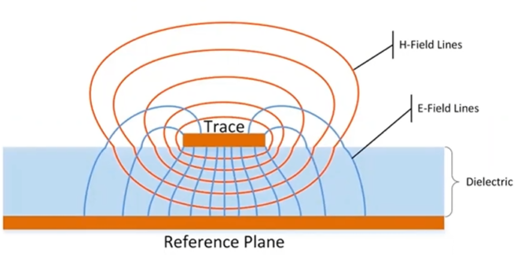

# Board Layout Guide

This is the second document that answers **"How?"** — the companion to the Architecture document, and follow up to the Schematic Design document. It covers the Printed Circuit Board (PCB) selection and layout rules for **OPNhydro**.

As in the Schematic Design document, the central problem remains **coexistence**.
- On one side: a pH probe measuring millivolt-level electrochemical potentials, an EC probe and an ESP32 that needs a clean analog supply. 
- On the other: three stepper drivers chopping current at 20–50 kHz, a buck converter switching at 1 MHz, and a solenoid valve.

After the PCB selection and general layout rules, we'll cover the different sections of the schematic.

## 1. PCB Selection and General Rules

### 1.1. From Circuit Theory back to Field Theory

Let's start by setting something straight. 

> "Electromagnetic (EM) field theory based on Maxwell's equations, is the fundamental description of electrical phenomena (fields, waves, radiation)."  -- Dr. Eric Bogatin [^Bogatin] and Kenneth Wyatts[^Wyatts].

**Circuit theory**, as we leared as undergrads, is a simplified, low-frequency (<100kHz) approximation. This model assumes that the physical size of the component is much smaller than the wavelength of the signal, allowing us to ignore wave propagation effects and use simple circuit laws, like Ohm's Law or Kirchhoff's laws.  

As signal rise times decrease (faster edges dI/dt) and PCB frequencies increase, the simple circuit theory assumptions fail, and **Field theory** (or transmission line theory) is required to account for radiation, retardation, and wave propagation. PCB layout shifts from simply drawing paths for current to designing transmission lines that contain EM fields, managing parasitic inductance/capacitance, and controlling radiated emissions (EMI).  Suddenly those physics classes about EM fields physics and transmission lines in particular are no longer reserved for the RF engineers, but become actual for PCB design.

### 1.2. The Energy travels through the Dielectric

> "Energy and signals travel in the spaces not the traces"  -- Ralph Morrison

In high-frequency PCB design, it is a common misconception that the signal "flows" inside the copper. In reality, the **copper traces and ground planes act as waveguides***, while **the energy** in the form of electromagnetic wave **travels through the dielectric material** (typically FR-4).

We all know that Flicking a light switch produces near instant light.
1. **Electrons** constantly move and collide with atoms at high speeds, but they are so tightly bound to the copper molecules, that their **drift velocity** (from source to destination) is about the speed of a snail — roughly **1 meter per hour**. At this speed, it would take hours for the light to turn on. 
2. **EM waves** travel with a speed that is eight orders of magnitude higher, about **150,000,000 meters per second**
$$
  \left.
    \begin{align*}
      v_p &= \frac{c}{\sqrt{\varepsilon_r}} \nonumber \\
      \rm{where\ } \varepsilon_r &\approx 4.2 \text{\ for\ FR-4}
    \end{align*}
  \right\} \Rightarrow v_p \approx \frac{c}{\sqrt{4.2}} \approx 15 \ \text{cm/ns}
$$

Since this is so counterintuitive, let's also look at an **analogy**:

1. When you throw a pebble into a still pond, it provides the initial energy.
2. The waves spread across the pond at ~8 km/h.  They carry the energy of your throw.
3. The water molecules stay in the same general area, just "sloshing" or vibrating to allow the wave to pass through them. A leaf floating on the water, willl just bobs up and down as the wave passes. It doesn't travel to the shore with the wave.

Now, imagine you have two parallel wooden planks floating on the surface of the pond. If you drop the pebble between them, the ripples are guided and forced to stay between the planks. The planks "contain" the energy and direct it.  Without the planks, the waves would spread out in every direction. 

### 1.2.1. EM fields are the Drivers

It is important to understand how the EM-wave propagates through the circuit board.
Signals and power transient **Fields** travel in the **Dielectric** at near light speed, while the conduction/displacement currents simultaneously flow back to the source at ~1cm/s.  The signal energy is in the fields, not in the copper!

The **Electric Field** starts on a positive charge and ends on a negative charge.  On a PCB it would start at the trace and end at the reference (ground) plane below it.  The Electric Field (E) is mainly concentrated between the trace and the return (ground) plane below it. If you only had a "forward" trace, the field lines would have nowhere to land. They would spray out into space (becoming an antenna).

The **Magnetic Field** loops around a current.  For high frequencies, the return path is directly underneath the trace. The forward current through the trace produces a magnetic field, and the return current produces an opposite magnetic field around part of the reference plane right under the trace.  Seen from a a distance the two magnetic fields cancel each other out, keeping the energy tightly "trapped" between the trace and the return path right below it.

As the wave travels forward through the dielectric, it **"drags"** a bunch of electrons along the forward trace. At the exact same time, it **"pushes"** an equal number of electrons in the opposite direction along the return plane.

The only reason a signal follows a trace is that the electrons in the copper react to the EM field and cancel it inside the metal. This "push-back" from the electrons is what forces the EM field to stay outside the wire and follow its path. We call that push-back 'current,' and we measure it with meters, but the real 'action' — the actual energy being delivered to your chip — is the field outside the wire. [^FEYNMAN]  This "push-back" from the electrons is what forces the EM field to stay outside the wire and follow its path.

[^FEYNMAN]: https://www.feynmanlectures.caltech.edu/II_13.html#:~:text=We%20have%20seen%20that%20there,then%2C%20produce%20a%20magnetic%20field.

The signal in the form of an E/M wave travels through the dielectric space between the trace and the reference plane.  The trace meerly serves as a wave guide, and guides the path of the signal energy.

>> When noisy and quiet signals share the same dielectric space, you can expect EMI, crosstalk from noise coupling, resulting in EMI failures.

Let me just say it again, and again, until it become more natural (to myself)
> The energy in a transmission line is not in the voltage or current, but in the electric (E) and magnetic (H) fields. E and H fields travel through the dielectric of the board, not through the copper.
The fields attach themselves to the copper trace and nearest plane and are steered (or guided) by that copper.  The the copper acts as a waveguide to move the energy from point A to point B. 

The wave-front moves through the dielectric at about 6 inch/ns in FR4.

low EMI rules
1. every signal trace needs an adjacent return plane (or trace)
2. Every power trace (or plane) needs an adjacent return path (trace or plane)
3. This includes return paths up/down through layers

If we allow fields from one circuit section A (motor control) to crosscouple with fields from circuit section B (analog) - this will lead to EMI, crosstalk and poor circuit performance.

**The typical stackup**

L1 signals
L2 Ground return plane
L3 power plane
L4 signals

This is also very high EMI risk.
- power and gnd are too far separated for good high frequency decoupling. Should be 2-3 mill max.
- signals in layer 4 are ferenced to power, rather than signal return. That is OK, if and only if, the power and return planes are tightly coupled together and with adequate decoupling capacitors.  Still wouldn't recommend it.
power and gnd separed by core distance

**Lower EMI four layer board stack up**

L1 Signals / Routed power
L2 Ground return plane
L3 Ground return plane
L4 Signals / Routed power

Prevent discontinuous signal return paths

Trace passing through two vias layers causes the wave to leak in between the reference planes.  May interfere with other signals in that space, and cause board edge radiation.  If the planes are the same potential, you can prevent this with nearby sticking vias between the ground planes.  If they are different potentials you can add stiching capacitance very close.

Segregating Functional Regions

1. keep analog traces away from motor control and digital sections
2. keep power conversions and motor control near the power entry point
3. all power and i/o connectors should be filtered and transient protected
4. all power and i/o connectors should be grouped together on one edge of the board, if possible for minimum EMI

Zl = 1 / j omega L
Xl = 1 / 2 pi f L

Z = ESR + Xc + Xl
the dip in |Z| is ESR

[^Bogatin]: https://www.oldfriend.url.tw/article/SI_PI_book/Signal%20and%20Power%20Integrity%20-%20Simplified_2nd_Eric%20Bogatin_Prentice%20Hall%20PTR_2010.pdf
[^Wyatts]: https://www.protoexpress.com/webinars/pcb-design-for-low-emi/?watch-now

1. Choose a stack-up
2. Partition circuit functons
3. Layout power plane
4. Place local decoupling caps
5. Route (minimize) clock traces
6. Route data & address
7. Check return paths
8. Route low-speed traces

### 1.5. PCB Guidelines

The PCB has two hard constraints that drive most of the other design decisions. First, the 4.7A peak current on the 24V rail requires copper heavy enough to carry that current continuously without excessive resistive heating. Second, the isolation moats around the pH and EC islands must be maintained through all four layers, which means the layer stack-up cannot be an afterthought.

The design specifies a **4-layer PCB with 2 oz copper on the outer layers**. The heavier copper on L1 and L4 keeps resistance and heat low on the high-current 24V traces. The two inner layers (L2 and L3) use standard 1 oz copper, which is sufficient for the ground and power planes they carry.

**Layer stack-up**

The layer assignment is not arbitrary — L2 is the EMI shield that separates the noisy switching circuits on L4 from the sensitive signal traces on L1.

Layer | Name   | Function                | Components
------|--------|-------------------------|--------------------------
L1    | Top    | Signal layer            | ESP32, LiDAR, I2C, UART, EZO, BNC
L2    | GND    | Solid ground plane      | One uninterrupted copper pour — the EMI shield
L3    | PWR    | Power planes            | Separate copper pours for 3.3V, 5V, and 24V
L4    | Bottom | High-current switching  | Stepper drivers, MOSFETs, 24V power traces

**Enclosure and mechanical**

The board targets a ~100 mm × 80 mm footprint, which fits standard off-the-shelf enclosures. Recommended specifications:

- **Enclosure:** IP65-rated ABS, approximately 150 × 100 × 70 mm. The IP65 rating keeps moisture and insects out of the electronics.
- **Cable glands:** Use glands for every wire entering the enclosure — probe cables, pump leads, and the PSU input.
- **BNC connectors:** Mount three panel-mount BNC connectors on the enclosure face for the pH, EC, and RTD probes. Panel-mount rather than PCB-mount prevents mechanical stress on the isolation islands if a probe cable is tugged.
- **PCB finish:** HASL (Hot Air Solder Leveling) is sufficient and lowest cost. ENIG (Electroless Nickel Immersion Gold) is a worthwhile upgrade for the fine-pitch SSOP-20 pads of the ADM3260.
- **Optional:** A clear lid panel allows status LED visibility without opening the enclosure.

**EMI Considerations**

### 1.5.1. Trace Widths

The trace widths can be calculated using the IPC-2221 empirical formula for external conductors.[^1]
[^1]: [IPC-2221 Trace Width Calculator, Altium PCB Design Guide](https://resources.altium.com/p/ipc-2221-calculator-pcb-trace-current-and-heating).

$$
    \begin{align}
    I  &= k × ΔT^{0.44} × A^{0.725} \\
    \rm{where\ \ } I &= \rm{current\ [A]} \nonumber \\
    k  &= 0.048 \rm{\ for\ outer\ layer,\ or\ } 0.024 \rm{\ for\ inner\ layer} \nonumber \\
    ΔT &= \rm{allowable\ temperature\ increase\ [°C]} \nonumber \\
    A  &= \rm{cross\ sectional\ area\ [mil²]} =  width_{mil} × thickness_{mil} \nonumber \\
   \rm{thickness_{mil}} &= 1.37\rm{mil\ for\ 1oz\ Cu,\ or\ } 2.74\rm{mil}\rm{\ for\ 2oz\ Cu} \nonumber 
\end{align}
$$

The table below uses a conservative $ΔT = 10°\rm{C}$ (IPC-2221 permits 20°C for most PCB classes). 

Net                     | Target Current    | Internal Trace Width | External Trace Width | Rationale
------------------------|-------------------|----------------------|----------------------|----------
24V input (PSU→TVS→RPP) | 6.5A (Peak)       | 5.0mm (200mil)       |  2.0mm (80mil)       | Reduce sag
24V main pump           | 1.2A (Continuous) | 1.0mm  (40mil)       |  0.4mm (15mil)       | Manage heat
24V each dosing pump    | 1.53A (Peak)      | 1.0mm  (40mil)       |  0.4mm (15mil)       | Lower inductance
24V ATO valve           | 0.3A (Peak)       | 0.2mm   (8mil)       |  0.2mm  (8mil)       | Fab minimum
5V rail (post-buck)     | 0.75A (Peak)      | 0.5mm  (20mil)       |  0.2mm  (8mil)       | Stable power
3.3V rail (post-LDO)    | 0.15A (Peak)      | 0.2mm   (8mil)       |  0.2mm  (8mil)       | Fab minimum

### 1.5.2. PCB Layout Strategy

- **Star Power**: Run a dedicated pair of 24V wires from your main power input connector directly to the stepper section, and a separate pair to the logic regulator. Do not "daisy chain" the power from the motors to the sensors.
- **Ground Plane:** Make sure you have an uninterrupted ground plane, to minimize current loops (inductance).
- **Ground Vias:** Give each ground connection its own via to the ground plane, so the impedance of the via doesn't cause the a sag parts nearby. (and no common impedance crosstalk)
- **Via Stitching:** If you must switch the 24V rail between layers, use multiple vias (at least 3–4 vias per 2A connection). A single standard 10-mil via is only rated for about 0.5A–1A before it acts like a fuse.
- **Antenna Support:** The ground plane should not extend under the ESP32-C6 antenna keep-out area to ensure proper wireless performance.
- **Analog/Digital Isolation:** The layout must keep analog traces physically isolated from switching power supplies and high-current motor traces.

## 2. Power Distribution Network (PDN)

Remember PDN are transmission lines, therefore require adjacent power return planes.  Can use the signal return, for as long as the power and signal don't share the same dielectic space.

Don't use ferrite chokes in the PDN, as we desire a low target impedance  throughout.  The exception might be filters for analog, RF or PLL circuits. 

---

## 3. I2C Sensors

---

## 4. Peristaltic Pump Drivers

---

## 5. Main Pump and Valve Drivers

---

## 6. Water Level Sensor and Switches

---

## 7. SoC, Test Points and Ficucials

