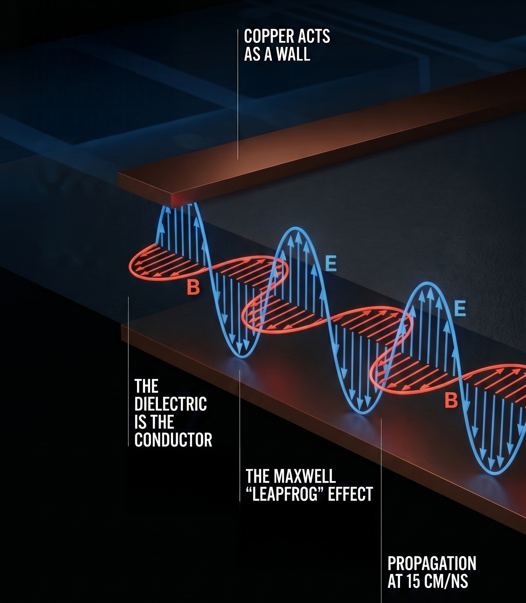
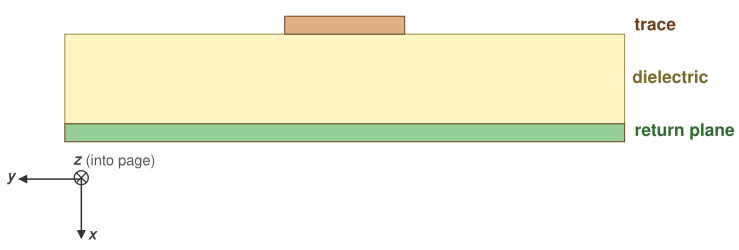
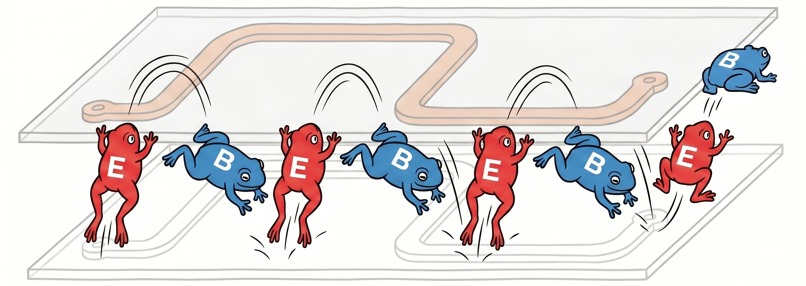
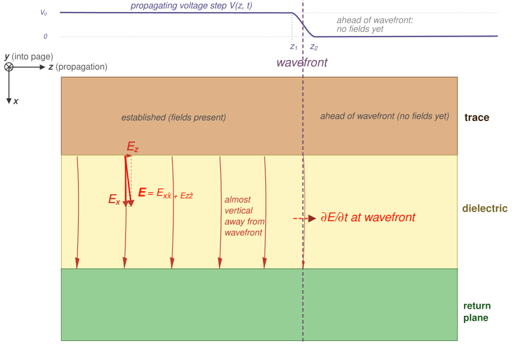
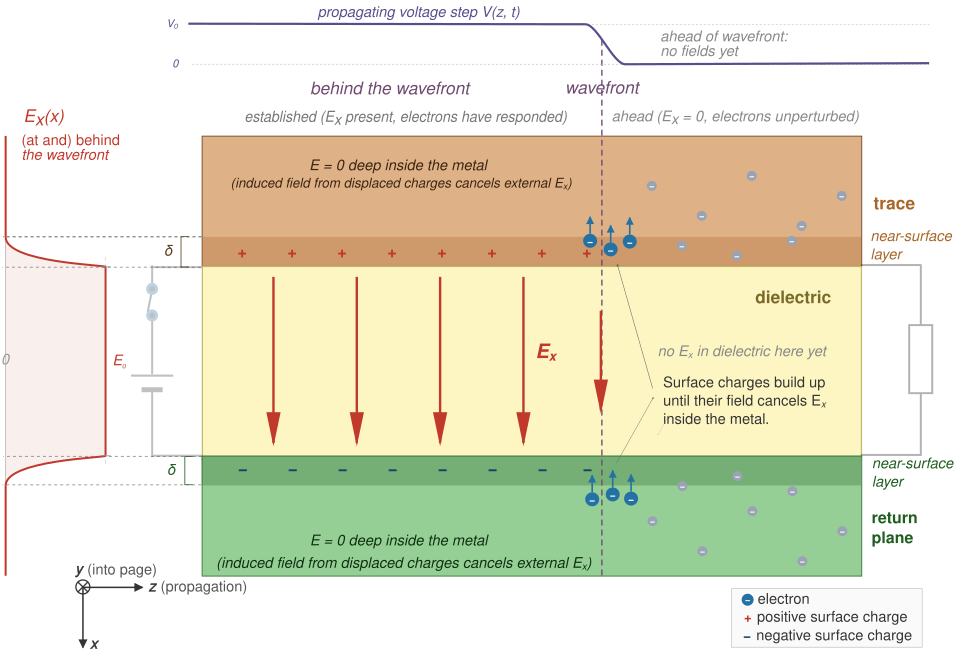
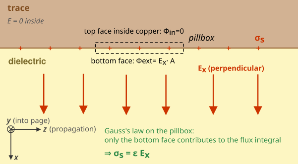
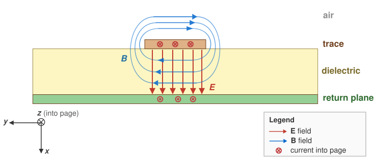
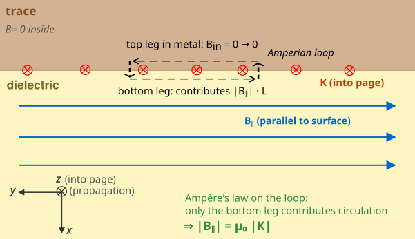
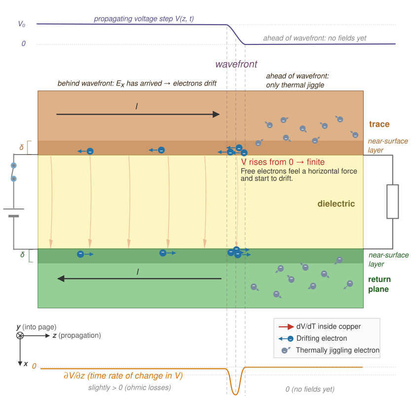
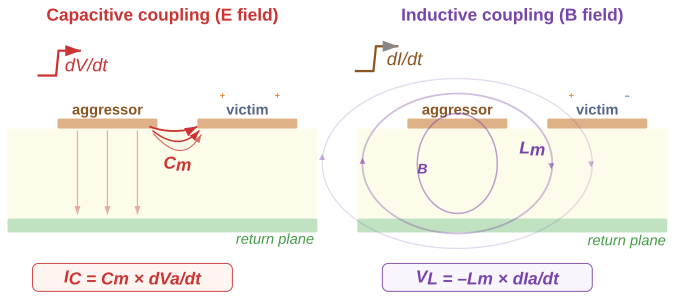

# Field Theory for PCB Design

**"Signal Integrity from First Principles"**

<figure>
  

  
  

</figure>

Modern high-speed electronic systems cannot be understood using lumped circuit models alone[^cantExplain]. As signal transition times decrease, the spatial extent of electromagnetic fields becomes comparable to the physical dimensions of PCB interconnects. Under these conditions, signal behavior is governed by the propagation of electromagnetic waves rather than by instantaneous circuit relationships.

Voltage and current remain useful quantities, but they are not fundamental. They arise from the underlying electric and magnetic fields, $\mathbf E$ and $\mathbf B$, which evolve in space and time according to Maxwell’s equations.
[^cantExplain]: Circuit theory cannot explain why a split in the ground plane causes a signal integrity problem, why energy travels in the dielectric rather than in the copper, or why crosstalk depends on field geometry rather than circuit topology.

A PCB trace together with its return path forms a transmission structure that guides electromagnetic energy. The conductors do not carry this energy in the conventional sense; instead, they establish boundary conditions that shape and confine the fields. The dominant portion of the signal energy resides in the dielectric region between conductors.

This field-based perspective provides a unified framework for understanding:
- signal propagation and transmission-line behavior
- crosstalk between adjacent traces
- power distribution network (PDN) transients
- electromagnetic interference (EMI) and radiation

Throughout this document, circuit models are used where appropriate, but always as approximations derived from the underlying field behavior.

Chapter 1 builds the field theory picture from first principles — starting with Maxwell's equations applied to a microstrip, and working through wave propagation, conductor response, rail collapse, crosstalk, and EMI. Chapter 2 translates that physics into concrete layout rules, stack-up choices and trace sizing.

 

---

 

## 1 Field Theory

> "Since the TTL days, there has been a four orders of magnitude change in the switching speed of transistors."  -- *Dan Beeker*
 

### 1.1 From Voltage Step to Electromagnetic Wave in the Dielectric

> "Energy and signals travel in the spaces not the traces"  -- *Ralph Morrison*

When a voltage step is applied to a PCB trace, it triggers the propagation of a coupled electromagnetic disturbance guided by the geometry of the conductors and the dielectric.

We examine how such a disturbance is created and how it propagates.
 

#### 1.1.1 Physical Setup

Consider a **microstrip** structure consisting of:
- a conducting trace,
- a return plane,
- a dielectric separating them.

<figure>
  

  
  <figcaption><i>Cross-section of the microstrip.</i></figcaption>
  

</figure>

We define a right-handed coordinate system ($\hat x \times \hat y = \hat z$):
- **$\hat x$:** from the trace down to the return plane (normal to the conductors, through the dielectric)
- **$\hat y$:** transverse to the trace (in the plane of the board, perpendicular to the trace direction)
- **$\hat z$:** direction of propagation

A voltage step is applied at one end of the trace. The central question is: 

What physical mechanism carries this signal forward?

 

#### 1.1.2 Governing Equations

The fields are governed by two of [Maxwell's equations](https://coertvonk.com/physics/electromagnetism/magnetism/materials-and-maxwells-equations-30453):
$$  
  \begin{align}  
    \nabla \times \mathbf E &= -\frac{\partial \mathbf B}{\partial t}
    \tag{\text{Faraday}}
    \\
    \nabla \times \mathbf B &=
    \mu\,\mathbf J
    +\ 
    \mu\,\varepsilon\, \frac{\partial \mathbf E}{\partial t}
    \tag{\text{Ampère-Maxwell}} 
  \end{align}
$$ 

where:
- $\mathbf E$ is the electric field vector at each point in space
- $\mathbf B$ is the magnetic field vector at each point in space
- $\mathbf J$ is the conduction current density
- $\mu$ and $\varepsilon$ are constants for the material

In the dielectric region:
- no free charges: $\rho = 0$
- no conduction current: $\mathbf J = \mathbf 0$

💡

In the dielectric the equations reduce to:
$$
  \begin{align*}
    \nabla \times \mathbf{B} &= \color{red}\cancel{\color{black}\mu \, \mathbf{J}} \color{black} + \mu\,\varepsilon \frac{\partial \mathbf{E}}{\partial t}
    \tag{\text{source-free Ampère-Maxwell}} \\
    \nabla \times \mathbf{E} &= -\frac{\partial \mathbf{B}}{\partial t}
    \tag{\text{Faraday}}
  \end{align*}
$$

These relations show that **time-varying electric and magnetic fields generate each other**.
 

#### 1.1.3 Intuitive Picture

  Now look — you've got a copper trace, and underneath it a big sheet of copper called the return plane. Between them, a thin slab of dielectric. That's it. That's the whole apparatus. And I want to tell you what happens when you flip a switch at one end and connect a battery.

  The instant you close the switch, there's a voltage between the trace and the plane. And whenever you have a voltage between two pieces of metal, there's an **electric field** between them. Bang — the field is just there, pointing from the trace down to the plane. Not in all of space, mind you — only right near the switch, because the rest of the trace hasn't heard the news yet.

  Now, here is where it gets interesting. The electric field went from zero to something. That's a change. And it turns out — and this is one of the most marvelous things in physics — that **a changing electric field makes a magnetic field**. Not "has a magnetic field associated with it." Makes one. Maxwell figured this out. The electric field changes in time, and a magnetic field curls up around it, right there in the dielectric.

  OK, so now we have a magnetic field. And it is also going from zero to something. It's changing in time too. And Faraday — long before Maxwell — figured out the other half of the story: **a changing magnetic field makes an electric field**. So the magnetic field we just made, by changing, makes another electric field — a little bit further along the trace than the one we started with.

  You see what's happening? The electric field made a magnetic field. The magnetic field made an electric field. The new electric field is further down the line. And now it is changing, so it makes another magnetic field, which makes another electric field, and off we go. The two fields are playing leapfrog[^LEAPFROG], and they're heading down the trace at an enormous speed.

  And how fast, exactly? In empty space these fields travel at the speed of light — that's what light *is*, by the way, the same kind of leapfrog. In the dielectric the fields go a little slower because the dielectric gets in their way. But still fast — about two-thirds the speed of light. Six inches in a nanosecond. *That's* how fast a signal really moves on your board.

  And that, really, is what every trace on every PCB is doing. It's not carrying electrons to some destination. It's guiding a little wave of energy. Isn't that something?

[^LEAPFROG]: In reality the two fields coexist at every point, but the "leapfrog" picture captures how each sustains the other.

<figure>
  

  
  

</figure>
 

#### 1.1.4 Wave Propagation Mechanism

<figure>
  

  
  <figcaption><i>Side-view of the wavefront propagating along the trace, with <b>E</b> pointing from trace to return plane.</i></figcaption>
  

</figure>

The intuition above pictures the wave as a sequence of E → B → E events. Maxwell's equations make this precise: a time variation at one point forces a spatial variation, and the wave's coherence comes from the two laws being applied everywhere simultaneously.

When a **voltage step** is applied to the trace:

1. An **electric field is established** ($\mathbf E$) between the trace and the return plane near the source. Because it rises from zero, it is **time-varying**.
 

2. From the Ampère–Maxwell law, a time-varying electric field produces a **magnetic field** ($\mathbf B$) along $\hat y$ (transverse to the trace). The strength of this field changes as you move along $\hat z$ — that means a little further along $z$, its value is rising from zero; it is **time-varying**.
 

3. According to Faraday's law, this time-varying magnetic field **forces a spatial gradient in $\mathbf E$** along $\hat z$. A little further down the line, $\mathbf E$ is rising from zero; it too is **time-varying**, and the disturbance has moved forward.[^leapfrogRigor]

Steps 2 and 3 continue throughout the structure. The result is not the transport of charge along the conductor, but the propagation of a **self-sustaining electromagnetic wave** that drives only local charge motion.

Two conditions are essential:
- **Temporal variation:** the fields change in time at each point.
- **Spatial variation:** the fields differ from one location to another.

Together, they enforce propagation.

💡A voltage step on a trace and return plane launches an electromagnetic wave in the dielectric.

[^leapfrogRigor]: The "a little further down the line" framing in steps 2 and 3 is the leapfrog picture — useful for intuition, slightly loose as physics. The rigorous version: Maxwell-Ampère couples $\partial \mathbf E/\partial t$ here to $\partial \mathbf B/\partial z$ here, and the wavefront constraint $\partial/\partial t = -v\,\partial/\partial z$ converts the time variation into a spatial one. Appendix A.1 derives this coupling from Maxwell-Ampère; Appendix A.3 derives the wavefront constraint.
 

#### 1.1.5 Wave Equation and Velocity

The $\mathbf{E}$-field wave equation follows when you combine Faraday's law, the source-free Ampère–Maxwell law and Gauss's law.

  
Expand if you ❤️ to see the derivation.

  Take the curl of Faraday's law
  $$
      \nabla \times (\nabla \times \mathbf E) = -\frac{\partial}{\partial t}(\nabla \times \mathbf B)
  $$

  Substitute the source-free Ampère–Maxwell into the right side
  $$
      \nabla \times (\nabla \times \mathbf E) = -\mu\,\varepsilon \frac{\partial^2 \mathbf E}{\partial t^2}
  $$

  Recall the vector identity
  $$
      \nabla \times (\nabla \times \mathbf E) = \nabla(\nabla \cdot \mathbf E) - \nabla^2\mathbf E
      \tag{\text{vector identity}}
  $$

  Expand the left side using this vector identity
  $$
      \nabla(\nabla \cdot \mathbf E) - \nabla^2\mathbf E = -\mu\,\varepsilon \frac{\partial^2 \mathbf E}{\partial t^2}
  $$

  Apply Gauss's law:
  $$
      \nabla \cdot \mathbf E = \frac{\rho}{\varepsilon}
      \tag{\text{Gauss}}
  $$

  In the source-free dielectric there are no charges ($\rho = 0$), so this becomes $\nabla \cdot \mathbf E = 0$. The first term vanishes, leaving:
  $$
      -\nabla^2 \mathbf E = -\mu\,\varepsilon\, \frac{\partial^2 \mathbf E}{\partial t^2}
  $$

  Or equivalently, the wave equation:
  $$
      \nabla^2 \mathbf E = \mu\,\varepsilon\, \frac{\partial^2 \mathbf E}{\partial t^2}
  $$

 

💡

Combining Faraday and Ampère-Maxwell yields the standard wave equation
$$
    \nabla^2 \mathbf E = \underbrace{\mu\,\varepsilon}_{1/v^2} \,\frac{\partial^2 \mathbf E}{\partial t^2}
$$

In this we recognize the generic wave equation for any quantity propagating at speed $v$:

$$
    \nabla^2 f = \frac{1}{v^2} \ \frac{\partial^2 f}{\partial t^2}
    \tag{\text{generic wave}}
$$

Comparing the two, term by term, gives the wave speed $v$:

💡

The propagation speed is only determined by material properties
$$
  v = \frac{1}{\sqrt{\mu \, \varepsilon}}
$$

where:
- $v$ is the wave speed
- $\mu$ is the permeability of the material
- $\varepsilon$ is the permittivity of the material 

  
Expand to ❤️ how this gives the speed of light.

  In vacuum, the permeability constant $\mu = \mu_0$, and the permittivity constant $\varepsilon = \varepsilon_0$.
  $$
    \left\{
      \begin{align*}
        \mu_0 &= 4\pi \times 10^{-7} \text{ H/m} \\
        \varepsilon_0 &= 8.854 \times 10^{-12} \text{ F/m}
      \end{align*}
    \right.
  $$

  Substituting these constants:
  $$
      v = \frac{1}{\sqrt{4\pi \times 10^{-7} \times 8.854 \times 10^{-12}}} \approx 299.8 \times 10^6 \text{ m/s}
  $$

  That is the speed of light $c$ — derived entirely from electric and magnetic constants.

 

**In the dielectric** in a microstrip, the medium is not homogeneous (fields exist in both dielectric and air), and the mode is quasi-TEM rather than pure TEM. The propagation velocity (call it $v'$) is therefore determined by an **effective permittivity $\varepsilon_{\text{eff}}$**, so $\varepsilon = \varepsilon_{\text{eff}}\,\varepsilon_0$. The effective value is smaller than the bulk relative permittivity because part of the field is in air. For typical FR-4 microstrip ($\varepsilon_{\text{eff}} \approx 3.5$; bulk FR-4 has $\varepsilon_r \approx 4.3$):
$$
    v' = \frac{1}{\sqrt{4\pi \times 10^{-7} \times 3.5 \times 8.854 \times 10^{-12}}} \approx 16 \text{ cm/ns}
$$
 

#### 1.1.6 Interpretation

The signal does not propagate as a moving charge. The wave is the spatial pattern of $\mathbf E$ and $\mathbf B$ advancing through the dielectric, with the conductor surfaces forming the boundary that guides it. Energy resides in the dielectric volume, not in the copper.

For design, this reframes what a trace actually is. A trace is not a wire that carries current — it is one wall of a guiding structure whose other wall is the return plane. The integrity of the wave depends on what happens between those two walls. If the dielectric, the trace, and the return plane together form a clean boundary, the wave propagates undisturbed. If any one of them is compromised — a slot in the return plane, an abrupt change in dielectric, a missing return via, an unmatched termination — the wave is disrupted, and the signal pays the price.

§1.2 examines what the conductors actually do to make this work: not transporting energy, but enforcing the boundary conditions that let the wave exist at all.
 

#### 1.1.7 Summary

A voltage step launches an electromagnetic wave that propagates in the dielectric, guided by the trace and its return plane. The propagation velocity is determined by material properties — about 16 cm/ns for FR-4 microstrip. The conductors do not carry the signal; they shape the boundary that lets the wave exist.
 

---

 

### 1.2 Conductor Response: Surface Charge and Current

Section 1.1 established that signal propagation occurs as an electromagnetic wave in the dielectric. The conductors do not transport the signal energy; instead, they respond to the incident fields and enforce the boundary conditions required for the wave to exist.

💡

**The wave is primary; the conductor response is a consequence.** The wave in the dielectric drives surface charge and surface current on the copper. Those surface quantities exist because Maxwell's equations require them at the boundary — not because they carry the signal.

The **free electrons** in the conductor respond in two forms:
- **surface charge**, associated with the electric field
- **surface current**, associated with the magnetic field

Both arise directly from Maxwell’s equations.
 

#### 1.2.1 Intuitive Picture

  So put it all together:
  - The wave is in the dielectric.
  - The *down-field* from the wave shoves electrons around on the copper surfaces. Those electrons build a wall that keeps the wave trapped in the dielectric.
  - The *along-field* from the wave pushes other electrons along the trace, giving you the little current you measure with your ammeter.

  And here's a small puzzle. Once the wavefront has passed your section, the wall of charge is built — fine, that's what walls do. But the *current* keeps flowing. Why? Because the wavefront is still out there ahead of you, still building walls farther down the line, and it needs charge to do it. The current through your already-charged section is feeding the section in front of you — like water in a pipe still flowing because somebody downstream is still drinking. And the copper isn't perfect, by the way: there's a tiny residual along-field left at the surface paying the resistive toll, so the wave gets a little weaker as it goes.

  The wave is the boss. The electrons are the help. And what the electrons do — the thing we call "current" — is not how the energy gets from here to there. The energy is out in the dielectric, in the fields. The current is just the electrons reacting to the field, the same way a line of dominoes reacts to the first push. The dominoes aren't transporting the energy down the line — the *falling pattern* is. And on a PCB, the falling pattern is the field.

  You can also say this without ever mentioning an electron. The wave's $\mathbf E$ and $\mathbf B$ exist right up to the surface of the copper, but inside the copper they have to be zero — that's what good conductors do. So there's a jump at the surface, and nature does not allow that for free: wherever the perpendicular $\mathbf E$ has a jump, there must be **charge** to account for it; wherever the parallel $\mathbf B$ has a jump, there must be **current**. The metal has no choice. You can read off the surface charge and the surface current *purely from what the field is doing in the dielectric* — no forces, no electron motion, no kinetics. The electrons just sign the ledger.

  And that's really all there is to it. The hard part is believing it.

> Translating into formal terms: 
> - "down-field" → normal $E_x$ (perpendicular to the conductor surfaces);
> - "along-field" → longitudinal $E_z$ (along the direction of propagation).

 

#### 1.2.2 Electric Field at the Conductor Boundary

In a microstrip, the electric field in the dielectric has two components:
- a dominant **normal** component $E_x$, perpendicular to the conductor surfaces (along the dielectric thickness)
- a smaller **longitudinal** component $E_z$, along the direction of propagation

<figure>
  

  
  <figcaption><i>Side-view: $E_x$ (normal, dominant) and $E_z$ (longitudinal, small) components of the microstrip electric field.</i></figcaption>
  

</figure>

These components produce distinct physical effects at the conductor surface.
 

#### 1.2.3 Surface Charge Formation (driven by $E_x$)

As the wavefront reaches a section of the conductor, the normal electric field $E_x$ rises from zero to a finite value.

This field exerts a force on the **free electrons**:
- *in the trace*, electrons move away from the dielectric-facing surface.
- *in the return plane*, electrons move toward the dielectric-facing surface.
<figure>
  

  
  <figcaption><i>Microstrip Ex confinement.</i></figcaption>
  

</figure>

This redistribution produces:
- **positive surface charge** on the underside of the trace
- **negative surface charge** on the top of the return plane

The system rapidly reaches a local equilibrium in which:
- The *net field inside the conductor is driven to zero*, because the surface charges generate their own electric field that opposes the external field.
- The *external field is confined to the dielectric*, since the electric field cannot extend into the conductor.
 

##### Boundary Condition

Following the more intuitive discussion above, here's the formal version.

  
Expand if you ❤️ to see the derivation

  Imagine a conductor with a surface charge density $\sigma_s$ (charge per unit area) and normal vector $\hat n$ that points perpendicular to the conductor surface. To find the electric field just outside the surface, we place a very thin, small, cylindrical Gaussian "pillbox" so that it straddles the conductor surface.
  <figure>
    

    
    <figcaption><i>Side-view close-up of pillbox straddling the trace/dielectric boundary.</i></figcaption>
    

  </figure>

  Gauss's law in integral form states that the net electric flux through any closed surface ($S$) is directly proportional to the total electric charge ($Q_{enc}$) enclosed within that surface.

  

  $$
      \oint_S \mathbf E \cdot d\mathbf a = \frac{Q_{enc}}{\varepsilon} \tag{\text{Gauss}}
  $$
  
 

  where $d \mathbf{a}$ is an infinitesimal vector element of the surface area, pointing outwards normal to the surface.

  A key property of a conductor in electrostatic equilibrium is that the electric field $\mathbf {E}$ inside the conducting material is zero, so the inside area doesn't contribute. With the height $h \to 0$, the side areas do not contribute either. This implies that the only flux passing through the pillbox comes from the bottom face.
  $$
    \begin{align*}
      \oint_{out} \mathbf E \cdot (A \hat n) &= \left( \mathbf{E} \cdot \hat n \right) A = \frac{Q_{enc}}{\varepsilon} \tag{$d\mathbf{a_{out}}=A\hat n$} \\
      \Rightarrow
      \varepsilon \left(\mathbf{E}\cdot\hat n \right)A &= Q_{enc} \tag{$Q_{enc} = \sigma_s A$}
    \end{align*}
  $$

  The enclosed charge is $Q_{enc} = \sigma_s A$
  $$
      \varepsilon \left(\mathbf{E}\cdot\hat n \right) \bcancel{A} = \sigma_s \bcancel{A}
  $$

  $\mathbf{E}\cdot\hat n$ is the component of the field normal to the surface ($E_x$):
  $$
      \varepsilon\, E_x = \sigma_s
  $$

 

💡

The relationship between surface charge density and the electric field follows from Gauss’s law:
$$
    \sigma_s = \varepsilon\, E_x
$$

where:
- $\sigma_s$ is the surface charge density (in C/m2).
- $E_x$ is the electric field just outside the conductor.

This surface charge distribution is not arbitrary. It is exactly the distribution required to:
- cancel the field inside the conductor
- confine the external field to the dielectric

Thus, **the conductor shapes the electric field** through the formation of surface charge.
 

#### 1.2.4 Surface Current (driven by $\mathbf B$ and $E_z$)

This section presents two views of the surface current — the same two arguments the intuition foreshadowed:
1. Given a magnetic field at the surface, what current must exist? ($\mathbf B \to \mathbf K$) — the formal "$\mathbf B$-jump → current" boundary argument.
2. How does current get established as the wave propagates? ($E_z \to \mathbf J$) — the dynamical "along-field pushes electrons" picture.
 

##### Magnetic Field $\mathbf B$ drives the need for a Surface Current

The magnetic field associated with the propagating wave is tangential to the conductor surface. Maxwell’s equations require that this field be supported by current at the boundary.

When the magnetic field from the trace tries to enter the return plane, it induces [eddy currents](https://coertvonk.com/physics/electromagnetism/magnetism/motional-emf-30242) that create their own opposite magnetic field. This prevents the magnetic field $\mathbf{B}$ from entering. The return plane is electrically large and a good conductor, so the field cannot escape underneath it either; it has no other choice but to **loop tightly around the trace** in the dielectric above.
<figure>
  

  
  <figcaption><i>Cross-section of the microstrip. <b>B</b>-field curls around the trace.</i></figcaption>
  

</figure>

  
Expand if you ❤️ to see the derivation

  Zooming in on a small section of the trace/dielectric boundary, we see that the wave's $\mathbf B$ field is tangential to the trace surface. 
  <figure>
    

    
    <figcaption><i>Cross-section close-up of Amperian loop straddling the trace/dielectric boundary.</i></figcaption>
    

  </figure>

  Imagine a tiny rectangular "Amperian loop" straddling the bottom surface of the copper. Two sides — represented by the displacement vector $\mathbf L$ — run parallel to the surface (one inside the copper, one outside). Two sides of height $h$ run perpendicular to the surface.

  As we shrink the height $h \to 0$, the perpendicular sides contribute nothing. Inside the conductor, $\mathbf{B}_{in} = 0$. Therefore, the total path integral comes entirely from the outside leg:
  $$
    \oint \mathbf{B} \cdot d \mathbf{l} = \mathbf{B}_{out} \cdot \mathbf{L}
  $$

  The current passing through this loop is the surface current density $\mathbf K$ (amps per meter) crossing the loop, integrated along $\mathbf L$:
  $$
    I_{enc} = \mathbf K \cdot \mathbf L
  $$

  (Both $\mathbf B_{out}$ and $\mathbf K$ end up parallel to $\mathbf L$ along the outside leg, so each dot product reduces to a magnitude product $B_{out}\,L$ and $K\,L$.)

  Recall Ampère's law in integral form:
  

  $$
    \oint \mathbf{B} \cdot d\mathbf{l} = \mu\, I_{enc}
  $$
  

  Substitute $\oint \mathbf{B}\cdot d\mathbf{l}$ and $I_{enc}$ in Ampère's law:
  $$
    \begin{align*}
      \mathbf{B}_{out} \cdot \mathbf{L} &= \mu \left( \mathbf K \cdot \mathbf L \right) \\
      \Rightarrow\quad B_{out}\,\bcancel{L} &= \mu\, K\,\bcancel{L} \\
      \Rightarrow\quad \mathbf K &= \frac{1}{\mu}\,(\hat n \times \mathbf B_{\text{out}}) = \frac{1}{\mu}\, |\mathbf B_{\text{out}}|\, \hat z & \text{(right-hand rule)}
    \end{align*}
  $$ where $\hat n$ is the outward normal from the conductor. 

 

💡

Ampère's law forces a surface current [^sCurrent] in the propagation direction:
$$
    \mathbf K = \frac{B_y}{\mu}\,\hat z
$$

where:
- $\mathbf{K}$ is the surface current in A/m
- $B_y$ is the transverse component of the magnetic field at the boundary

[^sCurrent]: $\mathbf K$ and $\sigma_s$ are **surface** densities — the boundary counterparts of the volume densities $\mathbf J$ (A/m², current per cross-sectional area) and $\rho$ (C/m³, charge per volume). In a *perfect conductor*, all the response squeezes into an infinitely thin layer at the surface, so the volume densities formally become delta-functions and the meaningful quantities are $\sigma_s$ (C/m²) and $\mathbf K$ (A/m).

This shows that:
- the **magnetic field determines the surface current**
- the current is not an independent driver, but a response to the field

In real conductors, this current is distributed over a thin layer of thickness equal to the **skin depth**, where the fields penetrate slightly into the material. The skin depth $\delta$ is approximately 2 μm in copper at 1 GHz (see Appendix A.4).

For a real conductor, the surface-current approximation $\mathbf K \approx \mathbf J \cdot \delta$ holds for as long as $\delta \ll d$, where $d$ is the thickness of the conductor.

 

##### Longitudinal Electric Field $E_z$ establishes the Surface Current

While the previous result expresses a boundary condition, the current must also be established dynamically as the wave propagates.

At the wavefront, the voltage varies rapidly with position, changing from full intensity behind the wave to zero ahead of it. This produces a longitudinal electric field ($E_z$):
$$
  E_z = - \frac{\partial V}{\partial z}
$$

<figure>
  

  z.">
  <figcaption><i>Side-view: Current at the wavefront, driven by Ez.</i></figcaption>
  

</figure>

This field drives electron drift along the conductor, giving rise to **conduction current**:
- *in the trace*, electrons drift opposite to the direction of propagation
- *in the return plane*, electrons drift in the direction of propagation

This is the dynamic mechanism by which the current required by the magnetic field boundary condition is created.
 

##### Charge–Current Coupling (Continuity)

As the wavefront advances:
- surface charge builds up on newly reached sections
- current flows to supply this charge

Surface charge and current are linked by the Continuity Equation, a fundamental law in physics that expresses the conservation of charge.
$$
  \nabla\cdot \mathbf J + \frac{\partial \rho}{\partial t} = 0
  \tag{Continuity}
$$

In surface form:
$$
  \nabla_s \cdot \mathbf K + \frac{\partial \sigma_s}{\partial t} = 0
$$

  
Expand if you ❤️ to see the derivation

  The surface divergence operator $\nabla_s\cdot$ takes derivatives only in directions tangent to the surface — for our trace surface with normal $\hat x$, that's $\hat y$ and $\hat z$:
  $$
    \left(
    \frac{\partial K_y}{\partial y} + \frac{\partial K_z}{\partial z} \right)
    + \frac{\partial \sigma_s}{\partial t} = 0
  $$

  Surface current $\mathbf{K}$ only exists in the $z$-direction ($\mathbf{K} = K_z \hat z$), so we can rewrite this as:
  $$
    \bcancel{\frac{\partial K_y}{\partial y}}
    + \frac{\partial K_z}{\partial z}
    + \frac{\partial \sigma_s}{\partial t} = 0
  $$

  Recall the expression for the surface current $\mathbf K$ from the previous section:
  

  $$
    \mathbf K = \frac{B_y}{\mu}\,\hat z
  $$
  

  As we saw, $\mathbf{K}$ exists only in the $+z$-direction:
  $$
    K_z = \frac{B_y}{\mu}
  $$

  At the wavefront, $\sigma_s$ is ramping from zero to $\varepsilon E_x$ as the wave passes, so $\partial K_z/\partial z \neq 0$ — the current converges into the section to deposit the new charge.

  Because the wave moves at speed $v$, the field follows the form $E_x(z-vt)$. This **wavefront constraint** links a *change in time* to a *change in space*:
  $$
    \frac{\partial E_x}{\partial t} = -v\, \frac{\partial E_x}{\partial z}
  $$

  So $\partial/\partial t = -v\,\partial/\partial z$ for any field quantity. Apply that to surface charge conservation:
  $$
      \frac{\partial K_z}{\partial z} = v\,\frac{\partial \sigma_s}{\partial z}
  $$

  Integrate along $z$ on both sides. Both $K_z$ and $\sigma_s$ vanish ahead of the wavefront, so the integration constant is zero, leaving:
  $$
      K_z = v\,\sigma_s
  $$
  The surface current and surface charge are locked together by the wave speed.

 

💡

For a uniformly propagating wave, this leads to:
$$
  K_z = v\,\sigma_s
$$

where:
- $K_z$ is the longitudinal component of the surface current (along the propagation direction)
- $v$ is the propagation speed
- $\sigma_s$ is the surface charge density

This relation holds for a traveling wave and expresses that:
- surface charge and current move together
- both are part of the same propagating field structure
 

#### 1.2.5 Behavior Behind the Wavefront

Once the wavefront has passed:
- the normal field ($E_x$) becomes steady
- the longitudinal field ($E_z$) becomes small but nonzero (to sustain current against resistive losses in the conductor)

The surface charge at a given section is established once the wave has passed, but **current continues** through that section to supply the wavefront still advancing ahead.
 

#### 1.2.6 Interpretation

The conductor does not carry the signal in the conventional sense. Instead:
- **surface charge** enforces electric-field boundary conditions
- **surface current** sustains the magnetic field
- **electron motion is local**, responding to the passing wave

The signal itself remains a propagating electromagnetic field.

For design, this means surface charge and surface current are *consequences* of the wave, not independent variables. They cannot be controlled directly — they are whatever the wave demands at the boundary. Controlling them therefore reduces to controlling the wave's geometry: the trace shape, the dielectric thickness, the continuity of the return plane. Every layout decision that follows in chapter 2 is a way of shaping the wave so the conductor response stays clean and predictable. The next two sections build on this: §1.3 shows that the same wave that drives surface current also produces displacement current in the dielectric, closing the magnetic-field loop; §1.4 shows that growing or reshaping a current loop costs energy, and that this cost is what limits how fast a chip can switch.
 

#### 1.2.7 Summary

The response of a conductor to a propagating electromagnetic wave consists of:
- surface charge determined by the electric field
- surface current determined by the magnetic field

These quantities are fully constrained by Maxwell’s equations and are not independent drivers of signal propagation.
 

---

 

### 1.3 Sources of the Magnetic Field

Sections §1.1 and §1.2 established that signal propagation is an electromagnetic wave in the dielectric, and that the conductors respond through surface charge and current. We here examine a fundamental question:

> **What sustains the magnetic field as it spans both dielectric and conductor regions?**

<figure>
  

  
  <figcaption><i>Cross-section of the microstrip. <b>B</b>-field curls around the trace.</i></figcaption>
  

</figure>

#### 1.3.1 Intuitive Picture

  You might think the magnetic field comes from the current in the copper — and that’s true, but only part of the story.

  Between the trace and the return plane, there’s no current flowing in the usual sense. But the electric field there is changing as the signal moves. And a changing electric field produces a magnetic field just as surely as a current does.

  So the magnetic field doesn’t start and stop at the copper. It wraps around the trace, passes through the dielectric, and closes on itself as a continuous structure.

  The current in the copper and the changing field in the dielectric are just two ways of sustaining the same magnetic field.

  If you tried to remove the displacement current term, the field would have nowhere to go — it would break at the boundary. Maxwell added that term so the field could remain whole.

 

#### 1.3.2 Sources of the Magnetic Field

The magnetic field is governed by the Ampère–Maxwell equation:

$$
    \nabla \times \mathbf B =
    \mu \, \mathbf J 
    \;+\;
    \mu\,\varepsilon\, \frac{\partial \mathbf E}{\partial t}
    \tag{Ampère–Maxwell}
$$

This identifies two sources:
- **conduction current $\mathbf J$**
- **displacement current $\varepsilon\frac{\partial\mathbf{E}}{\partial t}$**
 

#### 1.3.3 Region-Dependent Contributions

In different regions different terms dominate:

In the **conductor** (§1.2)[^k2j]:
- $\mathbf E \approx 0$ inside
- displacement current is negligible
- magnetic field is sustained by **conduction current $\mathbf J$**

In the **dielectric** (§1.1):
- $\mathbf J = 0$
- magnetic field is sustained by the **displacement current $\varepsilon\frac{\partial\mathbf{E}}{\partial t}$**

[^k2j]: The surface current $\mathbf K$ from §1.2 is just $\mathbf J$ integrated across the skin-depth layer where the current flows.
 

#### 1.3.4 Continuity Across the Interface

The governing equation is valid everywhere; only the dominant source term changes between regions.

The magnetic field forms a single continuous solution across the structure, even though:
- it is supported by conduction current in the conductor
- it is supported by displacement current in the dielectric

At the boundary, the tangential magnetic field is consistent with the required surface current. Without the displacement current term, $\nabla \times \mathbf B$ would have a jump at the dielectric boundary — Maxwell added that term precisely so the field could remain whole, as §1.3.1 put it.

**Closed current loop.** The continuity of the field is mirrored by a continuity of the *current* itself. Conduction current in the trace, displacement current in the dielectric, and conduction current in the return plane form one closed loop, required by the divergence-free constraint $\nabla \cdot \left(\mathbf J + \varepsilon\,\partial \mathbf E/\partial t \right) = 0$:

- forward in the trace (along $+\hat z$)
- across the dielectric in $+\hat x$ at the leading edge of a positive pulse (as $\mathbf E$ grows)
- back in the return plane (along $-\hat z$)
- across the dielectric in $-\hat x$ at the trailing edge (as $\mathbf E$ decays)

The trace and the return plane act like the plates of a propagating capacitor: conduction in the metal, displacement in the dielectric, conduction back. The two source terms are not parallel mechanisms — they are complementary segments of one continuous current loop.
 

#### 1.3.5 Interpretation

The magnetic field is not confined to the conductor. It is a continuous field spanning both dielectric and conductor regions. Conduction current and displacement current are not separate phenomena; they are two contributions to the same electromagnetic field.

💡

**Reconciling §1.2 and §1.3.** §1.2 said "$\mathbf B$ determines $\mathbf K$"; §1.3 says "$\mathbf J$ sustains $\mathbf B$." These are not in conflict, and together they are the formal resolution of §1.3.1's "only part of the story." Maxwell-Ampère, $\nabla \times \mathbf B = \mu \mathbf J + \mu\varepsilon\,\partial \mathbf E/\partial t$, is an *identity* relating $\mathbf B$, $\mathbf J$, and $\partial \mathbf E/\partial t$ at every instant — none of the three is "the cause" of the others. The causal story is the one from §1.2: the wave in the dielectric is primary, and it drives the surface currents. Once those currents exist, Maxwell-Ampère bookkeeping requires them (together with the displacement current) to source the same continuous $\mathbf B$ field that drove them in the first place.

For design, the closed-loop view is the one that matters. The loop's geometry sets its inductance — that's what §1.4 turns into a design lever (rail collapse, decoupling, stack-up). Break the conduction return (a slot in the plane, a missing return via) or break the displacement-current path (an abrupt change in dielectric) and the loop opens up — the fields stop cancelling at a distance, and the failure modes of §1.5 (crosstalk) and §1.6 (EMI) follow directly.
 

#### 1.3.6 Summary

The magnetic field around a PCB trace is sustained by conduction current in the conductors and displacement current in the dielectric — together forming a single closed loop. Both terms are required by Maxwell's equations; neither alone is sufficient.
 

---

 

### 1.4 Power Distribution Network and Rail Collapse

The power distribution network (PDN) supplies the electromagnetic energy that active devices need to support changing current and voltage.

> **The central question: when a chip switches, where does the energy come from, and why isn't it always there in time?**
 

#### 1.4.1 Intuitive Picture

  You ask the circuit for current right now.

  But current isn’t just charge moving — it’s a magnetic field wrapped around a path. And that field has to grow if the current grows. The bigger the path, the more field there is to grow — geometry matters.

  Growing a magnetic field takes energy, and it takes time. The supply can’t instantly reshape the field everywhere in the power network — the news has to travel from the chip to the supply and back, at the speed of light in the dielectric. Fast, but for sub-nanosecond logic, still not fast enough.

  So what happens? The device pulls what it can locally, and the voltage dips. That’s rail collapse.

  The decoupling capacitor is sitting right there with energy already stored in its electric field. It doesn’t need to wait. It hands over the charge immediately while the rest of the system catches up.

  The whole event is a negotiation between electric and magnetic fields trying to reconfigure themselves fast enough to meet the demand.

 

#### 1.4.2 Voltage Drop and Inductance

When a device switches, it requires a rapid increase in current. This corresponds to an increase in the magnetic field surrounding the current loop, with energy
$$
  W_L = \tfrac{1}{2} \, L \, I^2
$$
where $L$ is the inductance of the loop. Increasing current requires increasing this stored magnetic energy, and that energy has to be delivered through the PDN. The cost is a voltage drop:

$$
  \Delta V = L \, \frac{dI}{dt}
$$

If the voltage drop is large enough — what designers call **rail collapse** — the chip misinterprets logic levels or produces timing errors.
 

#### 1.4.3 Field Interpretation

The circuit relation $\Delta V = L\,dI/dt$ is the macroscopic shadow of a field-level event. The chip's switching current flows in a loop — out the supply pin, through the bond wires, package leads, PCB power and ground planes, and back. That loop has a magnetic field threaded through it, with energy density $\tfrac{1}{2}\mathbf B^2/\mu$ stored throughout the volume the loop encloses.

When the chip demands more current, the $\mathbf B$ field everywhere in that loop must grow. Two field-level constraints make this hard:

- **Energy delivery is wave-rate-limited.** The energy has to travel from the supply to the chip, and the supply only "knows" about the demand once it reaches it. Both legs are bounded by the speed of light in the dielectric ($\approx 15$ cm/ns in FR-4) — a 5 cm path is already $\approx 300$ ps round-trip, comparable to the rise time of fast logic.
- **A growing $\mathbf B$ field induces an opposing $\mathbf E$ field** (Faraday). This back-EMF appears as a voltage drop across the loop's inductance and subtracts from the rail at the chip pin.

The decoupling capacitor sidesteps both. Its electric field already stores energy locally — $W_C = \tfrac{1}{2}\,C\,V^2$, in the dielectric between its plates, millimeters from the load. The cap doesn't need to grow a $\mathbf B$ field across a long loop; it just releases stored $\mathbf E$-field energy through a much shorter path. The smaller the loop from cap to load, the smaller its inductance, and the less back-EMF the demand produces.

This swap — the cap's $\mathbf E$-field reservoir feeding the growing $\mathbf B$-field around the demand loop — is the "negotiation between electric and magnetic fields" the §1.4.1 intuition named. Every time the chip switches, an $\mathbf E$-field somewhere has to give up energy so a $\mathbf B$-field somewhere can grow.

Rail collapse is therefore the price the chip pays for these two constraints. The design levers that fight back are **minimize loop inductance** and **shorten the distance to local energy reservoirs**.
 

#### 1.4.4 Example

A typical microcontroller might switch 100 mA in 1 ns. A 5 mm trace between a poorly placed decoupling capacitor and the chip presents about $L = 5\,\text{nH}$ of parasitic inductance:
$$
  \Delta V = 5\,\text{nH} \cdot \frac{100\,\text{mA}}{1\,\text{ns}} = 500\,\text{mV}.
$$

A 500 mV dip on a 3.3 V rail is enough to upset logic levels on most chips. The lever is brutally simple: shorten the path.
 

#### 1.4.5 Summary

Rail collapse is the gap between how fast a chip's current loop demands $\mathbf B$-field energy and how fast the supply can deliver it. The two design levers — both turned into concrete rules in §2.1 — are minimizing loop inductance (tight power/return coupling, short via paths, continuous return planes) and placing local $\mathbf E$-field reservoirs (decoupling capacitors) close enough to the load that the speed-of-light round-trip stays under the chip's rise time.
 

---

 

### 1.5 Crosstalk

Crosstalk arises from interaction between electromagnetic fields associated with different conductors.

A time-varying signal produces electric and magnetic fields that extend into space. If another conductor lies within this field, it becomes part of the system.
 

#### 1.5.1 Intuitive Picture

Look. Two traces on a board, side by side. One of them is doing something — call it the *aggressor*, that's the standard name. The other is just sitting there, minding its own business. Call it the *victim*. Because in a moment, that's what it is.

Here's the trouble. When you draw the aggressor on your schematic, you picture its field as a neat little package tucked between the trace and the return plane underneath. But fields don't care about your schematic. Maxwell tells them where to go, and Maxwell says fields *spread*. Most of the energy stays where you want it, sure — but some of the electric field bulges sideways into the dielectric, and some of the magnetic loops swing out wider than the trace itself. The fields are leaky. They don't have to be. They just are.

And the victim is sitting right there in the leak. It didn't ask to be. The field doesn't ask permission.

When the aggressor's *voltage* swings, the electric field changes everywhere — including over the victim. And what does a changing electric field do to a piece of metal? It pushes charge around. So charge moves on the victim. That's **capacitive coupling**. The two traces, whether you wanted it or not, *are* a capacitor.

When the aggressor's *current* swings, the magnetic field changes everywhere — including through the little loop the victim makes with its own return path. And what does a changing magnetic field do to a loop? It drives a current around it, in the direction that *opposes the change* — Lenz's law, nature being stubborn about being pushed around. That's **inductive coupling**. The two trace-loops, whether you wanted it or not, *are* a transformer.

So far, both effects just add up. But here's the puzzle: they don't add up the same way at both ends of the victim.

The capacitive current splits and travels *both* ways down the victim. The inductive current, because of Lenz, flows only *one* way — backward, toward the aggressor's source.

So at the near end (the end nearest the source), both effects push the same way and they *reinforce*. **Near-end crosstalk** — substantial. At the far end, they push opposite ways and they *fight*. **Far-end crosstalk** — on a uniform line, almost cancels. Same physics. Opposite sign. Depends on which end you put your probe.

And once you see it, crosstalk stops looking like two circuits sneaking signals at each other. It's *one* electromagnetic field sloshing around between the aggressor and its return — and a second piece of copper that, through no fault of its own, found itself sitting where the field happens to be. Move the copper. Or confine the field. The fields never cared about your circuits to begin with.

> TO DO: remove the next paragraph.  They Intuition section already covers this

A signal trace does not contain its fields perfectly. When it switches, its electric and magnetic fields extend into the surrounding space. If another conductor is placed within that space, it becomes part of the field system: the changing electric field moves charge on it, and the changing magnetic field induces a voltage along it.

Crosstalk is therefore not an interaction between circuits, but between fields and conductors.

#### 1.5.2 Geometry and Field Overlap

Consider two parallel microstrip traces above a common return plane:
- the **aggressor** trace carries a time-varying signal
- the **victim** trace is initially quiet

As a voltage step propagates along the aggressor, it generates:
- an electric field $\mathbf E$ between trace and return plane;
- a magnetic field $\mathbf B$ looping around the trace.

These fields are not perfectly confined to the region directly beneath the aggressor. A portion extends laterally into the surrounding dielectric. If the victim trace lies within this region, it is exposed to both fields:

Each produces a different coupling mechanism — and both are direct consequences of Maxwell's equations.

<figure>
  

  
  <figcaption><i>Cross-section: Capacitive coupling (<b>E</b> field fringing between traces) and inductive coupling (<b>B</b> field threading the victim loop).</i></figcaption>
  

</figure>
 

#### 1.5.3 Capacitive Coupling (electric field)

The electric field terminates partly on the neighboring conductor, creating **mutual capacitance**.

  
Expand if you ❤️ to see the derivation.

  Imagine two parallel traces on a PCB:
  - Trace 1 (Aggressor): has a time-varying voltage $V(t)$
  - Trace 2 (Victim): is affected by the electric field of Trace 1.
  - $C_m$ (Mutual Capacitance): The capacitance between Trace 1 and Trace 2.

By definition, the charge $Q$ induced on the victim trace due to the potential on the aggressor trace is proportional to the mutual capacitance: 

  $$
    Q = C_{m}\cdot V_{1}
  $$

From the Continuity Equation ($\nabla \cdot \mathbf{J} + \frac{\partial \rho}{\partial t} = 0$), we know that a change in charge over time results in a flow of current. Taking the time derivative of the charge equation:
$$
  \frac{dQ}{dt} = \frac{d}{dt}(C_m V_1) 
$$

The current $I$ is defined as the rate of flow of charge ($I=\frac{dQ}{dt}$).

💡

A time-varying voltage on the aggressor produces a time-varying electric field. This induces surface charge on the victim trace, resulting in current:
$$
    I_C = C_m \ \frac{dV}{dt}
$$ where:
- $I_C$ is the current in the victim trace
- $C_m$ is the mutual capacitance
- $V$ is the voltage on the aggressor

Characteristics:
- proportional to the voltage transition rate $dV/dt$
- depends on the strength and spatial extent of the electric field
- increases with closer spacing, longer parallel runs and weaker field confinement
 

#### 1.5.4 Inductive Coupling (magnetic field)

The changing current in the aggressor generates a changing magnetic field. Part of this field links the loop formed by the victim trace.

  
Expand if you ❤️ to see the derivation.

  By Faraday’s law, the changing magnetic flux induces an electric field:
  $$
      \nabla \times \mathbf{E} = -\frac{\partial \mathbf{B}}{\partial t} 
      \tag{\text{Faraday}}
  $$

  Integrate Faraday's law over the open surface $S$ of the victim loop:
  $$
    \iint_S (\nabla \times \mathbf{E}) \cdot d\mathbf{a} = -\iint_S \frac{\partial \mathbf{B}}{\partial t} \cdot d\mathbf{a}
  $$

  Using Stoke's Theorem, we convert the surface integral of the curl of $\mathbf E$ into a line integral of $\mathbf E$ around the closed boundary loop $C$.
  $$
    \oint_C \mathbf{E} \cdot d\mathbf{l} 
    = - \frac{d}{dt} \iint_S \mathbf{B} \cdot d\mathbf{a}
  $$

  The term on the left, $\oint_C \mathbf{E} \cdot d\mathbf{l}$, is the definition of electromotive force or **induced voltage** $V_{ind}$.

  The surface integral on the right is the definition of magnetic flux ($\Phi_m$) passing through the loop:
  

  $$
    \Phi_m = \iint_S \mathbf{B} \cdot d\mathbf{a}
  $$
  

  This simplifies the relationship to:
  $$
    V_L = - \frac{d\Phi_m}{dt}
  $$

  The magnetic flux ($\Phi_m$) threading through the victim loop is physically created by the current $I_a$ in the aggressor loop. Because the relationship is linear for most materials, we define **Mutual Inductance ($L_m$) as the ratio of flux to current.
  $$
    \Phi_m \triangleq L_m I_a 
  $$ where $L_m$ "hides" the geometry (distance, height and length) into a single constant.

  Finally, we substitude and the definition of flux
  $$
    V_L = - \frac{d(L_m I_a )}{dt}
  $$

 

💡

The changing magnetic flux creates an induced field that opposes the change that created it. The induced voltage:  
$$
  V_L = - L_m\frac{dI}{dt}
$$ where:
- $V_L$ is the induced voltage on the victim trace
- $L_m$ is the mutual inductance between the two trace-return-plane loops.
- $I$ is the current in the aggressor trace.

 It depends on how much of the aggressor's $\mathbf B$ field threads through the victim's loop — set by the physical distance between traces, the height above the return plane, and the length of the parallel run.

Characteristics:
- proportional to the rate of change of the aggressor's current $dI/dt$
- depends on loop geometry and magnetic flux linkage
- increases with larger loop area and weaker return-path control
 

#### 1.5.5 Combined Effect

This is the reinforce-vs-fight asymmetry that the §1.5.1 intuition foreshadowed. Formally:

The capacitive and inductive coupled signals arrive at the victim differently:

- **Capacitive coupling** injects current into the victim trace. That current splits and travels in both directions — toward the near end and the far end. Both ends see a pulse of the same polarity as the aggressor.

- **Inductive coupling** induces a current that opposes the aggressor's current (Lenz's law). That current flows toward the near end, producing a pulse of the same polarity as the aggressor there, and a pulse of opposite polarity at the far end.

The total induced signal is the sum of capacitive and inductive contributions.

In uniform transmission lines:

- **Near-End Crosstalk (NEXT)** appears closest to the aggressor's source. The capacitive and inductive components have the same polarity — they reinforce. 

- **Far-End Crosstalk (FEXT)** appears at the far end. The capacitive and inductive components have opposite polarity — they partially cancel.
 

#### 1.5.6 Design Implications

Crosstalk depends on field overlap and geometry:
- **Trace spacing:** increasing separation reduces field overlap
- **Dielectric thickness:** reducing height to the return plane improves confinement
- **Return path continuity:** uninterrupted reference planes prevent field spreading
- **Loop area:** minimizing the *aggressor's* loop reduces the $\mathbf B$ field generated; minimizing the *victim's* loop reduces the flux it captures. Both levers reduce magnetic coupling.
 

#### 1.5.7 Summary

Crosstalk is the result of electromagnetic fields from one conductor interacting with another. It arises from:
- electric-field coupling (mutual capacitance)
- magnetic-field coupling (mutual inductance)

Both are direct consequences of Maxwell’s equations. As §1.5.1 put it: there is one shared electromagnetic field, and the victim is a conductor that found itself in the wrong place. Every layout decision that follows in §2 either reduces the field's reach or reduces the victim's overlap with it.
 

---

 

### 1.6 Electromagnetic Interference (EMI)

Signal integrity asks whether the field arrives at the receiver correctly; EMI asks whether the field arrives somewhere it should not.

In a properly designed transmission structure, the electromagnetic fields associated with a signal are largely confined to the region between the signal conductor and its return path. This confinement minimizes interaction with the surrounding environment.

EMI occurs when electromagnetic fields are no longer confined to their intended region, allowing energy to couple into other structures or radiate into free space.

Thus, EMI is not a separate phenomenon, but a direct consequence of how well the electromagnetic field is contained by the geometry.
 

#### 1.6.1 Intuitive Picture

  Here's a thing about your PCB trace that nobody tells you. It is, secretly, an antenna. It always was.

  Because what's a trace, really? A piece of metal carrying a current. And what's an antenna? A piece of metal carrying a current. The difference between the two is whether the field stays put.

  When you do everything right — trace tight to its return plane, return path continuous, loop area small — the field *does* stay put. The forward-going field around the trace and the backward-going field around the return current cancel each other out at any reasonable distance. A meter from the board, it's like the trace isn't even there. The wave runs happily down the line, the receiver is happy, and nothing leaks.

  But break the containment — *anywhere* — and the cancellation fails. A slot in the return plane. A long via transition without a return via. Power and ground too far apart. Whatever it is, the return current can't stay underneath the signal. It detours. The loop opens up. The forward and backward fields no longer have anyone to cancel against.

  And what do unconfined fields do? They don't sit around politely. They propagate. They've always wanted to propagate — that's what fields do — and now nothing's holding them in. The wave that was supposed to travel from your driver to your receiver is *also* traveling sideways, outward, into your enclosure, into the air, into the next room. At the speed of light. In every direction. And the bigger the loop you accidentally opened up, the more of the wave is getting out.

  Here's the scary part. The radiated power scales as the *square* of the loop area, and the *fourth* power of frequency. Double the frequency: sixteen times more radiation. Quadruple the loop area: another sixteen times. Both at once: 256 times. That's why this hurts more every year — switching speeds keep going up, and the physics doesn't.

  And once you see this, EMI stops looking like a separate failure mode. It's crosstalk where the victim is *very far away*. Same loose fields. Same Maxwell. Same return-path discipline. You're either keeping the field where you put it, or you're not. And if you're not, sooner or later the field is going to find somebody it doesn't belong to.

#### 1.6.2 Field Confinement

To make the intuition above precise: in a well-designed structure, the signal's electric and magnetic fields stay tightly localized between the trace and its return plane. The forward field around the trace and the backward field around the return current cancel at any reasonable distance — the structure looks neutral from outside, even though it carries significant power inside.

Three geometric conditions deliver this confinement:
- a continuous reference plane directly under the signal layer
- minimal trace-to-plane distance, so the field is squeezed into a small dielectric volume
- minimal loop area, set by the area enclosed between the forward signal current and its return current

The continuous return plane is the load-bearing element. It allows the return current to localize directly under the signal, which is what keeps the loop small. When all three conditions are met, little energy escapes, coupling to other conductors is minimal, and radiation is weak.
 

#### 1.6.3 Loss of Confinement

When the geometry conditions of §1.6.2 are violated, the fields must expand to satisfy Maxwell's equations. Common causes:
- gaps or splits in reference planes
- changes of reference layer without a close return via
- long via transitions that separate signal and return
- large separation between power and ground conductors

In each case, the return current cannot remain directly under the signal. It detours; the loop opens up; the forward and backward fields no longer have anyone to cancel against. The magnetic field spreads outward, and the electric field extends further into the surrounding space.

This expansion has two visible consequences. The **electric-field expansion** increases capacitive coupling to nearby conductors — felt by neighbors close enough to be in the bulging $\mathbf E$ field. The **magnetic-field expansion** increases mutual inductance with nearby loops, and at a distance becomes radiation into free space. Crosstalk and EMI are therefore the same failure mode at different ranges: both result from a loop that opened up further than the design intended.
 

#### 1.6.4 Radiation

The expanded loop is an antenna.

💡

For a small loop (perimeter ≪ $\lambda$), the radiated electric field $E$ is proportional as [^EMCLOOP]
$$
    E_{rad} \;\propto\; \frac{f^2 \, A \, I}{r}
$$ where:
- $f$ is the frequency of the signal
- $A$ is the loop area
- $I$ is the loop current
- $r$ is the distance
[^EMCLOOP]: Derived from the magnetic dipole radiation formula. The full expression includes constants ($\mu_0$, $c$), but the proportionality to $f^2$, $A$, and $I$ captures the design levers.

The scaling is sharp. Radiated *power* goes as $f^4 A^2$ — doubling the frequency multiplies power by 16, and quadrupling the loop area another 16. This is why edge rates and unintended loop area dominate EMC budgets at modern switching speeds.
 

#### 1.6.5 Summary

EMI arises when electromagnetic fields extend beyond their intended region. Field confinement depends on a continuous, nearby return path and a small loop area. When the loop opens — from a plane discontinuity, a stray via, or a sloppy stack-up — the fields expand. At short range, the expansion shows up as crosstalk; at long range, as radiated emission. Controlling the geometry of the return path is the primary lever for both.
 

---

---

 

## 2 From Physics to Layout

Chapter 1 established that signals propagate as electromagnetic waves guided by conductor geometry, with energy residing primarily in the dielectric. Voltage and current are derived quantities that reflect the behavior of the underlying fields.

This chapter translates those results into practical PCB design decisions.

The central principle is:

> **PCB layout controls electromagnetic field geometry.**

Design rules presented in this chapter follows from one of four physical mechanisms:
- disruption of wave propagation (signal integrity)
- insufficient energy delivery (PDN behavior)
- field overlap (crosstalk)
- loss of field confinement (EMI)
 

### 2.1 PCB Design Rules

Everything in §1.1 through §1.5 leads to a single conclusion: the signal energy travels as an EM wave through the dielectric, guided by the copper boundaries. The trace is one wall, the return plane is the other. The copper confines the field ($E_x$ cancellation), the dielectric carries it forward (displacement current), and the return current in the return plane provides the equal-and-opposite $\mathbf B$ that prevents radiation (field cancellation at a distance).

When that field structure breaks down, the consequences fall into four categories: degraded signal quality on a single net (reflections, ringing), rail collapse in the power distribution network (§1.4), crosstalk between adjacent nets (§1.5), and radiated EMI (§1.6). Every PCB layout rule exists to prevent one or more of these — by keeping the field confined, the return path intact, and the coupling between unrelated fields to a minimum.
 

#### Signal Quality

A signal traveling along a trace is an EM wave guided by the trace and its return plane. Anything that disrupts the wave's propagation — an impedance discontinuity, a missing return path, a stub — causes part of the energy to reflect back toward the source. The reflected wave interferes with the forward wave, producing ringing, overshoot, and timing uncertainty on the net.

**Rule 1a — Maintain a continuous return plane.** The $\mathbf B$ field from the forward current in the trace and the return current in the plane cancel at a distance, keeping the energy confined. A continuous plane provides a nearby, low-impedance return path, so the current loop is small and the fields close tightly around the trace. Interrupt the plane — a slot, a cutout, a missing pour — and the return current detours, the loop area grows, the impedance changes, and the wave partially reflects.

<figure>
  

  
  <figcaption><i>Trace crossing a gap in the return plane. (Courtesy: Kenneth Wyatt)</i></figcaption>
  

</figure>

> "Forget the word ground. Every signal has a return path. Think return path and you will train your intuition to look for and treat the return path as carefully as you treat the signal path." -- Eric Bogatin

**Rule 1b — Provide return vias at layer transitions.** When a trace passes through a via, the EM wave transfers between layers. The wave is not just the trace — it is the field between the trace and its reference plane. If the return plane changes (say, from L2 to L3), the return current must also transition. Without a nearby ground via, the return path detours, the loop area grows, and the wave leaks between the return planes — causing both reflections on the signal net and interference with other signals in that space.

<figure>
  

  
  <figcaption><i>Trace passing through two planes with via. (Courtesy: Kenneth Wyatt)</i></figcaption>
  

</figure>

If the planes are the same potential, prevent leakage with nearby stitching vias between them. If they are different potentials, place stitching capacitors as close to the signal via as possible.

**Rule 1c — Keep every signal and power layer one dielectric away from a return plane.** The wave's confinement weakens as the trace moves away from its return — fields spread laterally, the loop area grows, and the characteristic impedance becomes ill-defined. Every routing layer needs a return plane in the immediately adjacent dielectric (no skipping a layer). This constraint is what drives the stack-up choice in §2.2.
 

#### Crosstalk

Both coupling mechanisms — capacitive ($C_m$, from overlapping $\mathbf E$ fields) and inductive ($L_m$, from overlapping $\mathbf B$ fields) — depend on how much of the aggressor's field volume overlaps with the victim's. Every mitigation strategy reduces that overlap.

**Rule 2a — Increase trace spacing.** The fringing $\mathbf E$ field that causes capacitive coupling falls off roughly as $1/d$ with distance, and the $\mathbf B$ field that causes inductive coupling (Ampère's law) falls off at a comparable rate. The 3W rule (center-to-center spacing of at least 3× the trace width) is a practical approximation of this. For critical traces (analog sensors, clocks), use $5W$.

**Rule 2b — Minimize parallel run length.** Both $C_m$ and $L_m$ are proportional to the length over which two traces run in parallel. The coupling is cumulative — every millimeter of shared dielectric adds to the total. Where two sensitive traces must be routed near each other, cross them at 90° rather than running them in parallel.

**Rule 2c — Reduce trace height above the return plane.** The closer a trace is to its return plane, the more tightly the $\mathbf E$ and $\mathbf B$ fields are confined directly underneath. Less field energy spills sideways into the neighboring trace's volume.

**Rule 2d — Interpose a return plane between signal layers.** A grounded conductor between two signal layers terminates $\mathbf E$ field lines from traces above (Gauss's law — the lines land on the return plane instead of reaching the layer below) and provides a local return path that contains the $\mathbf B$ field, blocking inter-layer coupling.

**Rule 2e — Separate functional domains.** Motor control traces and analog sensor traces must not share the same dielectric space. Keep traces on adjacent layers perpendicular to each other to minimize the parallel run length between layers.
 

#### Rail Collapse

Every time a chip switches, it draws a sharp current pulse from the power rail. That pulse passes through the inductance of the power distribution network, producing a voltage drop $\Delta V = L_{\text{PDN}} \times \frac{dI}{dt}$. The goal is to minimize the PDN inductance across the full frequency range over which the chip draws current. Three levers reduce that inductance: tight coupling between power and return planes (small loop area), local energy reservoirs (decoupling caps close to the load), and continuous return paths (no detours that enlarge the loop).

**Rule 3a — Tightly couple power and return planes.** A power plane and return plane separated by a thin dielectric (2–3 mil) form a parallel-plate capacitor with very low inductance. This provides broadband decoupling across the entire board area — the EM field between the planes can supply current before the discrete capacitors or the regulator can respond. This design uses two GND planes (L2, L3) with power routed as traces rather than a dedicated plane, so broadband plane decoupling is achieved through discrete capacitors instead (see §2.2).

**Rule 3b — Use multiple, low-inductance decoupling capacitors.** A single capacitor has parasitic lead and via inductance that limits its effectiveness above its self-resonant frequency. Multiple smaller capacitors in parallel reduce the effective inductance (inductances in parallel divide). Place them as close to the chip's power pins as physically possible — every millimeter of trace adds inductance.

**Rule 3c — Minimize power and ground lead length in packages.** The inductance of the bond wires and package leads between die and PCB is often the dominant contributor to $L_{\text{PDN}}$ at high frequencies. Packages with multiple, short power and ground pins (QFN, BGA) have lower inductance than those with long leads (SOIC, DIP).

**Rule 3d — Rely on on-chip decoupling for the highest frequencies.** Above ~100 MHz, no external capacitor can respond fast enough — the path inductance from capacitor to die is too high. Modern ICs include on-die decoupling for this reason. The PCB designer's job is to keep $L_{\text{PDN}}$ low at the frequencies below that.
 

#### EMI — Radiated Emissions

EMI is not a separate problem — it is the consequence of every other problem listed above. When a return path is broken, the $\mathbf B$ fields stop cancelling and the loop radiates. When crosstalk couples energy onto an unintended trace, that trace becomes an unintentional antenna. When a rail collapses, the transient current loop radiates at the switching frequency and its harmonics.

**Rule 4a — Minimize loop area.** Every current — signal, power, return — forms a loop. The radiated power from a loop is proportional to the loop area squared and to the fourth power of frequency: $P_{\text{rad}} \propto A^2 f^4$. Keep traces close to their return planes. Use ground vias at every layer transition. Route power close to its return.

**Rule 4b — Contain the fields at board edges.** EM fields that reach the edge of the PCB can radiate freely — there is no conductor to confine them. Pull traces and pours back from the board edge by at least 20× the dielectric thickness (the 20H rule). Place return plane stitching vias along the board perimeter to create a continuous shield.

**Rule 4c — Filter at I/O boundaries.** Every cable attached to the board is a potential antenna. Place filtering (ferrite beads, capacitors, common-mode chokes) at the point where signals enter or leave the board, before the field has a chance to propagate onto the cable.

 

---

 

### 2.2 PCB Stack-up

The PCB has two hard constraints that drive most of the other design decisions. First, the 6.5 A peak current on the 24 V input rail requires copper heavy enough to handle that current without excessive resistive heating. Second, the isolation moats around the pH and EC islands must be maintained through all four layers, which means the layer stack-up cannot be an afterthought.

The **typical 4-layer stack-up** is SIG/GND/PWR/SIG. This design does not use it for two reasons. First, the power and return planes would be separated by the full core distance — too far apart for effective high-frequency decoupling (2–3 mil max is needed). Second, signals on Layer 4 would be referenced to the power plane rather than GND, which only works if the power and return planes are tightly coupled with adequate decoupling capacitors.

Instead, we opt for the **Low EMI 4-layer stack-up** as shown below.

Layer | Name   | Function                         | Components
------|--------|----------------------------------|--------------------------
L1    | Top    | Sensitive signals / routed power | ESP32, LiDAR, I2C, UART, EZO, BNC, 3V3/5V power traces
L2    | GND    | Ground return plane              | Primary return reference for L1 signals
L3    | GND    | Ground return plane              | Primary return reference for L4 signals
L4    | Bottom | Noisy signals / routed 24V power | Stepper drivers, MOSFETs, 24V power traces

<figure>
  

  
  <figcaption><i>Lower EMI in 4-layer PCB. (Courtesy: Kenneth Wyatt)</i></figcaption>
  

</figure>

 

---

 

### 2.3 PCB Materials

The design specifies a **4-layer PCB with 2 oz copper on the outer layers**. The heavier copper on L1 and L4 keeps resistance and heat low on the high-current 24V traces. The two inner layers (L2 and L3) use standard 1 oz copper, which is sufficient for the return planes they carry.

**PCB finish:** HASL (Hot Air Solder Leveling) is sufficient and lowest cost for the packages used in this design (SSOP-20 at 0.65 mm pitch and larger). ENIG (Electroless Nickel Immersion Gold) is only worth the premium if a future revision adds true fine-pitch parts (QFN/LGA at 0.5 mm or below, or BGA).

---

### 2.4 Segregating Functional Regions

The board layout separates functional domains to minimize coupling between noise sources and sensitive circuits:

- Keep the BNC-to-EZO analog links and the EZO-to-MCU serial lines away from motor control and digital switching sections.
- Place power conversion (buck converter) and motor control (TMC2209 drivers) near the power entry point, so high-current loops stay short.
- Filter and transient-protect all power and I/O connectors at the board boundary.
- Group all power and I/O connectors along one edge of the board where possible, to contain cable radiation (Rule 4c).

---

### 2.5 Enclosure and Mechanical

The board targets a ~100 mm × 80 mm footprint, which fits standard off-the-shelf enclosures. Recommended specifications:

- **Enclosure:** IP65-rated ABS, approximately 150 × 100 × 70 mm. The IP65 rating keeps moisture and insects out of the electronics.
- **Cable glands:** Use glands for every wire entering the enclosure — probe cables, pump leads, and the PSU input.
- **BNC connectors:** Mount three panel-mount BNC connectors on the enclosure face for the pH, EC, and RTD probes. Panel-mount rather than PCB-mount prevents mechanical stress on the isolation islands if a probe cable is tugged.
- **Optional:** A clear lid panel allows status LED visibility without opening the enclosure.

### 2.6 Trace Widths

The trace widths can be calculated using the IPC-2221 empirical formula for PCB conductors.[^1]
[^1]: [IPC-2221 Trace Width Calculator, Altium PCB Design Guide](https://resources.altium.com/p/ipc-2221-calculator-pcb-trace-current-and-heating).

$$
    \begin{align}
    I  &= k \times \Delta T^{0.44} \times A^{0.725} \\
    \rm{where\ \ } I &= \rm{current\ [A]} \nonumber \\
    k  &= 0.048 \rm{\ for\ outer\ layer,\ or\ } 0.024 \rm{\ for\ inner\ layer} \nonumber \\
    \Delta T &= \rm{allowable\ temperature\ increase\ [°C]} \nonumber \\
    A  &= \rm{cross\text{-}sectional\ area\ [mil²]} =  width_{mil} \times thickness_{mil} \nonumber \\
   thickness_{mil} &= 1.37 \rm{\ mil\ for\ 1oz\ Cu,\ or\ } 2.74 \rm{\ mil\ for\ 2oz\ Cu} \nonumber 
\end{align}
$$

The table below uses a conservative $\Delta T = 10^\circ\mathrm{C}$ (IPC-2221 permits 20°C for most PCB classes). The inner-layer widths assume 1 oz copper; the outer-layer widths assume 2 oz copper per §2.3. Power nets are routed on the outer layers in this stack-up (§2.2), so the inner-layer column is reference-only — a 200 mil inner trace at 1 oz carries only ~3.9 A, which is **not** sufficient for the 6.5 A peak on the 24 V input. If any power net must be routed internally, treat the external-column width as a floor and widen further to compensate for the 1 oz inner copper.

Net                     | Target Current    | Internal Trace Width | External Trace Width | Rationale
------------------------|-------------------|----------------------|----------------------|----------
24V input (PSU→TVS→RPP) | 6.5A (Peak)       | N/A†       |  2.0mm (80mil)       | Reduce sag
24V main pump           | 1.2A (Continuous) | 1.0mm  (40mil)       |  0.4mm (15mil)       | Manage heat
24V each dosing pump    | 1.53A (Peak)      | 1.0mm  (40mil)       |  0.4mm (15mil)       | Peak current headroom
24V ATO valve           | 0.3A (Peak)       | 0.2mm   (8mil)       |  0.2mm  (8mil)       | Fab minimum
5V rail (post-buck)     | 0.75A (Peak)      | 0.5mm  (20mil)       |  0.2mm  (8mil)       | Stable power
3.3V rail (post-LDO)    | 0.15A (Peak)      | 0.2mm   (8mil)       |  0.2mm  (8mil)       | Fab minimum

† Inner-layer routing cannot carry 6.5 A at 1 oz copper within any practical trace width. This net must remain on an outer layer.

### 2.7 PCB Layout Strategy

- **Star power distribution** — Run a dedicated pair of 24V traces from the power entry connector directly to the stepper section, and a separate pair to the logic regulator. Do not daisy-chain power from the motors to the sensors.
- **Via stitching for high-current transitions** — When the 24V rail transitions between layers, use at least 3–4 vias per 2A connection. A single standard 10 mil via carries only 0.5–1A before excessive heating.
- **Decoupling capacitor placement** — Place bulk capacitors (10–100 µF) within 10 mm of each power pin cluster. Place high-frequency bypass capacitors (100 nF ceramic) within 2 mm of the chip power pin they serve, with vias dropping straight to the return plane. Route the capacitor's return via before the signal via — current must flow through the capacitor, not around it (Rule 3b).
- **Isolation moat continuity** — The pH and EC islands require unbroken isolation moats through all four layers (§2.2). No trace, pour, or via may cross the moat except the designated serial links, which must bridge the gap with adequate creepage. Verify moat integrity in the fabrication output for every layer.
- **Board-edge clearance** — Pull all traces and copper pours back from the board edge by at least 20× the dielectric thickness (Rule 4b). On the OPNhydro stack-up, this is approximately 1.5 mm. Place return-plane stitching vias along the board perimeter at ≤5 mm intervals.
- **Antenna keep-out** — The return plane must not extend under the ESP32-C6 antenna keep-out area to ensure proper wireless performance.

 

---

 

## Appendix A: More Math for Curious Readers

### A.1 Ampère-Maxwell law Couples Time Variation of E to Spatial Variation of B

For the wavefront traveling in the $+\hat z$ direction, at a place in between the trace and the return plane, we can apply some simplifications:
1. The magnetic field does not vary along $x$ or $y$, so all $\partial/\partial x$ and $\partial/\partial y$ vanish.
2. The magnetic field points in the $\pm\hat y$-direction, so $B_x = B_z = 0$.

Since there is no current $\mathbf{J}$ in the dielectric, the law simplifies to:
$$
    \nabla \times \mathbf{B} 
    = \mu\, \varepsilon \frac{\partial \mathbf{E}}{\partial t}
$$

Expand the curl ($\nabla \times \mathbf B$) operator, do a Laplace expansion for the matrix determinant:
$$
  \begin{align*}
    \nabla \times \mathbf{B} 
    &= \mu\, \varepsilon \frac{\partial \mathbf{E}}{\partial t} \\
    \Rightarrow
    \begin{vmatrix}
      \hat x & \hat y & \hat z \\
      \frac{\partial}{\partial x} & \frac{\partial}{\partial y} & \frac{\partial}{\partial z} \\
      B_x & B_y & B_z
    \end{vmatrix} 
    &= \mu\, \varepsilon \frac{\partial \mathbf{E}}{\partial t} \\
    \Rightarrow
    \hat x
    \begin{vmatrix}
      \frac{\partial}{\partial y} & \frac{\partial}{\partial z} \\
      B_y & B_z
    \end{vmatrix}
    - \hat y
    \begin{vmatrix}
      \frac{\partial}{\partial x} & \frac{\partial}{\partial z} \\
      B_x & B_z
    \end{vmatrix}
    + \hat z
    \begin{vmatrix}
      \frac{\partial}{\partial x} & \frac{\partial}{\partial y} \\
      B_x & B_y
    \end{vmatrix}
    &= \mu\, \varepsilon \frac{\partial \mathbf{E}}{\partial t} \\
    \Rightarrow
    \left(\frac{\partial B_z}{\partial y} - \frac{\partial B_y}{\partial z}\right) \hat x
    - \left(\frac{\partial B_z}{\partial x} - \frac{\partial B_x}{\partial z}\right) \hat y       
    + \left(\frac{\partial B_y}{\partial x} - \frac{\partial B_x}{\partial y}\right) \hat z
    &= \mu\, \varepsilon \frac{\partial \mathbf{E}}{\partial t} \\
  \end{align*}
$$

From the assumptions, we know that the field strength only changes as the wave travels down the line → $\frac{\partial}{\partial x} = \frac{\partial}{\partial y} = 0$, and the magnetic field only exists in the $y$-direction → $B_x = B_z = 0$. Applying these assumptions cancels every term except one:
$$
  \begin{align*}
    \left( \bcancel{\frac{\partial B_z}{\partial y}} - \frac{\partial B_y}{\partial z} \right) \hat x
    - \left( \bcancel{\frac{\partial B_z}{\partial x}} - \frac{\partial \cancel{B_x}}{\partial z} \right) \hat y       
    + \left( \bcancel{\frac{\partial B_y}{\partial x}} - \bcancel{\frac{\partial B_x}{\partial y}} \right) \hat z
    &= \mu \, \varepsilon \frac{\partial \mathbf{E}}{\partial t} \\
    \Rightarrow \frac{\partial B_y}{\partial z} \, (-\hat x)
    &= \mu \, \varepsilon \frac{\partial \mathbf{E}}{\partial t}
  \end{align*}
$$

This implies that only the part of $\mathbf{E}$ in the $x$-direction is relevant.
$$
    \frac{\partial B_y}{\partial z} (-\hat x) = \mu \, \varepsilon \frac{\partial E_x}{\partial t}\, \hat x
$$

💡

The rate of change in the electric field **in time** ($t$) is exactly balanced by the rate of change of the magnetic field **in space** ($z$)
$$
  \frac{\partial B_y}{\partial z} = -\mu\, \varepsilon\, \frac{\partial E_x}{\partial t}
$$

So, if $\mathbf E$ is changing in time at some point, the Ampère-Maxwell equation forces $\mathbf B$ to have a spatial gradient there — so $\mathbf B$ at the neighboring point is different. At that neighboring point, $\mathbf B$ is now changing in time, and by the second equation this forces spatial variation in $\mathbf E$ — so $\mathbf E$ at the *next* point is different. And so on.

 

---

 

### A.2 Faraday's law Couples Time Variation of B to Spatial Variation of E

We can do the same for **Faraday's law**.

For the wavefront traveling in the $+\hat z$ direction, at a place in between the trace and the return plane, we can apply some simplifications:
1. The electric field does not vary along $x$ or $y$, so all $\partial/\partial x$ and $\partial/\partial y$ vanish.
2. The electric field points in the $\pm\hat x$-direction, so $E_y = E_z = 0$.

Expand the curl ($\nabla \times \mathbf E$) operator, do a Laplace expansion for the matrix determinant:
$$
  \begin{align*}
    \nabla \times \mathbf{E} 
    &= -\frac{\partial \mathbf{B}}{\partial t} \\
    \Rightarrow
    \begin{vmatrix}
      \hat x & \hat y & \hat z \\
      \frac{\partial}{\partial x} & \frac{\partial}{\partial y} & \frac{\partial}{\partial z} \\
      E_x & E_y & E_z
    \end{vmatrix} 
    &= -\frac{\partial \mathbf{B}}{\partial t} \\
    \Rightarrow
    \hat x
    \begin{vmatrix}
      \frac{\partial}{\partial y} & \frac{\partial}{\partial z} \\
      E_y & E_z
    \end{vmatrix}
    - \hat y
    \begin{vmatrix}
      \frac{\partial}{\partial x} & \frac{\partial}{\partial z} \\
      E_x & E_z
    \end{vmatrix}
    + \hat z
    \begin{vmatrix}
      \frac{\partial}{\partial x} & \frac{\partial}{\partial y} \\
      E_x & E_y
    \end{vmatrix}
    &= -\frac{\partial \mathbf{B}}{\partial t} \\
    \Rightarrow
    \left(\frac{\partial E_z}{\partial y} - \frac{\partial E_y}{\partial z}\right) \hat x
    - \left(\frac{\partial E_z}{\partial x} - \frac{\partial E_x}{\partial z}\right) \hat y       
    + \left(\frac{\partial E_y}{\partial x} - \frac{\partial E_x}{\partial y}\right) \hat z
    &= -\frac{\partial \mathbf{B}}{\partial t} \\
  \end{align*}
$$

Applying both assumptions cancels every term except one:
$$
  \begin{align*}
    \left( \bcancel{\frac{\partial E_z}{\partial y}} - \frac{\partial \cancel{E_y}}{\partial z} \right) \hat x
    - \left( \bcancel{\frac{\partial E_z}{\partial x}} - \frac{\partial E_x}{\partial z} \right) \hat y       
    + \left( \bcancel{\frac{\partial E_y}{\partial x}} - \bcancel{\frac{\partial E_x}{\partial y}} \right) \hat z
    &= -\frac{\partial \mathbf{B}}{\partial t} \\
    \Rightarrow
    \frac{\partial E_x}{\partial z} \hat y 
      &= -\frac{\partial \mathbf{B}}{\partial t}
  \end{align*}
$$

This implies that only the part of $\mathbf{B}$ in the $y$-direction is relevant.
$$
    \frac{\partial E_x}{\partial z} \, \hat y = -\frac{\partial B_y}{\partial t} \, \hat y
$$

 

💡

The rate of change in the electric field **in space** ($z$) is exactly balanced by the rate of change of the magnetic field **in time** ($t$)
$$
  \frac{\partial E_x}{\partial z} = -\frac{\partial B_y}{\partial t}
$$

where $\hat y$ points across the trace width — the direction $\mathbf B$ curls around the conductor.

 

---

 

### A.3 TEM Ratio

For a TEM wave propagating in $+\hat z$ at speed $v$, the electric and magnetic field amplitudes are not independent — they are locked together by Faraday's law (§A.2) plus the wave-speed constraint.

Start from the relationship between the rate of change in the electric field *in space* ($z$) and the rate of change of the magnetic field *in time* ($t$) (Appendix A.2):

$$
    \frac{\partial E_x}{\partial z} = -\frac{\partial B_y}{\partial t}
$$

**Apply the wavefront constraint:** Because the wave moves at speed $v$, the field follows the form $E_x(z-vt)$. This links the *change in time* to the *change in space*:
$$
  \frac{\partial E_x}{\partial t} = -v\, \frac{\partial E_x}{\partial z}
$$

So $\partial/\partial t = -v\,\partial/\partial z$ for any field quantity. Substitute on the right:
$$
    \frac{\partial E_x}{\partial z} = v\,\frac{\partial B_y}{\partial z}
$$

Integrate along $z$. Both $E_x$ and $B_y$ vanish ahead of the wavefront, so the integration constant is zero:
$$
    E_x = v\,B_y
$$

💡

The wave's electric and magnetic field amplitudes are tied by the propagation speed $v$: 
$$
  v = \frac{E_x}{B_y}
$$

 

---

 

### A.4 Skin Depth

Inside a good conductor, the electromagnetic field does not propagate as a wave — it *diffuses*, decaying exponentially with depth. The decay length is the **skin depth** $\delta$.

**Conduction current dominates.**
Recall Ampère-Maxwell inside the conductor:

$$
    \nabla \times \mathbf B = \mu\,\mathbf J + \mu\varepsilon\,\frac{\partial \mathbf E}{\partial t} \tag{Ampère-Maxwell}
$$

Use Ohm's law $\mathbf J = \sigma\mathbf E$. At signal frequencies in a good conductor, $\sigma \gg \omega\varepsilon$ (for copper at 1 GHz, $\sigma \approx 5.8\times 10^7$ S/m vs. $\omega\varepsilon \approx 5.6\times 10^{-2}$ S/m — nine orders of magnitude). The displacement-current term is negligible:
$$
    \nabla \times \mathbf B \approx \mu\sigma\,\mathbf E
$$

**Combine with Faraday's law.** 
Take the curl of $\nabla \times \mathbf E = -\partial \mathbf B/\partial t$ and substitute the result above:
$$
    \nabla \times (\nabla \times \mathbf E) = -\frac{\partial}{\partial t}(\nabla \times \mathbf B) = -\mu\sigma\,\frac{\partial \mathbf E}{\partial t}
$$

Use the vector identity $\nabla \times (\nabla \times \mathbf E) = \nabla(\nabla \cdot \mathbf E) - \nabla^2 \mathbf E$. Free charge dies off rapidly in a good conductor, so $\nabla \cdot \mathbf E \approx 0$, leaving the **diffusion equation**:
$$
    \nabla^2 \mathbf E = \mu\sigma\,\frac{\partial \mathbf E}{\partial t}
$$

(Contrast with §1.1: in the dielectric, the wave equation has $\partial^2/\partial t^2$; here, the diffusion equation has $\partial/\partial t$. Conductors dissipate; dielectrics don't.)

**Time-harmonic field.** 
For a field oscillating at frequency $\omega$, write $\mathbf E(\mathbf r, t) = \mathbf E_0(\mathbf r)\,e^{-i\omega t}$. The time derivative becomes $-i\omega$:
$$
    \nabla^2 \mathbf E_0 = -i\omega\mu\sigma\,\mathbf E_0
$$

**Penetration into the metal.** 
Let $x$ be depth into the conductor (with $x=0$ at the surface). For 1D penetration, try $\mathbf E_0 \propto e^{kx}$:
$$
    k^2 = -i\omega\mu\sigma
$$

Take the complex square root using $-i = e^{-i\pi/2}$:
$$
    k = \pm\sqrt{\omega\mu\sigma}\cdot e^{-i\pi/4} = \pm\sqrt{\frac{\omega\mu\sigma}{2}}\,(1 - i)
$$

For the field to **decay** with depth, take the negative root. The field is then $\mathbf E_0(x) \propto e^{-x/\delta}\cdot e^{+ix/\delta}$ — exponentially damped and oscillating — where the decay length $\delta$ is set by the real part of $k$:

💡

The field amplitude drops by $1/e$ over depth $\delta$
$$
  \delta = \sqrt{\frac{2}{\omega\mu\sigma}}
$$

Higher frequency, higher conductivity, or higher permeability all push the field out of the bulk and into a thinner surface layer. For copper at 1 GHz, $\delta \approx 2\,\mu$m — well below the 35 µm thickness of 1 oz copper, justifying the surface-current approximation in §1.2's boundary-condition view.

Another way of seeing this: 
The wave is outside the conductor, and only induces current in the thin layer it can reach. This causes the skin effect.

---

## References

[1] Dipl-Ing J.J. Senff at HTS Dordrecht, Transmission Line lectures, 1984.
[2] Walter Lewin at MIT, Electricity and Magnetism lectures (8.02), Spring 2002.
[3] Ralph Morrison, Grounding and Shielding – Circuits and Interference, Wiley, 2016.
[4] Ralph Morrison, Fast Circuit Boards – Energy Management, Wiley, 2018.
[5] Eric Bogatin, Signal and Power Integrity – Simplified, 3rd edition, Prentice-Hall, 2018.
[6] [Dan Beeker, Industry Keynote: Electromagnetic Fields for Normal Folks, Altium, 2019](https://resources.altium.com/p/al-keynote-dan-beeker)
[7] [Walter Lewin, Electromagnetic Waves - Solutions to Maxwell's Equations - Polarization, MIT, 2004](https://www.youtube.com/watch?v=nFtNCPUMoYA&list=PLyQSN7X0ro22WeXM2QCKJm2NP_xHpGV89&index=14)

