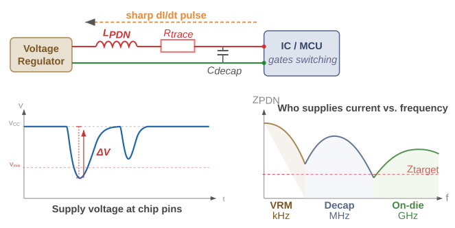
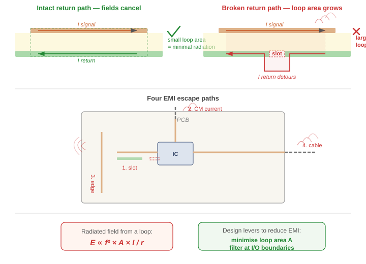

# Field Theory for PCB Design

**"Signal Integrity from First Principles"**

<figure>
  

  
  

</figure>

Modern high-speed electronic systems cannot be fully understood using lumped circuit models alone. As signal transition times decrease and edge rates increase, the physical dimensions of PCB interconnects become comparable to the spatial extent of electromagnetic fields. Under these conditions, signal behavior is governed not only by circuit relationships, but by the propagation of electromagnetic waves.

In this regime, voltage and current are no longer sufficient as primary descriptions [^cantExplain]. They are derived quantities that emerge from more fundamental physical entities: the electric field $\mathbf E$ and the magnetic field $\mathbf B$.

[^cantExplain]: It cannot explain why a split in the ground plane causes a signal integrity problem, why energy travels in the dielectric rather than in the copper, or why crosstalk depends on field geometry rather than circuit topology. 

A PCB trace, together with its return path, forms a transmission structure that guides electromagnetic energy through space. The dominant portion of the energy resides in the fields in the dielectric. The conductors serve to define boundary conditions that shape and confine these fields.

This perspective provides a unified framework for understanding a wide range of phenomena that are often treated separately in circuit theory, including:
- signal propagation and transmission line behavior
crosstalk between adjacent traces
- power distribution network (PDN) transients and rail collapse
- electromagnetic interference (EMI) and radiation

Reasoning in fields is what makes signal integrity tractable: where energy is stored, how it flows, and when it escapes.

Chapter 1 builds the field theory picture from first principles — starting with Maxwell's equations applied to a microstrip, and working through wave propagation, conductor response, rail collapse, crosstalk, and EMI. Chapter 2 translates that physics into concrete layout rules, stack-up choices and trace sizing.

 

---

 

## 1. Field Theory

> Since the TTL days, there has been a four orders of magnitude change in the switching speed of transistors.  -- *Dan Beeker*

**Circuit Theory**, the simplified low-frequency approximation taught in undergraduate courses, is based on field theory. It assumes that the PCB traces are much smaller than the wavelength of the signal, so we can ignore wave propagation and use simple circuit laws — Ohm's Law, Kirchhoff's laws. Before the mid-1990s, a typical device might output signals with 10 ns rise times at 10 MHz — slow enough that even rough layout practices such as wire wrapping sufficed.

This **Field Theory** perspective provides a unified framework for understanding a wide range of phenomena that are often treated separately in circuit theory, including:
- signal propagation and transmission line behavior
- crosstalk between adjacent traces
- power distribution network (PDN) transients and rail collapse
- electromagnetic interference (EMI) and radiation

Each of these effects arises from the same underlying field interactions.

Traditional circuit models remain useful, but they obscure the physical mechanisms responsible for these behaviors. By contrast, a field-based description makes those mechanisms explicit and provides deeper insight into how geometry and material properties influence system performance.

This chapter develops that field-based perspective starting from Maxwell’s equations and applies it to the analysis of PCB transmission structures.

 

---

 

### 1.1. From Voltage Step to Electromagnetic Wave in the Dielectric

> "Energy and signals travel in the spaces not the traces"  -- Ralph Morrison

When a voltage step is applied to a PCB trace, the resulting signal propagation is often described in terms of voltage and current. However, these quantities are not fundamental. They are derived from the underlying electromagnetic fields that evolve in space and time.

A more complete description begins with the electric field $\mathbf E$ and magnetic field $\mathbf B$. Signal transmission along a trace is not the motion of charge from source to load, but the propagation of a coupled electromagnetic disturbance guided by the geometry of the conductors and the dielectric.

We examine how such a disturbance is created and how it propagates.
 

#### 1.1.1. The Physical Setup

Consider a **microstrip** structure consisting of:
- a conducting trace,
- a return plane,
- a dielectric separating them.

We define coordinates aligned with the geometry:
- **$x$-axis:** perpendicular to the return plane (through the dielectric).
- **$y$-axis:** traverse to the trace.
- **$z$-axis:** along the direction of propagation.

A voltage step is applied at one end of the trace. The question is: what **physical process carries this signal forward?**
 

#### 1.1.1. Governing Equations

The evolution of the fields is governed by [Maxwell's equations](https://coertvonk.com/physics/electromagnetism/magnetism/materials-and-maxwells-equations-30453). The key relations are:

💡

$$  
  \begin{align}  
    \nabla \times \mathbf E &= -\frac{\partial \mathbf B}{\partial t}
    \tag{\text{Faraday}}
    \\
    \nabla \times \mathbf B &=
    \underbrace{\mu \ \mathbf J}_{\substack{\text{conduction} \\ \text{current}}}
    +\ 
    \underbrace{\mu\,\varepsilon\, \frac{\partial \mathbf E}{\partial t}}_{\substack{\text{displacement}\\ \text{current}}}
    \tag{\text{Ampère-Maxwell}} 
  \end{align}
$$ 

where:
- $\mathbf E$ is the electric field vectors at each point in space.
- $\mathbf B$ is the magnetic field vectors at each point in space
- $\mathbf J$ is the conduction current density
- $\mu$ and $\varepsilon$ are constants for the material.

In the dielectric region between the conductors,:
- there are no free charges ($\rho = 0$), and
- there is no conduction current ($\mathbf J = \mathbf 0$).

💡

In the dielectric the equations reduce to:
$$
  \begin{align*}
    \nabla \times \mathbf{B} &= \color{red}\cancel{\color{black}\mu \, \mathbf{J}} \color{black} + \mu\,\varepsilon \frac{\partial \mathbf{E}}{\partial t}
    \tag{\text{source-free Ampère-Maxwell}} \\
    \nabla \times \mathbf{E} &= -\frac{\partial \mathbf{B}}{\partial t}
    \tag{\text{Faraday}}
  \end{align*}
$$

These relations show that time-varying electric and magnetic fields generate each other.
 

#### 1.1.3. Coupled Field Dynamics

When a **voltage step** is applied to the left end of the trace, the following chain of events unfolds:
<figure>
  

  
  <figcaption><i>Side-view of electric field.</i></figcaption>
  

</figure>

Immediately after the **voltage step** is applied, 

1. The applied voltage immediately **establi shes an electric field** ($\mathbf E$) between the trace and the return plane. This field is initially confined near the source and increases from zero to a finite value → is therefore **time-varying**.
 

2. From the Ampère–Maxwell law, a time-varying electric field produces a **magnetic field** ($\mathbf B$). This magnetic field is initially localized near the source, just like the electric field that created it, and rises from zero to a finite value → is therefore **time-varying**.
 

3. According to Faraday's Law, this time-varying magnetic field ($\mathbf B$) **creates an electric field** slightly **further** along the trace. Here it increases from zero to a finite value → is therefore **time-varying**.

This coupling continues:
- a changing $\mathbf E$ produces $\mathbf B$
- a changing $\mathbf B$ produces $\mathbf E$ slighter father

Two features are essential:
- **Temporal variation:** the fields change in time at each point,
- **Spatial variation:** the fields differ from one location to another.

Neither alone produces motion. Together, they enforce propagation. The disturbance advances as a **self-sustaining electromagnetic wavefront**.

💡A voltage step on a trace and return plane launces an electromagnetic wave in the dielectric.

 

#### 1.1.4. Intuitive Picture

A useful way to visualize the process is as follows:

  A voltage step creates an electric field near the source. Because this field changes in time, it generates a magnetic field. That magnetic field, also changing, generates a new electric field slightly farther along the trace. The two fields continuously regenerate each other, advancing step by step.

  And that, really, is what every trace on every PCB is doing. It's not carrying electrons to some destination. It's guiding a little wave of energy. Isn't that something?
  <figure>
    

    
    

  </figure>

 

#### 1.1.4. Intuitive Picture (alt.)

Now look — you've got a copper trace, and underneath it a big sheet of copper called the return plane. Between them, a thin slab of plastic. That's it. That's the whole apparatus. And I want to tell you what happens when you flip a switch at one end and connect a battery.

The instant you close the switch, there's a voltage between the trace and the plane. And whenever you have a voltage between two pieces of metal, there's an **electric field** between them. Bang — the field is just there, pointing from the trace down to the plane. Not in all of space, mind you — only right near the switch, because the rest of the trace hasn't heard the news yet.

Now, here is where it gets interesting. The electric field went from zero to something. That's a change. And it turns out — and this is one of the most marvelous things in physics — that **a changing electric field makes a magnetic field**. Not "has a magnetic field associated with it." Makes one. Maxwell figured this out. The electric field changes in time, and a magnetic field curls up around it, right there in the plastic.

OK, so now we have a magnetic field. And it is also going from zero to something. It's changing in time too. And Faraday — long before Maxwell — figured out the other half of the story: **a changing magnetic field makes an electric field**. So the magnetic field we just made, by changing, makes another electric field — a little bit further along the trace than the one we started with.

You see what's happening? The electric field made a magnetic field. The magnetic field made an electric field. The new electric field is further down the line. And now it is changing, so it makes another magnetic field, which makes another electric field, and off we go. The two fields are playing leapfrog[^LEAPFROG], and they're heading down the trace at an enormous speed.

And that, really, is what every trace on every PCB is doing. It's not carrying electrons to some destination. It's guiding a little wave of energy. Isn't that something?

[^LEAPFROG]: In reality the two fields coexist at every point, but the "leapfrog" picture captures how each sustains the other.

<figure>
  

  
  

</figure>
 

#### 1.1.5. Wave Equation and Propagation Speed (optional)

The $\mathbf{E}$-field wave equation follows when you combine Faraday's law, the source-free Ampère–Maxwell law and Gauss's law.

  
Expand if you ❤️ to see the math.

  Take the curl of Faraday's law
  $$
      \nabla \times (\nabla \times \mathbf E) = -\frac{\partial}{\partial t}(\nabla \times \mathbf B)
  $$

  Substitute the source-free Ampère–Maxwell into the right side
  $$
      \nabla \times (\nabla \times \mathbf E) = -\mu\,\varepsilon \frac{\partial^2 \mathbf E}{\partial t^2}
  $$

  Recall the vector identity
  $$
      \nabla \times (\nabla \times \mathbf E) = \nabla(\nabla \cdot \mathbf E) - \nabla^2\mathbf E
      \tag{\text{vector identity}}
  $$

  Expand the left side using this vector identity
  $$
      \nabla(\nabla \cdot \mathbf E) - \nabla^2\mathbf E = -\mu\,\varepsilon \frac{\partial^2 \mathbf E}{\partial t^2}
  $$

  Apply Gauss's law:
  $$
      \nabla \cdot \mathbf E = \frac{\rho}{\varepsilon}
      \tag{\text{Gauss's law}}
  $$

  In the source-free dielectric there are no charges ($\rho = 0$), so this becomes $\nabla \cdot \mathbf E = 0$. The first term vanishes.

 

💡

Combining Faraday and Ampère-Maxwell yields the standard wave equation
$$
    \nabla^2 \mathbf E = \underbrace{\mu\,\varepsilon}_{1/v^2} \,\frac{\partial^2 \mathbf E}{\partial t^2}
$$

In this we recognize the generic wave equation for any quantity propagating at speed $v$:

$$
    \nabla^2 f = \frac{1}{v^2} \ \frac{\partial^2 f}{\partial t^2}
    \tag{\text{generic wave}}
$$

Comparing the two, term by term, gives the speed $v$ of the wave propagation:
$$
  \newcommand{\shaded}[1]{\colorbox{##F7F7D2}{$\displaystyle #1$}}
  \frac{1}{v^2} = \mu \varepsilon
  \quad \Rightarrow \quad
  \shaded{
    v = \frac{1}{\sqrt{\mu \, \varepsilon}}
  }
$$

In vacuum, the permeability constant $\mu = \mu_0$, and the permittivity constant $\varepsilon = \varepsilon_0$.
$$
  \left\{
    \begin{align*}
      \mu_0 &= 4\pi \times 10^{-7} \text{ H/m} \\
      \varepsilon_0 &= 8.854 \times 10^{-12} \text{ F/m}
    \end{align*}
  \right.
$$

Substituting these constants:
$$
    v = \frac{1}{\sqrt{4\pi \times 10^{-7} \times 8.854 \times 10^{-12}}} \approx 299.8 \times 10^6 \text{ m/s}
$$

That is the speed of light $c$ — derived entirely from electric and magnetic constants.

**In a dielectric** such as FR-4, the permittivity is higher, and the propagation speed is reduced accordingly.
$$
    v' = \frac{1}{\sqrt{4\pi \times 10^{-7} \times 4.2 \times 8.854 \times 10^{-12}}} \approx 146.3 \times 10^6 \text{ m/s}
$$

The wave **propagation speed in FR-4** is therefore **~15 cm/ns**. To be precise, this is the bulk-FR-4 (or stripline) speed. On a microstrip, part of the field is in air above the trace, so the effective permittivity is a bit lower and the speed rises to ~17–18 cm/ns.

Thus, the signal travels as an electromagnetic wave whose velocity is determined by material properties, not by the motion of electrons in the conductor.

#### 1.1.6. Interpretation

The voltage step does not “move” down the trace as a flow of charge. Instead:
- the electric and magnetic fields propagate through the dielectric,
- the conductors define boundary conditions that guide these fields,
- the signal is the advancing electromagnetic wavefront.

The energy associated with the signal resides primarily in the fields, not in the conductor.

#### 1.1.7. Mode Structure

In this analysis, the electric field is predominantly perpendicular to the conductors, and the magnetic field lies transverse to the direction of propagation. In an ideal homogeneous medium, this corresponds to a **transverse electromagnetic (TEM)** mode.

A microstrip is not homogeneous: part of the field exists in the dielectric and part in the air above. As a result, small longitudinal field components arise to satisfy boundary conditions. The mode is therefore quasi-TEM.
 

#### 1.1.8. Summary

💡

  A voltage step applied to a PCB trace launches an electromagnetic wave that propagates through the dielectric at speed:
  $$
    v = \frac{1}{\sqrt{\mu\,\varepsilon}}
  $$

The conductors guide this wave by enforcing boundary conditions, while the energy and dynamics of the signal reside in the electric and magnetic fields
 

---

 

### 1.2. Conductor Response: Surface Charge and Current

Section §1.1 established that a signal propagates as an electromagnetic wave in the dielectric. The conductors do not carry the signal energy; instead, they respond to the fields of the wave. This section examines that response.

The presence of free electrons in the conductor allows it to enforce boundary conditions on the fields. These responses take two forms:
- **surface charge**, which enforces electric-field boundary conditions
- **surface current**, which sustains the magnetic field

Both arise directly from the incident electromagnetic wave.
 

#### 1.2.1. Intuitive Picture (optional)

  When the wave reaches a section of copper, the electrons there don’t wait for instructions—they feel the electric field immediately.

  The vertical field pushes charges apart, piling them up on the surfaces until the field inside the metal disappears. That’s how the wave gets confined between the conductors.

  At the same time, the wave is moving, so the voltage changes from place to place. That creates a small field along the trace, and that field nudges the electrons sideways. That motion is the current.

  The important point is that the electrons aren’t carrying the signal down the line. Each section just reacts locally as the wave arrives—building charge, supporting current, and then settling into a steady state as the wave passes.

  The wave drives everything; the electrons respond.

#### 1.2.1. Intuitive Picture (alt)

So put it all together:
- The wave is in the plastic.
- The *down-field* from the wave shoves electrons around on the copper surfaces. Those electrons build a wall that keeps the wave trapped in the plastic.
- The *along-field* from the wave pushes other electrons along the trace, giving you the little current you measure with your ammeter.

The wave is the boss. The electrons are the help. And what the electrons do — the thing we call "current" — is not how the energy gets from here to there. The energy is out in the dielectric, in the fields. The current is just the electrons reacting to the field, the same way a line of dominoes reacts to the first push. The dominoes aren't transporting the energy down the line — the *falling pattern* is. And on a PCB, the falling pattern is the field.

You can also say this without ever mentioning an electron. The wave's $\mathbf E$ and $\mathbf B$ exist right up to the surface of the copper, but inside the copper they have to be zero — that's what good conductors do. So there's a jump at the surface, and nature does not allow that for free: wherever the perpendicular $\mathbf E$ has a jump, there must be **charge** to account for it; wherever the parallel $\mathbf B$ has a jump, there must be **current**. The metal has no choice. You can read off the surface charge and the surface current *purely from what the field is doing in the dielectric* — no forces, no electron motion, no kinetics. The electrons just sign the ledger.

And that's really all there is to it. The hard part is believing it.

 

#### 1.2.2. Electric Field Components Near the Conductor

In a microstrip, the electric field in the dielectric is primarily transverse (normal to the conductor surfaces), but it also contains a small longitudinal component along the direction of propagation.

> Throughout, $\hat x$ points from the trace to the return plane, $\hat z$ points in the propagation direction.

<figure>
  

  
  <figcaption><i>Microstrip electric field.</i></figcaption>
  

</figure>

We distinguish:

- **Traverse component $E_x$**
   - dominant
   - directed between trace and return plane
   - confines the wave to the dielectric

- **Longitudinal component $E_z$**
   - localized near the wavefront
   - persists at smaller magnitude behind the wave

These components produce distinct physical effects in the conductor.
 

#### 1.2.3. $E_x$ → Surface Charge Formation

As the wavefront reaches a section of the conductor,the transverse electric field $E_x$ rises from zero to a finite value.

This field exerts a force on the **free electrons**.
- *in the trace*, electrons move away from the dielectric-facing surface
- *in the return plane*, the electrons move toward the dielectric-facing surface.
<figure>
  

  
  <figcaption><i>Microstrip Ex confinement.</i></figcaption>
  

</figure>

This redistribution produces:
- **positive surface charge** on the underside of the trace
- **negative surface charge** on the top of the return plane

The system rapidly reaches a local equilibrium in which:
- the **net field inside the conductor is driven to zero**, because the surface charges generate their own electric field that opposes the external field. 
- The **external field is confined to the dielectric**, since the electric field cannot extend into the conductor.

 

##### Boundary Codition (Gauss's Law) (optional)

Following the more intuitive discussion above, here's the formal version.

  
Expand if you ❤️ to see the derivation

  Imagine a conductor with a surface charge density $\sigma_s$ (charge per unit area) and normal vector $\hat n$ that points perpendicular to the conductor surface. To find the electric field just outside the surface, we place a very thin, small, cylindrical Gaussian "pillbox" so that it straddles the conductor surface.
  <figure>
    

    
    <figcaption><i>Side-view close-up of pillbox straddling the trace/dielectric boundary.</i></figcaption>
    

  </figure>

  Gauss's law in integral form states that the net electric flux through any closed surface ($S$) is directly proportional to the total electric charge ($Q_{enc}$) enclosed within that surface.

  

  $$
      \oint_S \mathbf E \cdot d\mathbf a = \frac{Q_{enc}}{\varepsilon} \tag{\text{Gauss's law}}
  $$
  
 

  where $d \mathbf{a}$ is an infinitesimal vector element of the surface area, pointing outwards normal to the surface.

  A key property of a conductor in electrostatic equilibrium is that the electric field $\mathbf {E}$ inside the conducting material is zero, so the inside area doesn't contribute. With the height $h \to 0$, the side areas do not contribute either. This implies that the only flux passing through the pillbox comes from the bottom face.
  $$
    \begin{align*}
      \oint_{out} \mathbf E \cdot (A \hat n) &= \left( \mathbf{E} \cdot \hat n \right) A = \frac{Q_{enc}}{\varepsilon} \tag{$d\mathbf{a_{out}}=A\hat n$} \\
      \Rightarrow
      \varepsilon \left(\mathbf{E}\cdot\hat n \right)A &= Q_{enc} \tag{$Q_{enc} = \sigma_s A$}
    \end{align*}
  $$

  The enclosed charge is $Q_{enc} = \sigma_s A$
  $$
      \varepsilon \left(\mathbf{E}\cdot\hat n \right) \bcancel{A} = \sigma_s \bcancel{A}
  $$

  $\mathbf{E}\cdot\hat n$ is the component of the field normal to the surface ($E_x$):
  $$
      \varepsilon\, E_x = \sigma_s
  $$

 

💡

The relationship between surface charge density and the electric field follows from Gauss’s law:
$$
    \sigma_s = \varepsilon\, E_x, \quad \text{in }\left[ \rm{C/m^2} \right]
$$

where:
- $\sigma_s$ is the surface charge density
- $E_x$ is the electric field just outside the conductor.

This behavior follows directly from Gauss’s law: the discontinuity in the normal electric field at the boundary is equal to the surface charge density.

Thus, the surface charge distribution is not arbitrary. It is precisely the charge required to enforce the boundary condition that the electric field cannot exist inside a good conductor.
 

##### Intuitive Form (old)

I want to tell you what the down-field does, because I think this is the most beautiful thing happening on the whole PCB.

The wave comes along with an electric field pointing from the trace down to the return plane. Now, what's an electric field? It's a rule that says how hard an electron gets pushed, and which way. The field points down, electrons are negative, so every electron in both conductors suddenly gets shoved *up*.

In the trace, they move up, away from the bottom. Electrons leave, positive ions stay — so the bottom of the trace becomes a positively charged surface. In the return plane, they pile up on top — a negatively charged surface. You've made a capacitor, right there, on the fly.

Now here's the good part. Those two sheets of charge have their own field, pointing the *other way*. Inside the copper, two fields are fighting: the wave pushing down, the surface charges pushing up. The electrons keep rearranging until those fields *exactly cancel* — and the field inside the metal goes to zero.

And here's the whole point: because the field can't get into the copper, it has nowhere to go but to **stay between the two conductors**. The electrons have built a cage for the wave.

 

#### 1.2.4. Surface Current

We present two views of the same system
- Given a magnetic field at the surface, what current must exist? ($\mathbf B \to \mathbf K$)
 
- How does current get established as the wave propagates? ($\mathbf E \to \mathbf J$)
 

##### The Magnetic Field drives the need for Surface Current

The magnetic field $\mathbf{B}$, from the wave propagating through the dielectric, is screened by the return plane. To stay in the $xy$-plane, it has no other choice but to **loop around the trace**.
<figure>
  

  
  <figcaption><i>Cross-section of the microstrip. <b>B</b>-field curls around the trace.</i></figcaption>
  

</figure>

  
Expand if you ❤️ to see the derivation

  Zooming in on a small section of the trace/dielectric boundary, we see that the wave's $\mathbf B$ field is tangential to the trace surface. 
  <figure>
    

    
    <figcaption><i>Crosss-section close-up of Amperian loop straddling the trace/dielectric boundary.</i></figcaption>
    

  </figure>

  Imagine a tiny rectangular "Amperian loop" straddling the bottom surface of the copper. Two sides — represented by the displacement vector $\mathbf L$ — run parallel to the surface (one inside the copper, one outside). Two sides of height $h$ run perpendicular to the surface.

  As we shrink the height $h \to 0$, the perpendicular sides contribute nothing. Inside the conductor, $\mathbf{B}_{in} = 0$. Therefore, the total path integral comes entirely from the outside leg:
  $$
    \oint \mathbf{B} \cdot d \mathbf{l} = \mathbf{B}_{out} \cdot \mathbf{L}
  $$

  The current passing through this loop is the surface current density $\mathbf K$ (amps per meter) crossing the loop, integrated along $\mathbf L$:
  $$
    I_{enc} = \mathbf K \cdot \mathbf L
  $$

  (Both $\mathbf B_{out}$ and $\mathbf K$ end up parallel to $\mathbf L$ along the outside leg, so each dot product reduces to a magnitude product $B_{out}\,L$ and $K\,L$.)

  Recall Ampère's Law in integral form:
  

  $$
    \oint \mathbf{B} \cdot d\mathbf{l} = \mu\, I_{enc}
  $$
  

  Substitute $\oint \mathbf{B}\cdot d\mathbf{l}$ and $I_{enc}$ in Ampère's law:
  $$
    \begin{align*}
      \mathbf{B}_{out} \cdot \mathbf{L} &= \mu \left( \mathbf K \cdot \mathbf L \right) \\
      \Rightarrow\quad B_{out}\,\bcancel{L} &= \mu\, K\,\bcancel{L} \\
      \Rightarrow\quad \mathbf K &= \frac{1}{\mu}\,(\hat n \times \mathbf B_{\text{out}}) = \frac{1}{\mu}\, |\mathbf B_{\text{out}}|\, \hat z & \text{(right-hand rule)}
    \end{align*}
  $$ where $\hat n$ is the outward normal from the conductor. 

 

💡

Ampère's Law forces a surface current [^sCurrent] in the propagation direction:
$$
    \mathbf K = \frac{B_y}{\mu}\,\hat z
$$

where:
- $\mathbf{K}$ is the surface current in A/m
- $B_y$ is the traverse component of the magnetic field at the boundary

[^sCurrent]: $\mathbf K$ and $\sigma_s$ are **surface** densities — the boundary counterparts of the volume densities $\mathbf J$ (A/m², current per cross-sectional area) and $\rho$ (C/m³, charge per volume). In a *perfect conductor*, all the response squeezes into an infinitely thin layer at the surface, so the volume densities formally become delta-functions and the meaningful quantities are $\sigma_s$ (C/m²) and $\mathbf K$ (A/m).

This shows that:
- the **magnetic field determines the surface current**
- the current is not an independent driver, but a response to the field

In real conductors, this current is distributed over a thin layer of thickness equal to the skin depth, where the fields penetrate slightly into the material. The field dies off over the **skin depth** $\delta$ (≈ 2 μm in copper at 1 GHz; see Appendix A.4 for the derivation). That thin layer is where the current actually flows and the loss happens.

Surface current density ($\mathbf K$) isn't really on a 2D sheet — it's the 3D current density ($\mathbf J$) packed into the skin-depth layer, and integrating $\mathbf J$ across that layer's depth recovers $\mathbf K$.
$$
  \mathbf K = \int_0^\infty \mathbf J(z'), dz'
$$

For a perfect conductor ($\delta \to 0$), all the current crowds onto the surface and $\mathbf J$ becomes a delta function — exactly $\mathbf K , \delta(\text{surface})$. For a real conductor, $\mathbf J$ is finite but concentrated in a thin layer of thickness ≈ $\delta$ (the skin depth), and the surface-current approximation $\mathbf K \approx \mathbf J \cdot \delta$ holds to corrections of order $\delta/d$.

 

##### The Longitudinal Electric Field drives the Surface Current

While the previous section relates surface current to the magnetic field through boundary conditions, we now examine how that current is dynamically established as the wavefront propagates.

At the wavefront, the voltage varies rapidly with position (i.e., from full strength behind to zero ahead over a short distance). This spatial variation produces a longitudinal field $E_z$:
$$
  E_z = - \frac{\partial V}{\partial z}
$$

This field drives a drift of electrons along the conductor, giving rise to the current observed in circuit terms.

This field exerts a force on the electrons along the conductor:
- *in the trace*, electrons drift opposite to the direction of propagation
- *in the return plane*, electrons drift in the direction of propagation

The figure below illustrates this electron drift.
<figure>
  

  z.">
  <figcaption><i>Current at the wavefront, driven by the longitudinal field Ez.</i></figcaption>
  

</figure>

This drift is the **conduction current**.

However, this current should not be interpreted as transporting the signal. Instead:
- the wave propagates in the dielectric
- the electrons respond locally as the wavefront passes

Each section of the conductor becomes active only when reached by the wave.
 

##### Charge–Current Coupling (Continuity)

Surface charge and current are linked by charge conservation.

As the wavefront advances:
- surface charge builds up on newly reached sections
- current flows to supply this charge

The continuity equation governs this relationship:
$$
  \nabla\cdot J + \frac{\partial \rho}{\partial t} = 0
$$

In surface form, this implies that current converges or diverges as needed to create the required surface charge distribution.

Thus:
- current establishes charge
- charge shapes the electric field
- the field drives further current

This closed interaction maintains the propagating wave.

  
Expand if you ❤️ to see the derivation (TO DO: do we need this?)

  Surface current $\mathbf{K}$ only exists in the $z$-direction ($\mathbf{K} = K_z \hat z$), so we can rewrite this as:
  $$
    K_z = \frac{B_y}{\mu}
  $$

  Recall the **Continuity Equation** (that follows from Ampère–Maxwell Law)
  

  $$
    \nabla \cdot \mathbf J + \frac{\partial \rho}{\partial t} = 0
    \tag{Continuity}
  $$
  

  Expressed on a 2D surface, this becomes the surface charge conservation on the trace surface (the surface divergence operator $\nabla_s\cdot$ takes derivatives only in directions tangent to the surface — for our trace surface with normal $\hat x$, that's $\hat y$ and $\hat z$):
  $$
    \begin{align*}
      \nabla_s \cdot \mathbf K + \frac{\partial \sigma_s}{\partial t} &= 0 \\
      \Rightarrow\quad
      \frac{\partial K_y}{\partial y} + \frac{\partial K_z}{\partial z} + \frac{\partial \sigma_s}{\partial t}&= 0
    \end{align*}
  $$

  As we saw, $\mathbf{K}$ exists only in the $+z$-direction:
  $$
      \frac{\partial K_z}{\partial z} + \frac{\partial \sigma_s}{\partial t}= 0 
  $$

  At the wavefront, $\sigma_s$ is ramping from zero to $\varepsilon E_x$ as the wave passes, so $\partial K_z/\partial z \neq 0$ — the current converges into the section to deposit the new charge.

  Because the wave moves at speed $v$, the field follows the form $E_x(z-vt)$. This **wavefront constraint** links a *change in time* to a *change in space*:
  $$
    \frac{\partial E_x}{\partial t} = -v\, \frac{\partial E_x}{\partial z}
  $$

  So $\partial/\partial t = -v\,\partial/\partial z$ for any field quantity. Apply that to surface charge conservation:
  $$
      \frac{\partial K_z}{\partial z} = v\,\frac{\partial \sigma_s}{\partial z}
  $$

  Integrate along $z$ on both sides. Both $K_z$ and $\sigma_s$ vanish ahead of the wavefront, so the integration constant is zero.

 

💡

This relationship is governed by the continuity equation:
$$
  K_z = v\,\sigma_s
$$

where:
- $K_z$ is (the traverse component) of the surface current
- $v$ is the propagation speed
- $\sigma_s$ is the surface charge density

This expresses that surface charge and current advance together with the wave.
 

#### 1.2.5. Behavior Behind the Wavefront

Once the wavefront has passed:
- the transverse field ($E_x$) becomes steady
- the longitudinal field ($E_z$) becomes small but nonzero

This residual longitudinal field ($E_z$) sustains the current against resistive losses.

In other words:
- $\sigma_s$ and $\mathbf K$ are steady
- charge conservation reduces to $\nabla_s \cdot \mathbf K = 0$, which says the current flows uniformly along $z$.

In a **real conductor**:
- drifting electrons scatter off the lattice, converting drift kinetic energy to heat
- the electromagnetic wave supplies this energy; its amplitude drops slightly with distance, giving a small residual $E_z$ that re-accelerates the electrons between scattering events.

The surface charge at a given section is established once the wave has passed, but **current continues** through that section to supply the wavefront still advancing ahead. Each already-charged section acts as a conduit — its surface charges steer the current, and the small residual $E_z$ sustains it against drag, exactly as in a DC wire where stable surface charges guide a steady current.
 

#### 1.2.6. Interpretation

The conductor does not initiate or carry the signal. Instead, it enforces the structure required for the electromagnetic wave to exist.
- **Surface charge** shapes the electric field and confines it to the dielectric
- **Surface current** sustains the magnetic field
- **Electron motion is local**, responding to the passing wave

The signal itself remains a propagating electromagnetic field, guided by the conductor geometry.
 

#### 1.2.7. Summary

The response of a conductor to a propagating electromagnetic wave consists of:
- **surface charge formation** enforcing electric boundary conditions
- **surface current** sustaining the magnetic field

These quantities are not independent drivers but are determined by the fields of the wave and constrained by Maxwell’s equations and charge conservation.
 

---

### 1.3. Sources of the Magnetic Field

Sections §1.1 and §1.2 established that signal propagation is an electromagnetic wave in the dielectric, and that the conductors respond through surface charge and current. We now examine a fundamental question:

> **What sustains the magnetic field as it spans both dielectric and conductor regions?**

<figure>
  

  
  <figcaption><i>Cross-section of the microstrip. <b>B</b>-field curls around the trace.</i></figcaption>
  

</figure>

#### 1.3.1. Intuition

  You might think the magnetic field comes from the current in the copper—and that’s true, but only part of the story.

  Between the trace and the return plane, there’s no current flowing in the usual sense. But the electric field there is changing as the signal moves. And a changing electric field produces a magnetic field just as surely as a current does.

  So the magnetic field doesn’t start and stop at the copper. It wraps around the trace, passes through the dielectric, and closes on itself as a continuous structure.

  The current in the copper and the changing field in the dielectric are just two ways of sustaining the same magnetic field.

  If you tried to remove the displacement current term, the field would have nowhere to go—it would break at the boundary. Maxwell added that term so the field could remain whole.

#### 1.3.2. Physical Origin

Ampère–Maxwell makes the unification explicit. It writes $\nabla \times \mathbf B$ as a sum of two source terms — one fed by moving charge in the conductor, the other by a changing electric field in the dielectric:
$$
    \nabla \times \mathbf B =
    \underbrace{\mu \, \mathbf J}_{\substack{\text{conduction current}\\ \text{in the copper}}} 
    \;+\;
    \underbrace{\mu\,\varepsilon\, \frac{\partial \mathbf E}{\partial t}}_{\substack{\text{displacement current} \\ \text{in the dielectric}}}
$$

We have seen this all before:

- §1.1 showed that a changing electric field $\partial\mathbf{E}\partial t$ in the dielectric — the **displacement current** — contributes to a magnetic field $\mathbf B$. 

- §1.2 showed that the same wave drives a **conduction current** $\mathbf J$ in the copper, and a conduction current also contributes to the $\mathbf B$ field. The surface current $\mathbf K$ from §1.2 is just $\mathbf J$ integrated across the skin-depth layer where the current flows.

The conduction current isn't an independent source. It's a slave to the wave. But it's still a real current, and it still appears in $\nabla \times \mathbf B$ alongside $\partial \mathbf E / \partial t$.

##### Continuity of the Magnetic Field

A key consequence of the Ampère–Maxwell law is that the magnetic field remains continuous across regions of space.

In a microstrip:
- in the conductor → magnetic field is driven by conduction current
- in the dielectric → magnetic field is sustained by displacement current

These two contributions join seamlessly at the boundary.

##### Relationship to Current and Energy Flow

The conduction current observed in the trace is not the primary carrier of energy. Instead:
- energy flows in the electromagnetic field within the dielectric
- the current in the conductor arises as a response to that field

The magnetic field links these two views:
- it is generated by current
- it also participates in energy transport (via the Poynting vector)

Thus, current and field are mutually dependent aspects of the same physical system.

#### 1.3.3. Summary

The magnetic field in a PCB transmission structure arises from two sources:
- conduction current in the conductors
- displacement current in the dielectric

These contributions are unified through the Ampère–Maxwell law and together form a continuous magnetic field that supports wave propagation.

 

---

 

### 1.4. Rail Collapse in Power Distribution Networks

Every chip on the board also needs a stable supply voltage. These power paths are transmission lines too, and they are subject to the same field physics. 

Rail collapse is the transient reduction in supply voltage that occurs when a circuit demands current faster than the power distribution network (PDN) can supply it.

From a field-theory perspective, this is not a failure of “voltage delivery” in a circuit sense, but a consequence of how electromagnetic fields—and therefore energy—reconfigure in space and time.
 

#### 1.4.1. Intuition

  You ask the circuit for current right now.

  But current isn’t just charge moving — it’s a magnetic field wrapped around a path. And that field has to grow if the current grows.

  Growing a magnetic field takes energy, and it takes time. The supply can’t instantly reshape the field everywhere in the power network.

  So what happens? The device pulls what it can locally, and the voltage dips. That’s rail collapse.

  The decoupling capacitor is sitting right there with energy already stored in its electric field. It doesn’t need to wait. It hands over the charge immediately while the rest of the system catches up.

  The whole event is a negotiation between electric and magnetic fields trying to reconfigure themselves fast enough to meet the demand.

 

#### 1.4.2. Physical Origin

When a digital device switches, internal transistors change state and require a rapid increase in current. This demand must be supplied through the PDN, which includes:
- power planes
- return planes
- vias and interconnects
- decoupling capacitors

This is captured by the familiar inductive relation:
$$
  \Delta V = L_{PDN} \cdot \frac{dI}{dt}
$$
where $L_{PDN}$ is the effective inductance of the curent path.

This voltage drop can be understood directly in terms of energy. The magnetic field associated with the current stores energy
$$
  E = \tfrac{1}{2}L_{PDN}\,I^2
$$

As the current increases, the magnetic field must expand and its stored energy must grow. The required power is
$$
  P = \frac{dE}{dt} = L_{PDN}\,I\,\frac{dI}{dt}
$$

This energy cannot appear instantaneously; it must be delivered through the PDN. The voltage drop $\Delta V$ is the electrical manifestation of the work required to build up the magnetic field. In this sense, rail collapse is not simply a limitation of “current delivery,” but a consequence of the finite rate at which energy can be supplied to reconfigure the electromagnetic field.

Equivalently, this is Faraday’s law applied to the power loop: a changing current induces a back-EMF that opposes the change. The chip experiences that opposition as a temporary reduction in supply voltage.

If the voltage drop is large enough — what designers call **rail collapse** — the chip misinterprets logic levels or produces timing errors.

Since $L_{PDN}$ is set by the loop geometry, minimizing loop area reduces both the required magnetic energy and the voltage drop needed to establish it.
 

#### 1.4.3. Role of Decoupling Capacitors

Decoupling capacitors provide a local source of energy to supply transient current demands.

A capacitor stores energy in its electric field:
$$
  E = \tfrac{1}{2}CV^2
$$

When current demand increases:
- the capacitor supplies charge locally
- the electric field within the capacitor decreases
- this reduces the voltage across the capacitor

This allows the load to receive current immediately, while the PDN current increases more gradually.

##### Example

A typical microcontroller might switch 100 mA in 1 ns. Even a small parasitic inductance $L = 1\,\text{nH}$ (a few mm of trace) gives
$$
  \Delta V = 1\,\text{nH} \cdot \frac{100\,\text{mA}}{1\,\text{ns}} = 100\,\text{mV}.
$$

A 100 mV dip on a 3.3 V rail is enough to upset logic levels in some chips. A 5 mm trace from a poorly placed decoupling capacitor can already reach this.

##### No Single Capacitor Solves It

The chip draws current at many timescales — slow gate switching, fast clock edges, faster glitches — spanning DC up to GHz. Each regime is supplied by a different source:
- the **voltage regulator (VRM)** for slow load changes (DC to ~kHz),
- **bulk decoupling capacitors** for mid-frequency draws (kHz to ~10 MHz),
- **ceramic bypass capacitors** for high-frequency transients (10 MHz to ~100 MHz),
- the chip's **on-die capacitance** for the very fastest demand (>100 MHz).

Each tier hands off to the next as the current draw gets faster — the figure below sketches these frequency bands.
<figure>
  

  
  <figcaption><i>PDN inductance causes voltage sag when current changes sharply.</i></figcaption>
  

</figure>
 

#### 1.4.4. Design Implications

Effective PDN design focuses on minimizing the impedance seen by transient currents.

Key strategies include:
- Reduce loop inductance → place power and return planes close together and minimize via and path length.
- Provide local energy storage → place decoupling capacitors close to load pins to maintain low impedance over a broad spectrum.
- Prevent field spreading and lower inductance → maintaine continuous return paths.
 

#### 1.4.5. Summary

Rail collapse results from the inability of the PDN to supply rapidly changing current due to its inductance.

It reflects:
- the finite time required to establish magnetic fields
- the distributed nature of energy storage in those fields

Local decoupling capacitors mitigate this effect by supplying energy locally, reducing the dependence on rapid current delivery through the PDN.

 

---

 

### 1.5. Crosstalk

Crosstalk is the unintended coupling of signals between adjacent conductors. In a PCB, it arises because the electromagnetic fields associated with one trace extend into space and interact with nearby structures.

From a field-theory perspective, crosstalk is not a secondary effect—it follows directly from Maxwell’s equations. Any time-varying electric or magnetic field can induce charge motion or voltage in a neighboring conductor.

#### 1.5.1. Intuition

A signal trace does not contain its fields perfectly. When it switches, its electric and magnetic fields extend into the surrounding space.

If another conductor is placed within that space, it becomes part of the field system. The changing electric field moves charge on that conductor, and the changing magnetic field induces a voltage in it.

Crosstalk is therefore not an interaction between circuits, but between fields and conductors.

#### 1.5.2. Physical Origin

TO DO: write connecting paragraph

##### Geometry and Field Overlap

Consider two parallel microstrip traces above a common return plane:
- the **aggressor** trace carries a time-varying signal
- the **victim** trace is initially quiet

As a voltage step propagates along the aggressor, it generates:
- an electric field $\mathbf E$ between trace and return plane;
- a magnetic field $\mathbf B$ looping around the trace.

These fields are not perfectly confined to the region directly beneath the aggressor. A portion extends laterally into the surrounding dielectric. If the victim trace lies within this region, it is exposed to both fields:

Each produces a different coupling mechanism — and both are direct consequences of Maxwell's equations.

<figure>
  

  
  <figcaption><i>Across-view: Capacitive coupling (<b>E</b> field fringing between traces) and inductive coupling (<b>B</b> field threading the victim loop).</i></figcaption>
  

</figure>
 

##### Capacitive Coupling (electric field)

The electric field from the aggressor terminates partly on the victim trace, establishing a **mutual capacitance** $C_m$ between the two conductors.

This is purely Gauss's law at work: electric field lines must terminate on a conductor, and if another trace is closer or more convenient than the return plane, some of them will land there instead.

A time-varying voltage $V$ on the aggressor produces a time-varying electric field. This induces surface charge on the victim trace, resulting in a displacement current $I_C$:
$$
    I_C = C_m \ \frac{dV}{dt}
$$

**Characteristics:**
- proportional to the voltage transition rate $dV/dt$
- depends on the strength and spacial extent of the electric field
- increases with closer spacing, longre parallel runs and weaker field confinement

 

##### Inductive Coupling (magnetic field)

The time-varying current in the aggressor generates a time-varying magnetic field. Part of this field links the loop formed by the victim trace.

By Faraday’s law, the changing magnetic flux induces a voltage:
$$
    \nabla \times \mathbf{E} = -\frac{\partial \mathbf{B}}{\partial t} 
    \tag{\text{Faraday}}
$$

  
Expand if you ❤️ to see the derivation.

  Integrate Faraday's Law over the opn surface $S$ of the victim loop:
  $$
    \iint_S (\nabla \times \mathbf{E}) \cdot d\mathbf{a} = -\iint_S \frac{\partial \mathbf{B}}{\partial t} \cdot d\mathbf{a}
  $$

  Using Stoke's Theorem, we convert the surface intgral of the curl of $\mathbf E$ into a line integral of $\mathbf E$ around the closed boundary loop $C$.
  $$
    \oint_C \mathbf{E} \cdot d\mathbf{l} 
    = - \frac{d}{dt} \iint_S \mathbf{B} \cdot d\mathbf{a}
  $$

  The term on the left, $\oint_C \mathbf{E} \cdot d\mathbf{l}$, is the definition of electromotive force or **induced voltage** $V_{ind}$.

  The surface intgral on the right is the definition of magnetic flux ($\Phi_m$) passing through the loop:
  

  $$
    \Phi_m = \iint_S \mathbf{B} \cdot d\mathbf{a}
  $$
  

  This simplifies the relationship to:
  $$
    V_L = - \frac{d\Phi_m}{dt}
  $$

  The magnetic flux ($\Phi_m$) threading through the victim loop is physically created by the current $I_a$ in the aggressor loop. Because the relationship is linear for most materials, we define **Mutual Inductance ($L_m$) as the ratio of flux to current.
  $$
    \Phi_m \triangleq L_m I_a 
  $$ where $L_m$ "hides" the geometry (distance, height and length) into a single constant.

  Finally, we substitude and the definition of flux back into the Faraday result:
  $$
    V_L = - \frac{d(L_m I_a )}{dt}
  $$

  Since $L_m$ is constant determined by the physical layout of the traces:

 

💡

The changing magnetic flux creates an induced field that opposes the change that created it. The induced voltage $V_L$:  
$$
  V_L = - L_m\frac{dI}{dt}
$$

Where $L_m$ is the mutual inductance between the two trace-return-plane loops. It depends on how much of the aggressor's $\mathbf B$ field threads through the victim's loop — set by the physical distance between traces, the height above the return plane, and the length of the parallel run.

**Characteristics:**
- proportional to the rate of change of the aggressor's current $dI/dt$
- depends on loop geometry and magnetic flux linkage
- increases with larger loop area and weaker return-path control

**Note:**

Inductive crosstalk is worst where the return path is constrained. On a PCB with a continuous return plane, the return current mirrors directly under the trace, keeping the loop area small. But through connectors, packages, and vias, multiple signals often share a single return pin instead of a wide plane. The return currents are forced through a common impedance, the loop areas grow, and the mutual inductance between aggressor and victim increases sharply.
 

##### Both Matter

The total induced signal on the victim trace is the superposition of capacitive and inductive contributions.

The capacitive and inductive coupled signals arrive at the victim differently:

- **Capacitive coupling** injects current into the victim trace. That current splits and travels in both directions — toward the near end and the far end. Both ends see a pulse of the same polarity as the aggressor.

- **Inductive coupling** induces a current that opposes the aggressor's current (Lenz's law). That current flows toward the near end, producing a pulse of the same polarity as the aggressor there, and a pulse of opposite polarity at the far end.

In uniform transmission lines:

- **Near-End Crosstalk (NEXT)** appears closest to the aggressor's source. The capacitive and inductive components have the same polarity — they add. 

- **Far-End Crosstalk (FEXT)** appears at the far end. The capacitive and inductive components have opposite polarity — they partially cancel. In a microstrip, FEXT is nonzero but typically smaller than NEXT.

#### 1.5.3. Design Implications

Because crosstalk is determined by field geometry, it is controlled by physical layout rather than schematic connectivity.

Key factors include:
- **Trace spacing:** increasing separation reduces field overlap
- **Dielectric thickness:** reducing height to the return plane improves confinement
- **Return path continuity:** uninterrupted reference planes prevent field spreading
- **Loop area:** minimizing loop area reduces magnetic coupling
- **Routing structure:** stripline geometries provide better confinement than microstrip

#### 1.5.4. Summary

Crosstalk is the result of electromagnetic fields from one conductor interacting with another. It arises from:
- electric-field coupling (mutual capacitance)
- magnetic-field coupling (mutual inductance)

Both mechanisms are governed by Maxwell’s equations and depend on the spatial distribution of fields.

Effective control of crosstalk requires managing those fields through careful geometric design.

 

---

 

### 1.6. Electromagnetic Interference

Electromagnetic interference (EMI) occurs when electromagnetic energy generated by a circuit propagates beyond its intended region and affects other systems.
<figure>
  

  
  <figcaption><i>Top: intact return path (fields cancel, minimal radiation) vs. broken return path (enlarged loop radiates). Middle: four EMI escape paths on a PCB. Bottom: radiation formula and design levers.</i></figcaption>
  

</figure>

In PCB structures, EMI arises when the fields associated with signal propagation are no longer sufficiently confined to the transmission path. When this confinement fails, part of the energy transitions from a guided mode to a radiating mode.

#### 1.6.2. Intuition

  A signal on a PCB is a guided electromagnetic wave. As long as the trace and its return path keep the fields tightly contained, the energy stays where it belongs.

  But if you break that containment—open up the return path, spread the loop, or let the geometry get large compared to the wavelength—the fields are no longer “held in place.”

  And once the fields are free, they don’t just sit there. They propagate outward as waves.

  At that point, your PCB trace has quietly turned into an antenna.

  EMI is what happens when the fields escape.

#### 1.6.2. From Guided Fields to Radiation

Under ideal conditions, a PCB trace and its return path form a transmission structure that confines electromagnetic fields:
- the electric field is largely contained between the conductors
- the magnetic field loops tightly around the current path

In this regime, energy propagates along the structure without significant radiation.

Radiation occurs when this balance is disturbed. If the geometry no longer supports tight field confinement, the fields extend into free space and can propagate away from the board as electromagnetic waves.

#### 1.6.3. Physical Origin

The physics comes from the same Maxwell's equations as §1.1. The difference is context: signal integrity asks whether the field arrives at the receiver correctly; EMI asks whether the field arrives somewhere it should not.

In a well-confined transmission line, these fields are bound to the structure by boundary conditions. Howeve, when confinement is weakened:
- the fields are no longer fully constrained
- they can satisfy Maxwell’s equations as free-space waves

Radiation is therefore not a separate mechanism—it is the natural continuation of the same field dynamics when boundary constraints are relaxed.

A current loop is an antenna. For a small loop (perimeter ≪ $\lambda$), the radiated electric field $E$ at distance $r$ grows with the square of the frequency, with the loop area $A$, and with the loop current $I$, and falls off inversely with $r$:[^EMCLOOP]
$$
    E \;\propto\; \frac{f^2 \, A \, I}{r}
$$
[^EMCLOOP]: Derived from the magnetic dipole radiation formula. The full expression includes constants ($\mu_0$, $c$), but the proportionality to $f^2$, $A$, and $I$ captures the design levers.

##### Conditions for Radiation

This formula for the radiated electric field teaches us the condition under which radiation becomes significant:

**1. Disrupted Return Path ($A$)**

A continuous return path is required to maintain field confinement. Interruptions force return currents to detour. Examples are
- a slot in the return plane
- a missing via at a layer transition
- a signal crossing between power islands forces the return current to detour.

This increases loop area and allows magnetic fields to spread, increasing radiation.

**2. Increased Loop Area ($A$)**

The strength of radiated fields depends strongly on the area enclosed by the current loop.
- small loop → tightly confined magnetic field
- large loop → broader field distribution and stronger radiation

As the loop area grows — and since radiated power scales with $A^2$, even a modest detour will have outsized consequences.

**3. Fast Signal Transitions ($d/dt$)**

Rapid voltage and current transitions produce large:
- $dV/dt$ → strong time-varying electric fields
- $dI/dt$ → strong time-varying magnetic fields

These rapidly changing fields contain high-frequency components, which radiate more efficiently.

**4. Electrical Length Comparable to Wavelength ($f$)**

A structure radiates efficiently when its dimensions are a significant fraction of the wavelength of the signal.

As a rule of thumb:
- structures approaching $\lambda/10$ begin to radiate noticeably
- structures near $\lambda/4$ can behave as efficient antennas

At modern edge rates, even relatively short PCB traces can meet these conditions.

**5. Distance ($r$)**

TO DO: this would be a good time to introduce the spacing between traces.

**6. Board-edge fringing** 

The EM field guided by a microstrip trace extends laterally beyond the trace edges. If a high-speed trace runs near the board perimeter, those fringing fields reach the edge of the return plane and radiate — there is no copper beyond the edge to contain them.

**7. Connector and cable radiation**

Every conductor that leaves the board — a power cable, a sensor wire, a USB connection — is a potential antenna. The board's internal switching noise couples onto the cable as common-mode current, and the cable radiates it. This is typically the dominant EMI path in a system like OPNhydro, where multiple cables connect to off-board sensors and motors.

#### 1.6.4. Design Implications

EMI control is fundamentally a problem of field containment.

Effective strategies include:
- Maintain continuous return paths → avoid gaps in return planes
- Minimize loop area → route signals close to their return paths
- Improves electric field confinement → use tight layer spacing
- Reduces high-frequency content → control edge rates where possible
- Maintain consistent impedance and geometry
Avoid discontinuities → use differential signaling when appropriate
reduces net radiating fields through cancellation

#### 1.6.5. Summary

Electromagnetic interference arises when electromagnetic fields are no longer confined to their intended transmission path and instead propagate into free space.

This occurs due to:
- disrupted return paths
- increased loop area
- fast signal transitions
- structures comparable to signal wavelength

EMI is not a separate phenomenon from signal propagation — it is the same electromagnetic behavior under different boundary conditions.

 

---

---

 

## 2. From Physics to Layout

Chapter 1 established how signals actually travel on a PCB — as EM waves guided by copper boundaries, with energy in the dielectric and currents as the electrons' response to the field. This chapter turns that physics into layout decisions.

The sections proceed from rules to physical build to final strategy:

- **§2.1** distills the field theory into layout rules covering signal quality, crosstalk, rail collapse, and EMI.
- **§2.2** explains the OPNhydro stack-up — a Low-EMI four-layer arrangement driven by the 6.5 A peak on the 24 V input rail and the isolation moats around the pH and EC islands.
- **§2.3** specifies the dielectric and copper.
- **§2.4** separates the noisy motor-control, digital, and sensitive analog domains.
- **§2.5** covers enclosure and mechanical constraints.
- **§2.6** derives trace widths from current, impedance, and thermal limits.
- **§2.7** assembles all of the above into a concrete layout strategy.

Each rule in this chapter ties back to a specific result from Chapter 1. The aim is that no rule is a folklore prescription — every one has a physical reason behind it.
 

### 2.1. PCB Design Rules

Everything in §1.1 through §1.5 leads to a single conclusion: the signal energy travels as an EM wave through the dielectric, guided by the copper boundaries. The trace is one wall, the return plane is the other. The copper confines the field ($E_x$ cancellation), the dielectric carries it forward (displacement current), and the return current in the return plane provides the equal-and-opposite $\mathbf B$ that prevents radiation (field cancellation at a distance).

When that field structure breaks down, the consequences fall into four categories: degraded signal quality on a single net (reflections, ringing), rail collapse in the power distribution network (§1.4), crosstalk between adjacent nets (§1.5), and radiated EMI (§1.6). Every PCB layout rule exists to prevent one or more of these — by keeping the field confined, the return path intact, and the coupling between unrelated fields to a minimum.
 

#### Signal Quality

A signal traveling along a trace is an EM wave guided by the trace and its return plane. Anything that disrupts the wave's propagation — an impedance discontinuity, a missing return path, a stub — causes part of the energy to reflect back toward the source. The reflected wave interferes with the forward wave, producing ringing, overshoot, and timing uncertainty on the net.

**Rule 1a — Maintain a continuous return plane.** The $\mathbf B$ field from the forward current in the trace and the return current in the plane cancel at a distance, keeping the energy confined. A continuous plane provides a nearby, low-impedance return path, so the current loop is small and the fields close tightly around the trace. Interrupt the plane — a slot, a cutout, a missing pour — and the return current detours, the loop area grows, the impedance changes, and the wave partially reflects.

<figure>
  

  
  <figcaption><i>Trace crossing a gap in the return plane. (Courtesy: Kenneth Wyatt)</i></figcaption>
  

</figure>

> "Forget the word ground. Every signal has a return path. Think return path and you will train your intuition to look for and treat the return path as carefully as you treat the signal path." -- Eric Bogatin

**Rule 1b — Provide return vias at layer transitions.** When a trace passes through a via, the EM wave transfers between layers. The wave is not just the trace — it is the field between the trace and its reference plane. If the return plane changes (say, from L2 to L3), the return current must also transition. Without a nearby ground via, the return path detours, the loop area grows, and the wave leaks between the return planes — causing both reflections on the signal net and interference with other signals in that space.

<figure>
  

  
  <figcaption><i>Trace passing through two planes with via. (Courtesy: Kenneth Wyatt)</i></figcaption>
  

</figure>

If the planes are the same potential, prevent leakage with nearby stitching vias between them. If they are different potentials, place stitching capacitors as close to the signal via as possible.

**Rule 1c — Keep every signal and power layer one dielectric away from a return plane.** The wave's confinement weakens as the trace moves away from its return — fields spread laterally, the loop area grows, and the characteristic impedance becomes ill-defined. Every routing layer needs a return plane in the immediately adjacent dielectric (no skipping a layer). This constraint is what drives the stack-up choice in §2.2.
 

#### Crosstalk

Both coupling mechanisms — capacitive ($C_m$, from overlapping $\mathbf E$ fields) and inductive ($L_m$, from overlapping $\mathbf B$ fields) — depend on how much of the aggressor's field volume overlaps with the victim's. Every mitigation strategy reduces that overlap.

**Rule 2a — Increase trace spacing.** The fringing $\mathbf E$ field that causes capacitive coupling falls off roughly as $1/d$ with distance, and the $\mathbf B$ field that causes inductive coupling (Ampère's law) falls off at a comparable rate. The 3W rule (center-to-center spacing of at least 3× the trace width) is a practical approximation of this. For critical traces (analog sensors, clocks), use $5W$.

**Rule 2b — Minimize parallel run length.** Both $C_m$ and $L_m$ are proportional to the length over which two traces run in parallel. The coupling is cumulative — every millimeter of shared dielectric adds to the total. Where two sensitive traces must be routed near each other, cross them at 90° rather than running them in parallel.

**Rule 2c — Reduce trace height above the return plane.** The closer a trace is to its return plane, the more tightly the $\mathbf E$ and $\mathbf B$ fields are confined directly underneath. Less field energy spills sideways into the neighboring trace's volume.

**Rule 2d — Interpose a return plane between signal layers.** A grounded conductor between two signal layers terminates $\mathbf E$ field lines from traces above (Gauss's law — the lines land on the return plane instead of reaching the layer below) and provides a local return path that contains the $\mathbf B$ field, blocking inter-layer coupling.

**Rule 2e — Separate functional domains.** Motor control traces and analog sensor traces must not share the same dielectric space. Keep traces on adjacent layers perpendicular to each other to minimize the parallel run length between layers.
 

#### Rail Collapse

Every time a chip switches, it draws a sharp current pulse from the power rail. That pulse passes through the inductance of the power distribution network, producing a voltage drop $\Delta V = L_{\text{PDN}} \times \frac{dI}{dt}$. The goal is to minimize the PDN inductance across the full frequency range over which the chip draws current.

**Rule 3a — Tightly couple power and return planes.** A power plane and return plane separated by a thin dielectric (2–3 mil) form a parallel-plate capacitor with very low inductance. This provides broadband decoupling across the entire board area — the EM field between the planes can supply current before the discrete capacitors or the regulator can respond. This design uses two GND planes (L2, L3) with power routed as traces rather than a dedicated plane, so broadband plane decoupling is achieved through discrete capacitors instead (see §2.2).

**Rule 3b — Use multiple, low-inductance decoupling capacitors.** A single capacitor has parasitic lead and via inductance that limits its effectiveness above its self-resonant frequency. Multiple smaller capacitors in parallel reduce the effective inductance (inductances in parallel divide). Place them as close to the chip's power pins as physically possible — every millimeter of trace adds inductance.

**Rule 3c — Minimize power and ground lead length in packages.** The inductance of the bond wires and package leads between die and PCB is often the dominant contributor to $L_{\text{PDN}}$ at high frequencies. Packages with multiple, short power and ground pins (QFN, BGA) have lower inductance than those with long leads (SOIC, DIP).

**Rule 3d — Rely on on-chip decoupling for the highest frequencies.** Above ~100 MHz, no external capacitor can respond fast enough — the path inductance from capacitor to die is too high. Modern ICs include on-die decoupling for this reason. The PCB designer's job is to keep $L_{\text{PDN}}$ low at the frequencies below that.
 

#### EMI — Radiated Emissions

EMI is not a separate problem — it is the consequence of every other problem listed above. When a return path is broken, the $\mathbf B$ fields stop cancelling and the loop radiates. When crosstalk couples energy onto an unintended trace, that trace becomes an unintentional antenna. When a rail collapses, the transient current loop radiates at the switching frequency and its harmonics.

**Rule 4a — Minimize loop area.** Every current — signal, power, return — forms a loop. The radiated power from a loop is proportional to the loop area squared and to the fourth power of frequency: $P_{\text{rad}} \propto A^2 f^4$. Keep traces close to their return planes. Use ground vias at every layer transition. Route power close to its return.

**Rule 4b — Contain the fields at board edges.** EM fields that reach the edge of the PCB can radiate freely — there is no conductor to confine them. Pull traces and pours back from the board edge by at least 20× the dielectric thickness (the 20H rule). Place return plane stitching vias along the board perimeter to create a continuous shield.

**Rule 4c — Filter at I/O boundaries.** Every cable attached to the board is a potential antenna. Place filtering (ferrite beads, capacitors, common-mode chokes) at the point where signals enter or leave the board, before the field has a chance to propagate onto the cable.

 

---

 

### 2.2. PCB Stack-up

The PCB has two hard constraints that drive most of the other design decisions. First, the 6.5 A peak current on the 24 V input rail requires copper heavy enough to handle that current without excessive resistive heating. Second, the isolation moats around the pH and EC islands must be maintained through all four layers, which means the layer stack-up cannot be an afterthought.

The **typical 4-layer stack-up** is SIG/GND/PWR/SIG. This design does not use it for two reasons. First, the power and return planes would be separated by the full core distance — too far apart for effective high-frequency decoupling (2–3 mil max is needed). Second, signals on Layer 4 would be referenced to the power plane rather than GND, which only works if the power and return planes are tightly coupled with adequate decoupling capacitors.

Instead, we opt for the **Low EMI 4-layer stack-up** as shown below.

Layer | Name   | Function                         | Components
------|--------|----------------------------------|--------------------------
L1    | Top    | Sensitive signals / routed power | ESP32, LiDAR, I2C, UART, EZO, BNC, 3V3/5V power traces
L2    | GND    | Ground return plane              | Primary return reference for L1 signals
L3    | GND    | Ground return plane              | Primary return reference for L4 signals
L4    | Bottom | Noisy signals / routed 24V power | Stepper drivers, MOSFETs, 24V power traces

<figure>
  

  
  <figcaption><i>Lower EMI in 4-layer PCB. (Courtesy: Kenneth Wyatt)</i></figcaption>
  

</figure>

 

---

 

### 2.3. PCB Materials

The design specifies a **4-layer PCB with 2 oz copper on the outer layers**. The heavier copper on L1 and L4 keeps resistance and heat low on the high-current 24V traces. The two inner layers (L2 and L3) use standard 1 oz copper, which is sufficient for the return planes they carry.

**PCB finish:** HASL (Hot Air Solder Leveling) is sufficient and lowest cost for the packages used in this design (SSOP-20 at 0.65 mm pitch and larger). ENIG (Electroless Nickel Immersion Gold) is only worth the premium if a future revision adds true fine-pitch parts (QFN/LGA at 0.5 mm or below, or BGA).

---

### 2.4. Segregating Functional Regions

The board layout separates functional domains to minimize coupling between noise sources and sensitive circuits:

- Keep the BNC-to-EZO analog links and the EZO-to-MCU serial lines away from motor control and digital switching sections.
- Place power conversion (buck converter) and motor control (TMC2209 drivers) near the power entry point, so high-current loops stay short.
- Filter and transient-protect all power and I/O connectors at the board boundary.
- Group all power and I/O connectors along one edge of the board where possible, to contain cable radiation (Rule 4c).

---

### 2.5. Enclosure and Mechanical

The board targets a ~100 mm × 80 mm footprint, which fits standard off-the-shelf enclosures. Recommended specifications:

- **Enclosure:** IP65-rated ABS, approximately 150 × 100 × 70 mm. The IP65 rating keeps moisture and insects out of the electronics.
- **Cable glands:** Use glands for every wire entering the enclosure — probe cables, pump leads, and the PSU input.
- **BNC connectors:** Mount three panel-mount BNC connectors on the enclosure face for the pH, EC, and RTD probes. Panel-mount rather than PCB-mount prevents mechanical stress on the isolation islands if a probe cable is tugged.
- **Optional:** A clear lid panel allows status LED visibility without opening the enclosure.

### 2.6. Trace Widths

The trace widths can be calculated using the IPC-2221 empirical formula for PCB conductors.[^1]
[^1]: [IPC-2221 Trace Width Calculator, Altium PCB Design Guide](https://resources.altium.com/p/ipc-2221-calculator-pcb-trace-current-and-heating).

$$
    \begin{align}
    I  &= k \times \Delta T^{0.44} \times A^{0.725} \\
    \rm{where\ \ } I &= \rm{current\ [A]} \nonumber \\
    k  &= 0.048 \rm{\ for\ outer\ layer,\ or\ } 0.024 \rm{\ for\ inner\ layer} \nonumber \\
    \Delta T &= \rm{allowable\ temperature\ increase\ [°C]} \nonumber \\
    A  &= \rm{cross\text{-}sectional\ area\ [mil²]} =  width_{mil} \times thickness_{mil} \nonumber \\
   thickness_{mil} &= 1.37 \rm{\ mil\ for\ 1oz\ Cu,\ or\ } 2.74 \rm{\ mil\ for\ 2oz\ Cu} \nonumber 
\end{align}
$$

The table below uses a conservative $\Delta T = 10^\circ\mathrm{C}$ (IPC-2221 permits 20°C for most PCB classes). The inner-layer widths assume 1 oz copper; the outer-layer widths assume 2 oz copper per §2.3. Power nets are routed on the outer layers in this stack-up (§2.2), so the inner-layer column is reference-only — a 200 mil inner trace at 1 oz carries only ~3.9 A, which is **not** sufficient for the 6.5 A peak on the 24 V input. If any power net must be routed internally, treat the external-column width as a floor and widen further to compensate for the 1 oz inner copper.

Net                     | Target Current    | Internal Trace Width | External Trace Width | Rationale
------------------------|-------------------|----------------------|----------------------|----------
24V input (PSU→TVS→RPP) | 6.5A (Peak)       | N/A†       |  2.0mm (80mil)       | Reduce sag
24V main pump           | 1.2A (Continuous) | 1.0mm  (40mil)       |  0.4mm (15mil)       | Manage heat
24V each dosing pump    | 1.53A (Peak)      | 1.0mm  (40mil)       |  0.4mm (15mil)       | Peak current headroom
24V ATO valve           | 0.3A (Peak)       | 0.2mm   (8mil)       |  0.2mm  (8mil)       | Fab minimum
5V rail (post-buck)     | 0.75A (Peak)      | 0.5mm  (20mil)       |  0.2mm  (8mil)       | Stable power
3.3V rail (post-LDO)    | 0.15A (Peak)      | 0.2mm   (8mil)       |  0.2mm  (8mil)       | Fab minimum

† Inner-layer routing cannot carry 6.5 A at 1 oz copper within any practical trace width. This net must remain on an outer layer.

### 2.7. PCB Layout Strategy

- **Star power distribution** — Run a dedicated pair of 24V traces from the power entry connector directly to the stepper section, and a separate pair to the logic regulator. Do not daisy-chain power from the motors to the sensors.
- **Via stitching for high-current transitions** — When the 24V rail transitions between layers, use at least 3–4 vias per 2A connection. A single standard 10 mil via carries only 0.5–1A before excessive heating.
- **Decoupling capacitor placement** — Place bulk capacitors (10–100 µF) within 10 mm of each power pin cluster. Place high-frequency bypass capacitors (100 nF ceramic) within 2 mm of the chip power pin they serve, with vias dropping straight to the return plane. Route the capacitor's return via before the signal via — current must flow through the capacitor, not around it (Rule 3b).
- **Isolation moat continuity** — The pH and EC islands require unbroken isolation moats through all four layers (§2.2). No trace, pour, or via may cross the moat except the designated serial links, which must bridge the gap with adequate creepage. Verify moat integrity in the fabrication output for every layer.
- **Board-edge clearance** — Pull all traces and copper pours back from the board edge by at least 20× the dielectric thickness (Rule 4b). On the OPNhydro stack-up, this is approximately 1.5 mm. Place return-plane stitching vias along the board perimeter at ≤5 mm intervals.
- **Antenna keep-out** — The return plane must not extend under the ESP32-C6 antenna keep-out area to ensure proper wireless performance.

 

---

 

## Appendix A: More Math for Curious Readers

### A.1. Ampère-Maxwell Law Couples Time Variation of E to Spatial Variation of B

For the wavefront traveling in the $+\hat z$ direction, at a place in between the trace and the return plane, we can apply some simplifications:
1. The magnetic field does not vary along $x$ or $y$, so all $\partial/\partial x$ and $\partial/\partial y$ vanish.
2. The magnetic field points in the $\pm\hat y$-direction, so $B_x = B_z = 0$.

Since there is no current $\mathbf{J}$ in the dielectric, the law simplifies to:
$$
    \nabla \times \mathbf{B} 
    = \mu\, \varepsilon \frac{\partial \mathbf{E}}{\partial t}
$$

Expand the curl ($\nabla \times \mathbf B$) operator, do a Laplace expansion for the matrix determinant:
$$
  \begin{align*}
    \nabla \times \mathbf{B} 
    &= \mu\, \varepsilon \frac{\partial \mathbf{E}}{\partial t} \\
    \Rightarrow
    \begin{vmatrix}
      \hat x & \hat y & \hat z \\
      \frac{\partial}{\partial x} & \frac{\partial}{\partial y} & \frac{\partial}{\partial z} \\
      B_x & B_y & B_z
    \end{vmatrix} 
    &= \mu\, \varepsilon \frac{\partial \mathbf{E}}{\partial t} \\
    \Rightarrow
    \hat x
    \begin{vmatrix}
      \frac{\partial}{\partial y} & \frac{\partial}{\partial z} \\
      B_y & B_z
    \end{vmatrix}
    - \hat y
    \begin{vmatrix}
      \frac{\partial}{\partial x} & \frac{\partial}{\partial z} \\
      B_x & B_z
    \end{vmatrix}
    + \hat z
    \begin{vmatrix}
      \frac{\partial}{\partial x} & \frac{\partial}{\partial y} \\
      B_x & B_y
    \end{vmatrix}
    &= \mu\, \varepsilon \frac{\partial \mathbf{E}}{\partial t} \\
    \Rightarrow
    \left(\frac{\partial B_z}{\partial y} - \frac{\partial B_y}{\partial z}\right) \hat x
    - \left(\frac{\partial B_z}{\partial x} - \frac{\partial B_x}{\partial z}\right) \hat y       
    + \left(\frac{\partial B_y}{\partial x} - \frac{\partial B_x}{\partial y}\right) \hat z
    &= \mu\, \varepsilon \frac{\partial \mathbf{E}}{\partial t} \\
  \end{align*}
$$

From the assumptions, we know that the field strength only changes as the wave travels down the line → $\frac{\partial}{\partial x} = \frac{\partial}{\partial y} = 0$, and the magnetic field only exists in the $y$-direction → $B_x = B_z = 0$. Applying these assumptions cancels every term except one:
$$
  \begin{align*}
    \left( \bcancel{\frac{\partial B_z}{\partial y}} - \frac{\partial B_y}{\partial z} \right) \hat x
    - \left( \bcancel{\frac{\partial B_z}{\partial x}} - \frac{\partial \cancel{B_x}}{\partial z} \right) \hat y       
    + \left( \bcancel{\frac{\partial B_y}{\partial x}} - \bcancel{\frac{\partial B_x}{\partial y}} \right) \hat z
    &= \mu \, \varepsilon \frac{\partial \mathbf{E}}{\partial t} \\
    \Rightarrow \frac{\partial B_y}{\partial z} \, (-\hat x)
    &= \mu \, \varepsilon \frac{\partial \mathbf{E}}{\partial t}
  \end{align*}
$$

This implies that only the part of $\mathbf{E}$ in the $x$-direction is relevant.
$$
    \frac{\partial B_y}{\partial z} (-\hat x) = \mu \, \varepsilon \frac{\partial E_x}{\partial t}\, \hat x
$$

💡

The rate of change in the electric field **in time** ($t$) is exactly balanced by the rate of change of the magnetic field **in space** ($z$)
$$
  \frac{\partial B_y}{\partial z} = -\mu\, \varepsilon\, \frac{\partial E_x}{\partial t}
$$

So, if $\mathbf E$ is changing in time at some point, the Ampère-Maxwell equation forces $\mathbf B$ to have a spatial gradient there — so $\mathbf B$ at the neighboring point is different. At that neighboring point, $\mathbf B$ is now changing in time, and by the second equation this forces spatial variation in $\mathbf E$ — so $\mathbf E$ at the *next* point is different. And so on.

 

---

 

### A.2. Faraday's Law Couples Time Variation of B to Spatial Variation of E

We can do the same for **Faraday's Law**.

For the wavefront traveling in the $+\hat z$ direction, at a place in between the trace and the return plane, we can apply some simplifications:
1. The electric field does not vary along $x$ or $y$, so all $\partial/\partial x$ and $\partial/\partial y$ vanish.
2. The electric field points in the $\pm\hat x$-direction, so $E_y = E_z = 0$.

Expand the curl ($\nabla \times \mathbf E$) operator, do a Laplace expansion for the matrix determinant:
$$
  \begin{align*}
    \nabla \times \mathbf{E} 
    &= -\frac{\partial \mathbf{B}}{\partial t} \\
    \Rightarrow
    \begin{vmatrix}
      \hat x & \hat y & \hat z \\
      \frac{\partial}{\partial x} & \frac{\partial}{\partial y} & \frac{\partial}{\partial z} \\
      E_x & E_y & E_z
    \end{vmatrix} 
    &= -\frac{\partial \mathbf{B}}{\partial t} \\
    \Rightarrow
    \hat x
    \begin{vmatrix}
      \frac{\partial}{\partial y} & \frac{\partial}{\partial z} \\
      E_y & E_z
    \end{vmatrix}
    - \hat y
    \begin{vmatrix}
      \frac{\partial}{\partial x} & \frac{\partial}{\partial z} \\
      E_x & E_z
    \end{vmatrix}
    + \hat z
    \begin{vmatrix}
      \frac{\partial}{\partial x} & \frac{\partial}{\partial y} \\
      E_x & E_y
    \end{vmatrix}
    &= -\frac{\partial \mathbf{B}}{\partial t} \\
    \Rightarrow
    \left(\frac{\partial E_z}{\partial y} - \frac{\partial E_y}{\partial z}\right) \hat x
    - \left(\frac{\partial E_z}{\partial x} - \frac{\partial E_x}{\partial z}\right) \hat y       
    + \left(\frac{\partial E_y}{\partial x} - \frac{\partial E_x}{\partial y}\right) \hat z
    &= -\frac{\partial \mathbf{B}}{\partial t} \\
  \end{align*}
$$

Applying both assumptions cancels every term except one:
$$
  \begin{align*}
    \left( \bcancel{\frac{\partial E_z}{\partial y}} - \frac{\partial \cancel{E_y}}{\partial z} \right) \hat x
    - \left( \bcancel{\frac{\partial E_z}{\partial x}} - \frac{\partial E_x}{\partial z} \right) \hat y       
    + \left( \bcancel{\frac{\partial E_y}{\partial x}} - \bcancel{\frac{\partial E_x}{\partial y}} \right) \hat z
    &= -\frac{\partial \mathbf{B}}{\partial t} \\
    \Rightarrow
    \frac{\partial E_x}{\partial z} \hat y 
      &= -\frac{\partial \mathbf{B}}{\partial t}
  \end{align*}
$$

This implies that only the part of $\mathbf{B}$ in the $y$-direction is relevant.
$$
    \frac{\partial E_x}{\partial z} \, \hat y = -\frac{\partial B_y}{\partial t} \, \hat y
$$

 

💡

The rate of change in the electric field **in space** ($z$) is exactly balanced by the rate of change of the magnetic field **in time** ($t$)
$$
  \frac{\partial E_x}{\partial z} = -\frac{\partial B_y}{\partial t}
$$

where $\hat y$ points across the trace width — the direction $\mathbf B$ curls around the conductor.

 

---

 

### A.3. TEM Ratio

For a TEM wave propagating in $+\hat z$ at speed $v$, the electric and magnetic field amplitudes are not independent — they are locked together by Faraday's law (§A.2) plus the wave-speed constraint.

Start from the relationship between the rate of change in the electric field *in space* ($z$) and the rate of change of the magnetic field *in time* ($t$) (Appendix A.2):

$$
    \frac{\partial E_x}{\partial z} = -\frac{\partial B_y}{\partial t}
$$

**Apply the wavefront constraint:** Because the wave moves at speed $v$, the field follows the form $E_x(z-vt)$. This links the *change in time* to the *change in space*:
$$
  \frac{\partial E_x}{\partial t} = -v\, \frac{\partial E_x}{\partial z}
$$

So $\partial/\partial t = -v\,\partial/\partial z$ for any field quantity. Substitute on the right:
$$
    \frac{\partial E_x}{\partial z} = v\,\frac{\partial B_y}{\partial z}
$$

Integrate along $z$. Both $E_x$ and $B_y$ vanish ahead of the wavefront, so the integration constant is zero:
$$
    E_x = v\,B_y
$$

💡

The wave's electric and magnetic field amplitudes are tied by the propagation speed $v$: 
$$
  v = \frac{E_x}{B_y}
$$

 

---

 

### A.4. Skin Depth

Inside a good conductor, the electromagnetic field does not propagate as a wave — it *diffuses*, decaying exponentially with depth. The decay length is the **skin depth** $\delta$.

**Conduction current dominates.**
Recall Ampère-Maxwell inside the conductor:

$$
    \nabla \times \mathbf B = \mu\,\mathbf J + \mu\varepsilon\,\frac{\partial \mathbf E}{\partial t} \tag{Ampère-Maxwell}
$$

Use Ohm's law $\mathbf J = \sigma\mathbf E$. At signal frequencies in a good conductor, $\sigma \gg \omega\varepsilon$ (for copper at 1 GHz, $\sigma \approx 5.8\times 10^7$ S/m vs. $\omega\varepsilon \approx 5.6\times 10^{-2}$ S/m — nine orders of magnitude). The displacement-current term is negligible:
$$
    \nabla \times \mathbf B \approx \mu\sigma\,\mathbf E
$$

**Combine with Faraday's law.** 
Take the curl of $\nabla \times \mathbf E = -\partial \mathbf B/\partial t$ and substitute the result above:
$$
    \nabla \times (\nabla \times \mathbf E) = -\frac{\partial}{\partial t}(\nabla \times \mathbf B) = -\mu\sigma\,\frac{\partial \mathbf E}{\partial t}
$$

Use the vector identity $\nabla \times (\nabla \times \mathbf E) = \nabla(\nabla \cdot \mathbf E) - \nabla^2 \mathbf E$. Free charge dies off rapidly in a good conductor, so $\nabla \cdot \mathbf E \approx 0$, leaving the **diffusion equation**:
$$
    \nabla^2 \mathbf E = \mu\sigma\,\frac{\partial \mathbf E}{\partial t}
$$

(Contrast with §1.1: in the dielectric, the wave equation has $\partial^2/\partial t^2$; here, the diffusion equation has $\partial/\partial t$. Conductors dissipate; dielectrics don't.)

**Time-harmonic field.** 
For a field oscillating at frequency $\omega$, write $\mathbf E(\mathbf r, t) = \mathbf E_0(\mathbf r)\,e^{-i\omega t}$. The time derivative becomes $-i\omega$:
$$
    \nabla^2 \mathbf E_0 = -i\omega\mu\sigma\,\mathbf E_0
$$

**Penetration into the metal.** 
Let $x$ be depth into the conductor (with $x=0$ at the surface). For 1D penetration, try $\mathbf E_0 \propto e^{kx}$:
$$
    k^2 = -i\omega\mu\sigma
$$

Take the complex square root using $-i = e^{-i\pi/2}$:
$$
    k = \pm\sqrt{\omega\mu\sigma}\cdot e^{-i\pi/4} = \pm\sqrt{\frac{\omega\mu\sigma}{2}}\,(1 - i)
$$

For the field to **decay** with depth, take the negative root. The field is then $\mathbf E_0(x) \propto e^{-x/\delta}\cdot e^{+ix/\delta}$ — exponentially damped and oscillating — where the decay length $\delta$ is set by the real part of $k$:

💡

The field amplitude drops by $1/e$ over depth $\delta$
$$
  \delta = \sqrt{\frac{2}{\omega\mu\sigma}}
$$

Higher frequency, higher conductivity, or higher permeability all push the field out of the bulk and into a thinner surface layer. For copper at 1 GHz, $\delta \approx 2\,\mu$m — well below the 35 µm thickness of 1 oz copper, justifying the surface-current approximation in §1.2's boundary-condition view.

Another way of seeing this: 
The wave is outside the conductor, and only induces current in the thin layer it can reach. This causes the skin effect.

---

## References

[1] Dipl-Ing J.J. Senff at HTS Dordrecht, Transmission Line lectures, 1984.
[2] Walter Lewin at MIT, Electricity and Magnetism lectures (8.02), Spring 2002.
[3] Ralph Morrison, Grounding and Shielding – Circuits and Interference, Wiley, 2016.
[4] Ralph Morrison, Fast Circuit Boards – Energy Management, Wiley, 2018.
[5] Eric Bogatin, Signal and Power Integrity – Simplified, 3rd edition, Prentice-Hall, 2018.
[6] [Dan Beeker, Industry Keynote: Electromagnetic Fields for Normal Folks, Altium, 2019](https://resources.altium.com/p/al-keynote-dan-beeker)
[7] [Walter Lewin, Electromagnetic Waves - Solutions to Maxwell's Equations - Polarization, MIT, 2004](https://www.youtube.com/watch?v=nFtNCPUMoYA&list=PLyQSN7X0ro22WeXM2QCKJm2NP_xHpGV89&index=14)

