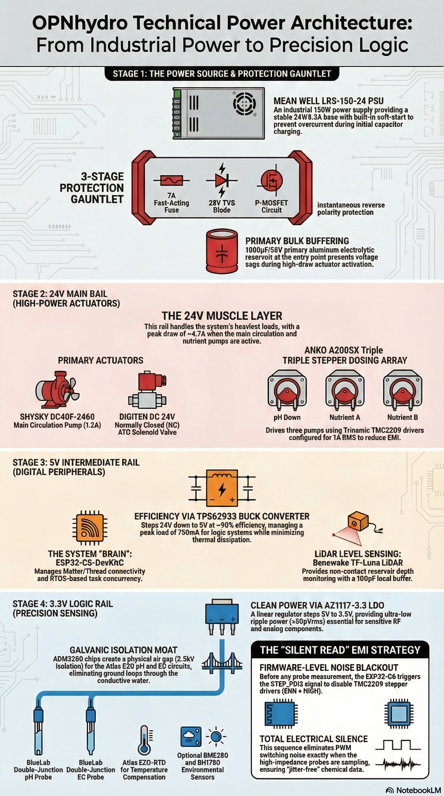
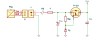
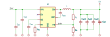
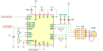
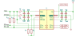
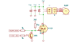
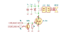
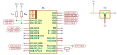

# Schematic Design Guide

This document describes the design trade-offs for the **OPNhydro** architecture. It answers **"How?"** questions, explaining the schematics including the glue around the ICs, trace widths and placement rules.

The key challenge with this board is the mix of a **sensitive** ESP32 and sensors (pH/EC), and their **noisy neighbors** such as a buck converter, isolated DC/DC converter (ADM3260), and high-noise steppers (TMC2209).

This document starts with the most critical parts of the Schematic and PCB Layout:
1. Stability Under Peak Loads
2. Integration of Precision Dosing and EMI Mitigation
3. Maintaining Signal Integrity via Isolation

It then continues to fill in the details:
4. Reservoir Level Circuits
5. Main Pump and ATO Solenoid Drivers
6. I2C and Optional Sensors
7. ESP32-C6 Hookup
8. EZO Circuits and Probe Calibration
9. Hand-Soldering

---

[TOC]


---


## 1. Stability Under Peak Loads

The system must manage a **peak draw of approximately 4.7A** when the 1.2A main pump, the Solenoid Valve and two 1.53A nutrient pumps are active on top of the typical current draw from the Reflected 5V rail.

**Topology**





---


### 1.1. Protection Gauntlet

The 24V enters the board and passes through a "protection gauntlet" before it reaches the motor drivers and the sensitive sensor logic:

1. **18 AWG Wire** for the Main Power Input (from PSU to PCB), according to standard electrical practices for currents up to 10A over short runs.
2. **Main Fuse (F):** 7A Fast-Acting Fuse provides a 50% headroom over the 4.7A peak, while still being close to 6.5A rating of the PSU. Not using PTC, because of its slow response time and voltage drop. 
3. **TVS Diode (D<sub>tvs</sub>):** If a massive overvoltage event occurs, the TVS diode will shunt the excess current to ground, potentially blowing the fuse but saving the rest of the PCB.
4. **Reverse Polarity Protection (P-CH):** If power is connected in reverse polarity, this stops current instantly, saving the remainder of the board.

**Circuit:**



**Part Selection:**

Reference       | Specs                                   | Manufacturer / Details
----------------|-----------------------------------------|-----------------------
Wire            | 18AWG, 10A over short runs              |
H               | 12A / 400V Header, 0.2" pitch           | Phoenix Contact MSTA-series 2P 0.2" 
P               | 12A / 630V Plug, 0.2" pitch, 12-30AWG   | Phoenix Contact MSTB-series 2P 0.2" 
FB              | 12A / 50Ω(100Mhz) Ferrite Bead          | Murata BLM31-series 1206
F               | 7A / 125VAC Fast Fuse                   | Littelfuse NANO451-series
P-CH            | 30V / 32A P-CH MOSFET                   | Alpha & Omega AON6407 
D<sub>tvs</sub> | 28V<sub>rs</sub> TVS                    | Diodes SMBJ-series SMBJ28A-13-F 
D<sub>z</sub>   | 12V / 200mW zener                       | Diodes BZT52C12S-7-F 
R<sub>gs</sub>  | 33kΩ ±1% / 1/8W                         | Yageo RC_L-series 0805
C<sub>blk</sub> | 1000µF ±20% / 50V  elec. (see §1.2)     | Panasonic M-A-series Radial

**Engineering Notes:**
- Reverse Polarity Protection explained:
    1. Normal polarity (+24V at Source):
      - 33kΩ pulls gate toward +24V
      - Zener clamps gate at +12V
      - V<sub>gs</sub> = 12 − 24 = −12V → **FET fully ON** ✓
      - Current through Zener: (24−12) / 33k = 0.36mA → 4.3mW dissipation, trivial
    2. Reverse polarity (supply plugged backwards → Source at −24V):
      - 33kΩ pulls gate toward 0V
      - Zener anode is now at +24V → clamps gate at 24−12 = +12V
      - V<sub>gs</sub> = 12 − 0 = +12V → **FET stays OFF** ✓
      - +12V is within the ±20V V<sub>gs</sub>(max) rating — safe ✓


---


### 1.2. Bulk Caps are Your Friend

The use of a hierarchical capacitance strategy — employing a global reservoir and multiple local reservoirs — is fundamental to maintaining the chemical and thermal stability required for this high-precision 100L system. This approach ensures that peak loads stay as local as possible.

Every wire and PCB trace has inductance. Inductance resists instantaneous changes in current:
$$
  U = L \  \frac{dI}{dt}
$$

When a stepper driver or motor demands a sudden surge of current, the inductance of the supply path creates a voltage drop — the rail sags. The further the current has to travel from the supply, the worse the sag. Bulk capacitance acts as a local energy reservoir — storing charge close to the load so it can be delivered instantly when current demand spikes.

For this board, the TMC2209 is of special concern, because it chops current to the stepper coils at 20–50kHz. Every switching cycle it draws a sharp current pulse from the VM pin. Without local capacitance, these pulses travel back through the trace inductance to the bulk cap at the power entry.

The recommended bulk capacitors:

Rail | Place               | Peak Current | Value / Voltage | Dielectric             | Purpose
----:|---------------------|--------------|----------------:|------------------------|--------
 24V | Main power entry    | ~4.7A        | 1000µF / 50V    | Aluminium electrolytic | Primary reservoir
 24V | Each TMC2209 VM pin | ~1.5A        |  220µF / 50V    | Aluminium electrolytic | Local reservoir
 24V | Main Pump MOSFET    | ~1.2A        |  220µF / 50V    | Aluminium electrolytic | Local reservoir
  5V | Buck output         | ~0.75A       |  220µF / 10V    | Aluminium polymer      | ESP32 WiFi Tx
3.3V | LDO output          | ~0.15A       |   22µF / 10V    | MLCC X7R               | Low current

**The Engineering:**

- Given the acceptable ripple and transient duration, the required capacitance follows as: $C = I × Δt / ΔU$.
- If these are unknown, use a rule of thumb: provide 100µF to 200µF electrolytic capacitors for every 1A of current. 
- To reduce aging, use electrolytic capacitors that are rated for 150% to 200% of the expected voltage.
- Aluminium polymer is low ESR, but hard to find at above 25V. Aluminium electrolytic capacitors are a pragmatic choice for 50V.
- Use low-ESR capacitors: e.g. Panasonic FR series for Aluminium electrolytic, and Panasonic FK or Kemet R60 for Aluminium polymer.
- Place local bulk capacitance directly at the Voltage Supply (VS) pins of the three TMC2209 drivers and MOSFETs.


### 1.3. Buck Converter

The buck converter converts 24V to 5V for the TTL logic.  For the design we follow Figure 10.1 of the [TPS62933 Datasheet](https://www.ti.com/lit/ds/symlink/tps62933.pdf?ts=1773728788941) and their [WEBENCH Power Designer](https://webench.ti.com/power-designer/switching-regulator). We add bulk caps on the input and output, per previous section.

**Circuit:**



**Part Selection:**

Reference       | Specs                                   | Manufacturer / Details
----------------|-----------------------------------------|-----------------------
U               | 3.8–30V / 3A Buck Converter             | T.I. TPS62933DRLR
L               | 10µH / 3A ±20% R<sub>DC</sub><50mΩ      | Bourns SDR1307-series
R<sub>rt</sub>  | 21kΩ ±1% / 1/8W (calc. below)           | Yageo RC_L-series 0805
R<sub>t</sub>   | 52.3kΩ ±1% / 1/8W (calc. below)         | Yageo RC_L-series 0805
R<sub>b</sub>   | 10kΩ ±1% / 1/8W (calc. below)           | Yageo RC_L-series 0805
C<sub>mf</sub>  | 10µF ±10% / 50V ceramic (X5R or X7R)    | Murata GRT-series X5R 1206
C<sub>bst</sub> | 100nF ±10% / 10V ceramic                | Murata GRM-series X7R 0402
C<sub>ss</sub>  | 33nF ±10%  / 50V ceramic (calc. below)  | Murata GRM-series X7R 0402
C<sub>b1</sub>  | 1000µF ±20% / 50V elec. (see §1.2)      | Panasonic M-A-series elec.
C<sub>b2</sub>  | 3× 10µF ±10% / 10V ceramic              | Murata GRM-series X5R 0805
C<sub>b3</sub>  | 220µF ±20% / 10V poly. (see §1.2)       | Panasonic SVPK-series poly.

**Engineering Notes:**
- Given the internal reference voltage $V_{r} = 0.8 \rm{\ V}$, we selected $R_{b}=10 \rm{\ k\Omega}$ and $R_{t}=52.3 \rm{\ k\Omega}$ for the voltage divider. The output voltage $V_o$ follows, per §9.3.4 of the datasheet:
$$
  \begin{align}
    V_o &= V_r \times \frac{R_b + R_t}{R_b} \\
        &= 0.8 \rm{\ V} \times \frac{10\rm{\ k\Omega} + 52.3\rm{\ k\Omega}}{10\rm{\ k\Omega}} \approx 5 \rm{\ V} \nonumber
  \end{align}
$$
- For a switching frequency $f_{s} \approx 1 \rm{\ MHz}$, we select $R_{rt} = 21 \rm{\ kΩ}$, per §9.3.5:
$$
  \begin{align}
  f_{s} &= 17.293 \times 10^6 \times \left(\frac{R_{rt}}{10^3}\right)^{-0.942} \\
  &= 17.293 \times 10^6 × 21^{-0.942} \approx 1 \rm{\ MHz} \nonumber
  \end{align}
$$
- We use the soft-start feature to minimize inrush current for driving capacitive load. For a soft-start $t_{ss} = 5 \rm{\ ms}$, where $V_{r} = 0.8 \rm{\ V}$ and a typical $I_{ss}=5.5 \rm{\ \mu A}$, the required $C_{ss}$ follows per §9.3.6:
$$
  \begin{align}
    C_{ss} &= \frac{t_{ss} \times I_{ss}}{V_r} \\
    &= \frac{5 \rm{\ ms} \times 5.5 \rm{\ \mu A}}{0.8 \rm{\ V}} \approx 33 \rm{\ nF} \nonumber
  \end{align}
$$


---


### 1.4. Linear Regulator LDO (3.3V)

The linear voltage regulator converts 5V to 3V3 for the LVTTL logic.  For the design, we follow the typical applications circuit in the [AMS1117-3.3 Datasheet](https://www.diodes.com/assets/Datasheets/AZ1117I.pdf):

**Circuit:**


**Part Selection:**

Reference       | Specs                                       | Manufacturer / Details
----------------|---------------------------------------------|-----------------------
U               | 3.3V / 1A Linear Regulator                  | Diodes AZ1117IH-3.3TRG1
C<sub>b1</sub>  | Not needed (already part of buck converter) | 
C<sub>b2</sub>  | 22µF ±20% / 10V, polymer                    | Murata GRM-Series X75 1206


---


### 1.5. PCB Guidelines

To safely handle the peak 4.7A load, the architecture mandates a **4-layer PCB** with **2oz copper** outer layers. This copper weight is essential for managing the heat and resistance of the 24V power traces under continuous 24/7 operation.

**Layer Stack-Up**

Layer | Name | Function               | Components
------|------|------------------------|--------------------------
L1    | Top  | Signal layer           | ESP32, LiDAR, I2C, UART, EZO, BNC
L2    | GND  | Solid Main GND Plane   | One uninterrupted copper pour. This is the EMI shield.
L3    | PWR  | 3.3V / 5V / 24V Planes | Seperate copper pours for low resistance.
L4    | Bot  | Steppers / MOSFETs     | So GND plane shields them from signal layer

**Notes**

- Recommended: IP65 rated ABS enclosure, ~150×100×70mm
- Cable glands for all wiring (to keep water and insects out)
- Panel-mount BNC connectors for pH/EC/RTD probes (3×)
- Optional: Clear lid for status LED visibility
- PCB Size: about 100mm × 80mm (fits common enclosures)
- PCB Finish: Hot Air Solder Leveling (HASL), or Electroless Nickel Immersion Gold (ENIG)

### 1.5.1. Trace Widths

The trace widths can be calculated using the IPC-2221 empirical formula for external conductors.[^1]
[^1]: [IPC-2221 Trace Width Calculator, Altium PCB Design Guide](https://resources.altium.com/p/ipc-2221-calculator-pcb-trace-current-and-heating).

$$
    \begin{align}
    I  &= k × ΔT^{0.44} × A^{0.725} \\
    \rm{where\ \ } I &= \rm{current\ [A]} \nonumber \\
    k  &= 0.048 \rm{\ for\ outer\ layer,\ or\ } 0.024 \rm{\ for\ inner\ layer} \nonumber \\
    ΔT &= \rm{allowable\ temperature\ increase\ [°C]} \nonumber \\
    A  &= \rm{cross\ sectional\ area\ [mil²]} =  width_{mil} × thickness_{mil} \nonumber \\
   \rm{thickness_{mil}} &= 1.37\rm{mil\ for\ 1oz\ Cu,\ or\ } 2.74\rm{mil}\rm{\ for\ 2oz\ Cu} \nonumber 
\end{align}
$$

The table below use a conservative $ΔT = 10°\rm{C}$ (IPC-2221 permits 20°C for most PCB classes). 

Net                     | Target Current    | Internal Trace Width | External Trace Width | Rationale
------------------------|-------------------|----------------------|----------------------|----------
24V input (PSU→TVS→RPP) | 6.5A (Peak)       | 5.0mm (200mil)       |  2.0mm (80mil)       | Reduce sag
24V main pump           | 1.2A (Continous)  | 1.0mm  (40mil)       |  0.4mm (15mil)       | Manage heat
24V each dosing pump    | 1.53A (Peak)      | 1.0mm  (40mil)       |  0.4mm (15mil)       | Lower inductance
24V ATO valve           | 0.3 (Peak)        | 0.2mm   (8mil)       |  0.2mm  (8mil)       | Fab minimum
5V rail (post-buck)     | 0.75A (Peak)      | 0.5mm  (20mil)       |  0.2mm  (8mil)       | Stable power
3.3V rail (post-LDO)    | 0.15 (Peak)       | 0.2mm   (8mil)       |  0.2mm  (8mil)       | Fab minimum


### 1.5.2. PCB Layout Strategy

- **Star Power**: Run a dedicated pair of 24V wires from your main power input connector directly to the stepper section, and a separate pair to the logic regulator. Do not "daisy chain" the power from the motors to the sensors.
- **Via Stitching:** If you must switch the 24V rail between layers, use multiple vias (at least 3–4 vias per 2A connection). A single standard 10-mil via is only rated for about 0.5A–1A before it acts like a fuse.
- **Antenna Support:** The ground plane should not extend under the ESP32-C6 antenna keep-out area to ensure proper wireless performance.
- **Analog/Digital Isolation:** The layout must keep analog traces physically isolated from switching power supplies and high-current motor traces.


---


## 2. Integration of Precision Dosing and EMI Mitigation

The high precision steppers generate significant **Electromagnetic Interference (EMI)** through high-speed PWM switching. To mitigate this:
- A *"Silent Read" Strategy* protects sensitive probes from the electromagnetic interference (EMI) generated by stepper PWM switching. The firmware shuts down the stepper drivers during sensor reads (via ENA) to create a "blackout" of switching noise for the sensitive pH and EC probes
- *Bypass Capacitors* suppress the middle and high frequency noise.
- *PCB Layout Strategy*, thermal relief and EMI shielding.

The **main pump**, **stepper motors**, the **solenoid** and **buck converter** turn the PCB into a high-noise environment. Stepper drivers are notorious for creating Electromagnetic Interference (EMI) and ground bounce that can "ghost" the I2C bus or cause pH readings to jump.


---


### 2.1. Stepper Driver Circuit (TMC2209)

> All currents in this section are RMS currents. 

**Circuit:**

The Standard Application Circuit in Fig. 3.1 of the [TMC2209 Datasheet](https://www.analog.com/media/en/technical-documentation/data-sheets/tmc2209_datasheet_rev1.09.pdf) and [TM2209 EVAL Schematics](https://www.analog.com/media/en/evaluation-documentation/evaluation-design-files/TMC2209-EVAL_Layout_Data_V1.1.zip) show a typical Stepper Driver using the TMC2209. The design follows their recommendations:



**Part Selection:**

Reference       | Specs                                       | Manufacturer / Details
----------------|---------------------------------------------|-----------------------
U               | 4.75-28V / 2A TMC2209 Motor Driver          | Analog Devices stallGuard-series TMC2209-LA-T
R<sub>t</sub>   | 14kΩ ±1% / 1/8W (calc. below)               | Yageo RC_L-series 0805
R<sub>b</sub>   | 10.7kΩ ±1% / 1/8W (calc. below)             | Yageo RC_L-series 0805
R<sub>s</sub>   | 2× 110mΩ ±1% / 1/3W (calc. below)           | Susumu RL-series 0805
C<sub>cp</sub>  | 22nF ±10% / 100V cer.                       | Murata GRM-series X7R 0603
C<sub>vcp</sub> | 100nF ±10% / 50V cer.                       | Murata GRM-series X7R 0402
C<sub>mf1</sub> | 100nF ±10% / 50V cer.                       | Murata GRM-series X7R 0402
C<sub>mf2</sub> | 2× 100nF ±10% / 10V, X5R/X7R (per §3.1)     | Murata GRM-series X7R 0402
C<sub>b1</sub>  | 2.2μF ±10% / 10V X7R                        | Murata GRM-series X7R 0603
C<sub>b2</sub>  | 220µF ±20% / 50V (per §3.1)                 | Panasonic M-A-series Elec.
HDR             | 3A 250V 4-pin XH 2.5mm Male Header          | JST XH-series XHP-4
PLG             | 3A 250V 4-pin XH 2.5mm Female Plug[^NEMA17] | JST XH-series S4B-XH-A[^JSTXHCONTACT]

[^NEMA17]: Commonly mislabelled "XH2.54"); XH series is 2.5mm pitch, not 2.54mm DuPont. [nkoproducts.com](https://ankoproducts.com/products/a200sx). Compatible with Molex KK 0.1"
[^JSTXHCONTACT]: Contacts Sold Separately

**Engineering Notes:**
- The Header follows the NEMA 17 convention. The pins are Coil A+, Coil A-, Coil B+, Coil B-[^STEPPERHEADER]
- `SPREAD` tied to GND to selects StealthChop mode, per architecture.
- `CLK` tied to GND, to select the internal clock.
- `STEP` tied to dedicated input signal, e.g. `STEP_PH_DH`.
- `DIR` left unconnected (int. pull-down) to select increasing count
- `STDBY` left unconnected (int. pull-down) to enables the internal supply regulator.
- `INDEX` left unconnected. Adds no value in normal operation.
- **Die Pad** must be wired to GND plane; provide as many vias as possible for heat transfer.
- Peristaltic pumps are self-sealing — the rollers pinch the tube closed when stopped, so backflow cannot occur and direction reversal is never needed.
- `STEP_PDIS` allows the firmware to disable the driver for a "Silent Read".
- Register `IHOLD=0` handles standstill power saving without the register-reset complication of STDBY.
- `DIAG` left unconnected. Stall detection is preferred via the `DRV_STATUS` register.
- If we end up with a free GPIO, we can use this to allow interrupt-driven stall detection using the `DIAG`-pin without polling.

[^STEPPERHEADER]: ⚠ Verify pin order from A200SX datasheet before PCB layout. Coil swap (A↔B or polarity) only affects rotation direction; the TMC2209 handles both.


### 2.1.1. Single Wire UART Bus

Using a **Single Wire UART Bus** with the `AD0` and `AD1` pins for addressing is the most "EZO-like" way to handle the TMC2209 drivers — it keeps the pin count low and control digital.

The TMC2209 Device Address is set using pins `AD1` and `AD0`. These pins have internal pull-down resistors:
   - for pH Dn, set address 0b00 → leave `AD1` and `AD0` unconnected
   - for NUT A, set address 0b10 → tie `AD1` to 3V3 and leave `AD0` unconnected
   - for NUT B, set address 0b11 → tie `AD1` and `AD0` to 3V3

**Conflicts Notes:**
- When the ESP32 `TXD` drives HIGH to send a command, and the TMC2209's open-drain output momentarily pulls the bus LOW to begin its response (a brief overlap before software tri-states TX) → A low-impedance conflict occurs. The 1kΩ on TX limits the fault current to a safe level of 3.3V / 1kΩ = 3.3 mA. 
- Along the same lines: the firmware should configure ESP32 UART1 in **half-duplex / single-wire mode**, so TX is tri-stated (high-impedance) during the receive window. The TMC2209 then pulls the bus LOW open-drain to transmit its response, with no conflict from TX.
- The firmware should set `SENDDELAY` to ≥2 for all nodes. Otherwise, a non-addressed node might detect a transmission error upon read access to a different node. 

### 2.1.2. Output Current

The **Output Current** is limited by:
1. The **R<sub>s</sub>** shunt resistors measure the output currents. The TMC2209 measures the voltage drop across this resistor to determine actual coil current, then adjusts its PWM chopper duty cycle to regulate current to the `IRUN/IHOLD target`. §8 suggests 120 mΩ low-inductance resistors. Instead we use a 110 mΩ 1/4W to ensure it will not exceed the full-scale voltage of 325mV.
2. Set a hard limit using the **V<sub>REF</sub>** input of the TMC2209. This linearly scales the maximum current. The value for voltage $V_{REF}$, follows from the architecture that specifies that $V_{REF}$ should be set for a current corresponding to 90% of the maximum stepper current of 1.7 A<sub>RMS</sub>.  The formula from the Motor Current Control chapter (§9) of the data sheet, shows that the current depends on $CS$, $V_{FS}$ and $V_{REF}$ and can be calculated as: 
$$
    \begin{align}
        I_{RMS}  &= \frac{CS+1}{32} \times \frac{V_{FS}}{R_{s} + 20 \rm{\ mΩ}} \times \frac{1}{\sqrt 2} \times \frac{V_{VREF}}{2.5 \rm{\ V}} \\
        \rm{where\ \ } 
        CS  &= \rm{current\ scale\ setting\ as\ set\ by\ the\ IHOLD\ and\ IRUN\ (default=31)} \nonumber \\
        V_{FS}  &= \rm{full\textnormal{-}scale\ voltage\ set\ by\ vsense\ control\ bit\ (default=325\ mV)} \nonumber \\
        R_{s}  &= \rm{resistance\ of\ the\ sense\ resistors} = 110\ m\Omega \nonumber \\
        V_{VREF} &= \rm{linearly\ scales\ the\ output\ current\ to\ the\ motor\ (2.5\ V\ for\ 100\%) } \nonumber
    \end{align}
$$
Without software throddeling ($CS=31$) and the default $\textnormal{vsense control bit}$, the required $V_{VREF}$ follows as:
$$
    \begin{align}
        0.9 \times 1.7\rm{\ A}  &= \frac{32}{32} \times \frac{325 \rm{\ mV}}{110 \rm{\ m\Omega} + 20 \rm{\ mΩ}} \times \frac{1}{\sqrt 2} \times \frac{V_{VREF}}{2.5 \rm{\ V}} \nonumber \\
        \Rightarrow
        V_{VREF} &= 0.9 \times 1.7\rm{\ A} \times \frac{110 \rm{\ m\Omega} + 20 \rm{\ mΩ}}{325 \rm{\ mV}} \times \sqrt 2 \times 2.5 \rm{\ V} 
        \approx 2.16 \rm{\ V} \nonumber
    \end{align}
$$
To create this voltage, use the 5V<sub>OUT</sub> pin with a a R<sub>H</sub> and R<sub>L</sub> Voltage Divider. Ignoring the $R_{VREF}=240 \rm\ M\Omega$, the required resistors follow as $R_{t} = 14 \rm{\ k\Omega}$ and $R_{b} = 10.7 \rm{\ k\Omega}$:
$$
    \begin{align}
        V^{'}_{VREF} &= \frac{R_{b}}{R_{b}+R_{t}} \times 5 \rm{\ V} = \frac{10.7 \rm{\ k\Omega}}{10.7 \rm{\ k\Omega} + 14 \rm{\ k\Omega}} \times 5 \rm{\ V} \approx 2.16 \rm{\ V} \nonumber
    \end{align}
$$
3. The firmware **CS Register** (see below).


The **firmware** should aim for an **operating range of 70% to 80%** corresponding to setting the CS to 24 or 27. Increase to 85–90% only if stalling occurs on aged tubing.

CS value | Current limit| Target range
:-------:|:------------:|:-----------:
24       |      1.19A   | 70%
25       |      1.24A   | 73%
26       |      1.29A   | 76%
27       |      1.34A   | 79%
28       |      1.43A   | 81%
29       |      1.39A   | 84%
30       |      1.48A   | 87%
31       |      1.53A   | 90%


### 2.1.2. Firmware Considerations

We suggest using the [TeensyStep](https://github.com/luni64/TeensyStep) to define when and how fast to generate the steps, and [TMCStepper](https://github.com/teemuatlut/TMCStepper) to tell the driver how to interpret those steps (e.g., silent mode, current limits, microstepping).

Key UART registers to configure at startup are:

| Register     | Value | Purpose 
|--------------|-------|---------
| `IHOLD`      |     0 | Zero standstill current (EN tied to GND — this is essential)
| `IRUN`       |    24 | Run current ≈ 70% (CS=24 → 1.19A; increase to 27 for ~79% if stalling occurs — see CS table above) |
| `IHOLDDELAY` |     6 | Steps between IRUN→IHOLD transition after last STEP pulse
| `TPWMTHRS`   |     0 | StealthChop2 active at all speeds
| `SENDDELAY`  |    ≥2 | Required for multi-driver bus. See note above.

STEP pulses must be generated by hardware peripherals, not software loops. If the ESP32 is busy with a Wi-Fi request, SSL/TLS handshake, a software-timed pulse loop can stall for tens of milliseconds. A single missed or late pulse causes the stepper to lose a step — and since dosing accuracy is derived from step count × tube displacement, one lost step per dose accumulates into measurable calibration error over time.

The recommended ESP32-C6 hardware options is to use the **Remote Control Transceiver (RMT)**. This  generates arbitrary pulse sequences from a preloaded buffer with nanosecond resolution, independent of the CPU. Configure it to output N pulses at the target step frequency, then trigger it once per dose. When the burst completes it fires a interrupt; the CPU core is free throughout.

The ESP32-C6 supports up to 4 independent RMT TX channels on ESP32-C6 → one per STEP pin with one spare.


---


### 2.2. "Silent Read"

The "Silent Read" strategy is a fundamental coordination technique in the OPNhydro architecture designed to ensure the highest possible data integrity for sensitive electrochemical sensors. Its importance is rooted in the need to manage the conflicting requirements of high-precision dosing and high-accuracy monitoring within the same electrical environment.

The dosing sequence is:
1. Turn OFF the TMC2209 drivers (using the !EN pin) while reading the sensors to ensure 100% electrical silence.
2. Read pH/EC (EZO sensors) and calculate dose.
3. Enable drivers and step the motors.
4. Wait for the reservoir to mix before reading again.

The schematic or firmware should use **StealthChop2** for dosing. It generates significantly less Electrical Noise (EMI) than the high-torque SpreadCycle mode, which improves EZO-EC data integrity.


---


### 2.3. Capacitors to the Rescue

The existing 220µF bulk caps at VM also suppress the **medium-frequency** switching ripple by providing charge locally, within the short trace between cap and VM pin, before the inductance of the supply path has time to cause a voltage dip.

**Recommended MF capacitors:**

Rail | Place               | Peak Current | Value / Voltage | Dielectric             | Purpose
----:|---------------------|--------------|----------------:|------------------------|--------
 24V | Main power entry    | ~4.7A        |   10µF / 50V    | MLCC X7R[^2]           | MF bypass
 24V | Each TMC2209 VM pin | ~1.5A        |  220µF / 50V    | Aluminium Electrolytic | MF bypass
 24V | Main Pump MOSFET    | ~1.2A        |  220µF / 50V    | Aluminium Electrolytic | MF bypass
  5V | Buck output         | ~0.75A       |   10µF / 10V    | MLCC X7R[^3]           | MF bypass

[^2]: e.g. Murata GRM31CR61H106KA12L (SMD Comm X7R). DC bias derating is better for 1206 package.
[^3]: e.g. Murata GRM21BR61C106KE15L. Use 0805 package.

Note that the Benewake TF-Luna LiDAR includes a 100nF capacitor to debounce signals and prevent EMI-induced false triggers on the safety interlock lines.

For **high-frequency bypass** (decoupling), the goal is to present the lowest possible impedance at the target frequencies. The capacitor value sets the resonant frequency with its parasitic inductance (ESL).

**Recommended HF/VHF bypass capacitors:**

Rail | Value / Voltage | Dielectric | Package   | Purpose
----:|----------------:|------------|-----------|---------
 24V | 100nF / 50V     | MLCC X7R   | 0402/0603 | HF bypass
  5V | 100nF / 16V     | MLCC X7R   | 0402/0603 | HF bypass per IC
3.3V | 100nF / 10V     | MLCC X7R   | 0402/0603 | HF bypass per IC
3.3V |  10nF / 10V     | MLCC X7R   | 0402      | VHF bypass for sensitive pins

**The Engineering:**

- *Why 100nF:* Self-resonant frequency of a 100nF 0402 MLCC[^4] is SRF=~30MHz, while the equivalent series resistance ESR=~0.2mΩ at 1 MHz → it operates as an effective bypass to ground up from about ~1 Mhz to ~30MHz — covering the HF-part of the switching harmonics.
- *Why 10nF:* a similar 10nF cap[^5] as the is SRF=~85MHz and ESR=~0.2mΩ at 1 MHz → it operates as bypass to ground up from ~1MHz to ~85MHz — covering the VHF-end of switching harmonics.
- *Why X7R not X5R:* X7R holds capacitance better across temperature (−55°C to +125°C, ±15%). X5R is acceptable on low-voltage rails but degrades more with temperature and DC bias.
- *Why those pesky small 0402/0603:* Smaller package = lower ESL = lower impedance at high frequency. 0805 and larger have noticeably higher ESL and are less effective as HF bypass caps.

[^4]: Such as the Murata GRM155R71C103KA01D
[^5]: Such as the Murata GRM155R71C104KA88J

Long PCB traces or component leads add inductance, which reduces the SRF. The **placement priority order** should be:

Capacitor value  | Maximum distance
-----------------|-----------------
10nF ceramics    | 2mm from IC
100nF ceramics   | 5mm from IC
10-22µF ceramics | 10mm from IC
Electrolytics    | 20mm from load

For added protection, use **ferrite beads** on power inputs to further reject high-frequency noise.


### 2.4. PCB Layout Strategy

At 1.0A RMS, the TMC2209 drivers generate only a 1/4 of the heat compared to their 2.0A limit.
- **A "Thermal Chimney":** Use a large GND plane on the bottom layer as a heatsink. Use a 4×4 array of 16 thermal vias, 0.3mm diameter, spaced 1mm apart under the TMC2209 center pad connecting to the GND plane to pull heat away.
- **EMI Shielding:** By keeping high-speed switching (stepper drivers) **on the bottom** (L4) and sensitive logic on the top (L1), the internal Ground and Power planes act as a Faraday shield, preventing motor noise from "leaking" into the pH and EC readings. 


---


## 3. Maintaining Signal Integrity via Isolation

In a conductive nutrient solution, multiple probes (pH, EC, RTD) can create ground loops, where small currents leak between probes and distort readings.  

Mitigation strategy:
   - *Isolation circuit:* Isolated DC and I2C via the ADM3260 chip, providing a physical air gap to eliminate ground loops.  
   - *Physical distance*: Separate the Noisy and Sensitive neighbors.
   - *Pi-Filters:* Ensures noise of the isolation chip itself does not "leak" into the high-impedance analog front-end of the pH and EC circuits.

To prevent Ground Loops, the architecture uses Isolated I2C via the ADM3260 chip, providing a physical air gap to eliminate these loops.  


---


### 3.1. Isolation Circuit (ADM3260)

**Circuit:**

The Typical Application Diagram in Fig. 20 of the [ADM3260 Datasheet](https://www.analog.com/media/en/technical-documentation/data-sheets/adm3260.pdf) and [UG-724](https://www.analog.com/media/en/technical-documentation/user-guides/EVAL-ADM3260MEBZ_UG-724.pdf) show a typical Isolated I2C Interface using the ADM3260. The design follows their recommendations[^MOREAMD3260] :

[^MOREAMD3260]: See also, Analog Devices ADM3260 Datasheet: The definitive source for "Layout Guidelines" and "EMI Considerations" (See pages 16-18); Atlas Scientific USB Isolator Schematic: Their public hardware documentation shows the ADM3260 implementation for I2C isolation; AN-0971 Application Note: "Recommendations for Control of Radiated Emissions with isoPower Devices."

>The ADM3260 uses an internal isoPower transformer switching at ~180MHz, it can cause the "Island" to act like a radio antenna.

Although disabling the stepper motors eliminates external EMI, the ADM3260 itself is a switching power supply. A pi-filter at the V_ISO ensures that the internal noise of the isolation chip does not "leak" into the high-impedance analog front-end of the pH and EC circuits. 



**Part Selection:**

Reference       | Specs                           | Manufacturer / Details
----------------|---------------------------------|-----------------------
U               | 2.5kV I2C Isolator              | Analog Devices ADM3260ARSZ
FB              | R<sub>DC</sub>=20mΩ Z=60Ω(100MHz) Ferrite Bead | TDK MPZ-series MPZ1608S600ATDH5
C<sub>blk</sub> | 10μF ±10% / 16V cer.            | Murata GRM-series X5R 0805
C<sub>mf</sub>  | 100nF 10% / 16V cer             | Murata GRM-series X7R 0402
C<sub>hf</sub>  | 10nF 10% / 16V cer.             | Murata GRM-series X7R 0402
R<sub>t</sub>   | 16.9kΩ ±1% / 1/8W (calc. below) | Yageo RC_L-series 0805
R<sub>b</sub>   | 10kΩ ±1% / 1/8W (calc. below)   | Yageo RC_L-series 0805
R<sub>up</sub>  | 2.2kΩ ±1% / 1/8W (calc. below)  | Yageo RC_L-series 0805

**Engineering Notes:**


- **V<sub>SEL</sub>** sets the isolated output voltage V<sub>ISO</sub>. For V<sub>ISO</sub>=3.3V, create a voltage divider so that V<sub>SEL</sub> matches the 1.25V reference voltage: 
$$
  \begin{align}
    V_{SEL} &= V_{ISO} \cdot \frac{\rm{R_{l}}}{\rm{R_{l}}+\rm{R_{h}}}
    \\
    & = 3.3\rm{\,V} \cdot \frac{10\,kΩ}{10\,kΩ+16.9\,kΩ} \approx 1.25\rm{V} \nonumber
  \end{align}
$$
- **I2C pullups** are required on the isolated side, just like the main side. A "stiff" 2.2kΩ here is better for fighting the noise. Use ±1% tolerance resistors to ensure the I2C rise times are identical on SDA and SCL.
- **Bypass capacitors** are mandatory for the device to function correctly and provide stable isolated power.
  - for 10 nF: place cap within 1 or 2 mm of the pins
  - for 100 nF: place cap within 1 or 2 mm of the pins
- For caps and resistors, follow the **footprint** from Fig. 23 in the [Datasheet](https://www.analog.com/media/en/technical-documentation/data-sheets/adm3260.pdf).
- The signal **`EZO_PDIS`** is intended for powering down sensors between long monitoring intervals. Power to the sensors need to be restored and stabilized well before the measurement is taken.[^FAULTRECOVERY] 
- The **Ferrite beads** may help mitigating the Electromagnetic Interference (EMI). The bead surrounded by capacitors on both sides forms a π-Filter. 
- Use the **"Stitching Capacitance" trick** to reduce EMI: place a small amount of "stitching capacitance" across the isolation barrier. This is achieved by overlapping internal PCB layers or using a dedicated Y-rated capacitor. Extend GND<sub>P</sub> and GND<sub>ISO</sub> on separate inner layers into the moat. The capacitive coupling of the structure is calculated with the following basic relationships for parallel plate capacitors:[^A-0971]
    $$
        \begin{align}
          C  &= \frac{A\varepsilon}{d} \rm{\ and\ } \varepsilon=\varepsilon_0\times\varepsilon_r  \\
          \rm{where\ \ } 
          A  &= \rm{area\ of\ the\ overlapping\ reference\ planes} \nonumber \\
          C  &= \rm{total\ stiching\ capacitance} \nonumber \\
          d  &= \rm{thickness\ of\ the\ insulation\ layer\ in\ the\ PCB} \nonumber \\
          \varepsilon_0 &= \rm{permittivity\ of\ free\ space} = 8.854\times10^{-12} \rm{\ F/m} \nonumber \\
          \varepsilon_r &= \rm{relative\ permittivity\ of\ the\ PCB\ insulation\ material\ } \approx 4.5\rm{\ for\ FR4} \nonumber \\
        \end{align}
    $$
- To reduce edge radiation, consider using a **Via Fence and Guard Ring**.[^A-0971]

[^FAULTRECOVERY]: It can also be used for fault recovery: pulse HIGH 100ms then LOW; wait ≥1.2s before sending I2C commands.
[^BLM18]: Murata EMI Guide: Recommends the BLM18 series ferrite beads for suppressing high-frequency noise in isolated DC/DC converters.
[^A-0971]: [A-0971](https://www.analog.com/en/resources/app-notes/an-0971.html)

---


### 3.2. Physical distance

Physical distance is the most effective EMI mitigation. Separate the "Noisy" from the "Quiet."

The gold standard for this "Multi-EZO" PCB layout is the [Atlas Scientific i4 InterLink](https://files.atlas-scientific.com/i4-interlink-datasheet.pdf) and the [Whitebox Labs T3 schematics](https://github.com/whitebox-labs/tentacle-raspi-oshw).

[^^8]: Analog Devices AN-0971 (Recommendations for Control of Radiated Emissions with isoPower Devices). This document also details how to use PCB "Stitching Capacitance" to keep the board quiet.

1. **Zone A: Power Entry (Edge of Board)**
   - Components: DC Jack, 7A Fast Fuse, RPP, TVS Diode, Bulk Cap.
   - Goal: Kill spikes and provide bulk current immediately upon entry.
2. **Zone B: High-Power Drive (Bottom Half)**
   - Components: 3x TMC2209 drivers, 3x Bulk caps, Solenoid MOSFET.
   - Routing: Keep the 24V "VM" traces on L4 (Bottom).
   - Thermal: Place the drivers here to utilize the L2 GND plane as a heatsink.   
   - Noise profile: Extreme (source)
3. **Zone C: Digital Logic (Top Center)**
   - Components: ESP32, LiDAR header, 5V/3.3V Regulators, EZO-RTD (Non-isolated).
   - Routing: Keep I2C/UART on L1 (Top), shielded by the L2 GND Plane.
   - Noise profile: Moderate (sensitive)
4. **Zone D: Isolated Islands (Top Corners)**
   - Components: 2x ADM3260, EZO-pH/EC sockets, BNC connectors.
   - Noise profile: zero tolerance

To visualize the ADM3260 on a 4-layer stack-up, imagine the chip sitting like a bridge over a **Moat**. The goal is to ensure that no electrical path exists between the Mainland and the Island except through the silicon of the chip itself. Ensure the Moat is at least 6mm wide for high-voltage safety (creepage).

Below is how the layers should be carved to maintain 2.5kV isolation:

Layer       | Mainland               | The Moat                  | The Island (pH or EC)
------------|------------------------|---------------------------|----------------------
L1 (Top)    | ESP32, LiDAR           | No Copper                 | EZO Socket, BNC
L2 (GND)    | Solid Main GND Plane   | Stitching Cap[^STITCHCAP] | Floating GND_ISO
L3 (PWR)    | 3.3V / 5V / 24V Planes | Stitching Cap             | Floating V_ISO (3.3V)
L4 (Bottom) | Steppers and glue      | No Copper                 | (Keep empty for signal)


[^STITCHCAP]: See the next paragraph.


---


## 4. Reservoir Level Circuits

Tight water level control is about chemical stability. A LiDAR circuit measures the water level, so that the firmware can add water to the reservoir when needed.  Two Float Switches function as alarms in the firmware fails to refill the reservoir.


### 4.1. LiDAR Circuit

**Circuit**

The circuit follows the guidance from the [LiDAR Datasheet](https://github.com/May-DFRobot/DFRobot/blob/master/TF-Luna%20LiDAR%EF%BC%888m%EF%BC%89%20Datasheet.pdf).


**Part Selection:**

Reference       | Specs                                          | Manufacturer / Details
----------------|------------------------------------------------|-----------------------
C<sub>b</sub>   | 100μF ±20% / 25V, electrolytic                 | Panasonic FN-series, elec. 
HDR             | 6-pin Molex 1.25mm, male header                | Molex PicoBlade-51021-series 0532610671 [^LiDARCONN]
PLG housing     | 6-pin Molex 1.25mm, female plug housing        | Molex PicoBlade-51021-series 0510210600
PLG contacts    | 6× 26-28AWG Molex 1.25mm, female plug contacts | Molex PicoBlade-50079-series 0500798000

[^LiDARCONN]: See [RobotShop Community](https://community.robotshop.com/forum/t/whats-the-electrical-connector-on-the-tf-luna-lidar-sensor/99629)


**Engineering notes:**

- Connector pins: VCC, RX/SDA, TX/SCL, GND, Config, (unconnected for UART; GND for I2C), Data Ready (I2C mode).


---


### 4.2 Float Switches

The two float switches use opposite pull directions so that both GPIO signals are *active-HIGH when their cutoff condition is triggered* — consistent logic for both software and the hardware NPN cutoff transistors.

**Circuit**


**Part Selection:**

Reference | Specs                                     | Manufacturer / Details
----------|-------------------------------------------|-----------------------
J         | 4-pin 3.5mm, side-entry screw terminal    | Same Sky TB0011-350-series 2223-TB0011-350-04BE-ND
R         | 2× 10kΩ 1/8W ±1%                          | Yageo RC_L-series 0805
C         | 2× 100nF 50V ±10% cer.                    | Murata GRM-series X7R 0402

**Engineering notes:**

- Pins 3V3, high-level float, low level float, GND
- Mount both float switches in with the hinge DOWN.
    - When water rises to the switch, the float arm lifts → magnet nears the reed switch → circuit closes.
    - When water drops below the switch, the float arm falls → magnet nears the reed switch → circuit opens.


---


## 5. Main Pump and ATO Solenoid Drivers


All pumps and the ATO valve use the same 24V rail and identical driver circuits.

Standard electrical practices suggest 20 AWG or 22 AWG wires are sufficient for the individual 1.2A to 1.5A loads of the pumps and valves.

Notes about the Main Pump:
- Pump must be fully submerged in water before power-on (prevents dry-run damage)
- Mount pump vertically or horizontally, avoid inverted position
- Add inline strainer/filter to prevent debris clogging impeller
- Test PWM control at low duty cycles to find minimum stable speed
- Allow 10-15 second startup delay in software for motor initialization

Notes about the ATO valve:
- Most solenoid valves have 2-wire leads (polarity doesn't matter for DC)
- Arrow on valve body indicates flow direction
- Use thread sealant (Teflon tape or pipe dope) on NPT threads
- Mount valve with coil vertical (prevents water ingress)
- Recommend: inline manual shutoff valve for maintenance
- Recommend: firmware timeout prevents flooding if all level sensors fail


---


### 5.1. Main Pump Driver

The main pump supports PWM speed control via the 24V power input.

The float switch drives a small NPN transistor that directly clamps the MOSFET gate to GND when the cutoff condition fires. This is independent of firmware — the pump shut down in hardware even if the ESP32 is hung or misbehaving.

**Circuit**



**Part Selection**

Reference       | Specs                   | Manufacturer / Details
----------------|-------------------------|---------
N-CH            | 55V 42A N-CH MOSFET     | Infineon IRLR2905TRPBF
NPN             | 40V 0.2A NPN Transistor | Onsemi MMBT3904LT1G
D               | 40V 3A Schottky Diode   | Onsemi SS34
R<sub>g</sub>   | 100Ω 1/8W ±1%           | Yageo RC_L-series 0805
R<sub>b</sub>   | 4.7kΩ 1/8W ±1%          | Yageo RC_L-series 0805
R<sub>h</sub>   | 10kΩ 1/8W ±1%           | Yageo RC_L-series 0805
C<sub>mf</sub>  | 100nF 50V ±10% X5R/X7R  | Murata GRM-series X7R 0402
C<sub>b</sub>   | 220µF 50V ±20% Elec.    | Panasonic ME-series Elec.
HDR             | 2-pos MC 0.2" header    | Phoenix Contact MC-series 1836189
PLG             | 2-pos MC 0.2" plug      | Phoenix Contact MC-series 1836079

**Engineering notes:**
- Header chosen to avoid compatibility with 24V PSU header.
- Header pins: 24V, switched GND
- The IRLR3636 remains a valid drop-in efficiency upgrade if desired.
- R<sub>up</sub> ensures the motor stays on during ESP32 reset.
- C<sub>l</sub> for bulk over the 24V rails to help with inrush, which for a 200mA solenoid is modest — maybe 600mA for 1–2ms.
- R<sub>g</sub> helps manage the inrush current to the MOSFET's gate capacitor. This protects the ESP32-C6 while allowing for the fast switching speeds required for PWM speed control.

**Firmware suggestions:**
- Minimum: ~30-40% duty recommended to prevent stall.
- Frequency: 25 kHz (above audible range, smooth motor control)


---


### 5.2. ATO Valve Driver

**Circuit**



**Part Selection**

Reference       | Specs                   | Manufacturer / Details
----------------|-------------------------|---------
N-CH            | 30V 5.7A N-CH MOSFET    | Alpha & Omega AO3400A
NPN             | 40V 0.2A NPN Transistor | Onsemi MMBT3904LT1G
D               | 40V 3A Schottky Diode   | Onsemi SS34
R<sub>g</sub>   | 100Ω 1/8W ±1%           | Yageo RC_L-series 0805
R<sub>b</sub>   | 4.7kΩ 1/8W ±1%          | Yageo RC_L-series 0805
R<sub>h</sub>   | 10kΩ 1/8W ±1%           | Yageo RC_L-series 0805
C<sub>mf</sub>  | 100nF 50V ±10% X5R/X7R  | Murata GRM-series X7R 0402
C<sub>b</sub>   | 47µF / 50V              | Panasonic MA-series Elec.
HDR             | 2-pos MC 0.2" header    | Phoenix Contact MC-series 1836189
PLG             | 2-pos MC 0.2" plug      | Phoenix Contact MC-series 1836079

**Engineering notes:**
- Header chosen to avoid compatibility with 24V PSU header.
- Header pins: 24V, switched GND


---


## 6. I2C and Optional Sensors

The default I2C addresses of the sensors are:
- EZO-pH:  0x63
- EZO-EC:  0x64
- EZO-RTD: 0x66
- BME280 air temp/humidity sensor:  0x76/0x77
- BH1750 light sensor: 0x23/0x5C
- SSD1306 OLED display: 0x3C/0x3D

### 6.1. I2C

To fix noisy SDA/SCL lines, use one or more of these methods:[^I2CNOISE]
- Strengthen Pull-ups: Use lower resistance values (instead of 10kΩ) to increase current and ensure the signal reaches a logic high quickly, especially with high bus capacitance. → Use 2.2kΩ pull-ups.
- Series Resistors: Place a small (100 to 300Ω) resistor in series with the SDA/SCL lines to reduce ringing and improve RF noise immunity. The resistor along with the pin capacitance forms a low pass filter and filters out any high frequency signals which may get coupled to the I2C lines.
- Proper Decoupling: Use 0.1µF capacitors to ground for the power supply (VDD to GND) of the ICs. 
- Physical Layout: Keep I2C traces short and separated from noise sources.
- Shunt Capacitors: Place small capacitors (10 - 50pF) on the SDA and SCL lines to ground to create a low-pass filter, reducing high-frequency noise.

[^I2CNOISE]: [I2C Design Mathematics: Capacitance and Resistance](https://www.allaboutcircuits.com/technical-articles/i2c-design-mathematics-capacitance-and-resistance/#:~:text=The%20NXP%20specification%20states%20that,cases%20the%20effect%20is%20negligible.)


---


### 6.2. Optional I2C Sensors

Included are two I2C headers for future expansion with e.g. a air temp/humidity sensor (BME280), light sensor (BH1750) or OLED display (SSD1306).

#### Circuit


**Part Selection**

Reference       | Specs                             | Manufacturer / Details
----------------|-----------------------------------|-----------------------
C<sub>mf</sub>  | 100nF 50V ±10% cer.               | Murata GRM-series X7R 0402
C<sub>b</sub>   | 10µF 16V ±10% cer.                | Murata GRM-series X5R 0805
HDR             | 2A 100V 4-Pos PH header           | JST PH-Series S4B-PH-K-S
PLG housing     | 2A 100V 4-Pos PH housing          | JST PH-Series PHR-4
PLG contacts    | 2A 100V 4-Pos PH contact 24-30AWG | JST PH-Series SPH-002T-P0.5S

**Engineering Notes**

- There is no standard for I2C connectors.  Follow the Grove (Seeed Studio) and STEMMA (Adafruit).
- Header pins: GND, VCC, SCL, SDA


---


## 7. ESP32-C6 Hookup


The ESP32-C6-DevKitC-1-N8 mounts to the carrier PCB via 2×20 pin headers. USB-C, boot/reset buttons, antenna, RGB LED (WS2812B) and power regulation are on the DevKit.

**Circuit**




**Part Selection**

Reference       | Specs                             | Manufacturer / Details
----------------|-----------------------------------|-----------------------
M*              | ESP32-C6 Development Board        | Espressif Systems ESP32-C6-DEVKITC-1-N8
R<sub>h</sub>   | 2× 2.2kΩ ±1% 1/8W (see I2C)       | Yageo RC_L-series 0805
R<sub>tx</sub>  | 2× 1kΩ ±1% 1/8W (see below)       | Yageo RC_L-series 0805

**Engineering Notes**

- Power/reset pins:
   - `3V3` — Regulated power out. Not needed → Leave unconnected.
   - `~RST` — Reset input (internal pull-up). → Leave unconnected.

- The ESP32-C6 chip provides for JTAG debugging using the following pins:
    - `GPIO4` — Ensure no low-impedance devices pull it low during startup to avoid booting issues. → Used as bidirectional I2C pin.
    - `GPIO5` — Ensure no low-impedance devices pull it low during startup to avoid booting issues. → Used as bidirectional I2C pin.

- The chip allows for configuring boot parameters through strapping pins. At Chip Reset, latches the values:
    - `GPIO8` — Controls the boot mode. It is also used for the on-board RGB LED. → Do not connect to an external load.
    - `GPIO9` — Controls the boot mode. Ensure no low-impedance devices pull it low during startup to avoid booting issues.
    - `GPIO15` — Controls peripheral voltage or JTAG. Ensure no low-impedance devices pull it low during startup to avoid booting issues. → Used as output.

- USB-C ports:
    - `GPIO16` — Connects UART0 TX to the CP2102N USB-UART Bridge RX (reserved). UART0 may transmit ROM boot messages and other serial data. → Leave unconnected.
    - `GPIO17` — Connects CP2102N USB-UART Bridge TX to UART0 RX (reserved). Any external connection would fight the CP2102N output. → Leave unconnected. 
    - `GPIO12`/`GPIO13` — USB `D−`/`D+` (reserved). These pins are used for Serial logging, code upload, JTAG. → Leave unconnected.

- General Purpose I/O pins with no restrictions:
    - `GPIO0` → Used as input.
    - `GPIO1` → Used as input.
    - `GPIO2` → Used as output.
    - `GPIO3` → Not used.
    - `GPIO6` → Used as output.
    - `GPIO7` → Not used.
    - `GPIO10` → Used as output.
    - `GPIO11` → Used as output.
    - `GPIO18` → Not used.
    - `GPIO19` → Used as output.
    - `GPIO20` → Used as output.
    - `GPIO21` → Used as input. See §2.1.1.
    - `GPIO22` → Used as tri-state output. See §2.1.1.
    - `GPIO23` → Not used.


---


## 8. EZO Circuits and Calibration

Atlas Scientific EZO circuits are modules designed to interface with and process data from specific sensors, such as pH, Electrical Conductivity (EC), and Temperature (RTD). They serve as the bridge between raw probe signals and the microcontroller, converting electrochemical potentials into digital data.

### 8.1 EZO Circuits

### 8.1.1. pH Level

In a mineral-heavy reservoir, ground loops are the hidden enemy of probe accuracy. Because water is conductive, multiple probes (pH, EC) in the same tank each develop their own electrochemical potential relative to the nutrient solution. When multiple probes share a common reference ground, small currents circulate between them, biasing readings.

The pH Probe connects to a dedicated electrical isolation circuit.

**Circuit**


**Part Selection**

Reference | Specs                                         | Manufacturer / Details
----------|-----------------------------------------------|-----------------------
M         | EZO Evaluation Expansion Board for pH Circuit | Atlas Scientific EZO-PH
J         | BNC Jack, Female 50Ω Panel Mount R/A          | TE Connectivity 5227161-6


### 8.1.2. Electrical Conductivity

**Circuit**

Like the pH probe, the Electrical Conductivity probe connects to a dedicated electrical isolation circuit.


**Part Selection**

Reference | Specs                                         | Manufacturer / Details
----------|-----------------------------------------------|-----------------------
M         | EZO Evaluation Expansion Board for EC Circuit | Atlas Scientific EZO-EC
J         | BNC Jack, Female 50Ω Panel Mount R/A          | TE Connectivity 5227161-6


### 8.1.3. Temperature

The PT-1000 temperature probe is immune to the electrical noise that affects electrochemical probes, meaning it does not require the same isolation strategy as the pH and EC sensors.

**Circuit**


**Part Selection**

Reference | Specs                                          | Manufacturer / Details
----------|-----------------------------------------------|-----------------------
M         | EZO Evaluation Expansion Board for RTD Circuit | Atlas Scientific EZO-RTD
J         | BNC Jack, Female 50Ω Panel Mount R/A           | TE Connectivity 5227161-6


---


### 8.2 Switching to I2C Mode

EZO circuits ship in **UART mode** (green LED). They must be switched to **I2C mode** (blue LED) before connecting to OPNhydro. This is done by briefly shorting two pins at power-on:[^ATLASI2C]
- Short the TX against PGND to switch to I2C mode
- A Green LED indicates UART mode, while Blue indicates I2C mode.
1. Place the EZO on a breadboard.
1. Connect `VCC` to 3V3.
2. Disconnect `GND` (power off the EZO circuit).
2. Disconnect `RX/SDA` and `TX/SCL` from the microcontroller.
3. Connect `TX/SCL` to `PGND` using a jumper wire.
5. Connect `GND` (power on).
6. Wait for LED to change from Green → Blue (takes ~2 seconds; indicates I2C mode is now active)
7. Note that this also resets the I2C address.
7. Disconnect `GND` (power off)
8. Remove the jumper wire.
9. Move the EZO on the PCB

[^ATLASI2C]: From Atlas Scientific EZO pH datasheet, p.37


---


### 8.3 Calibration

Probe calibration is essential to maintain the chemical and thermal stability required for a 50-plant NFT setup. Accuracy is important because the system performs micro-dosing (as little as 0.2 mL of acid in 100L of water), and uncalibrated sensors would cause the PID control loop to become unstable, leading to "pH yo-yoing" or overshooting.

All calibration is performed over I2C by sending ASCII command strings to each circuit's address:
1. Write command string to EZO address. E.g.,  `i2c_write(0x63, "Cal,mid,7")`.
2. Wait &geq;300 ms before reading response.
3. Read 1+ bytes from EZO address. The first byte is the status code:
     `1` = success (`*OK`)
     `2` = syntax error
     `254` = still processing (wait longer)
     `255` = no data
4. If `status==254`, wait another 100 ms and retry read

Calibration status can be queried at any time using `Cal,?` → returns `?Cal,<n>` where `n` = number of calibration points stored (`0` = uncalibrated).

#### 8.3.1. pH Level

Calibration solutions needed: pH 4.00, 7.00 and 10.00 buffers.
Order is mandatory: mid → low → high. Starting over with `Cal,mid` clears all stored points.

1. Step 1 — Mid-point (pH 7.00)
   - Place probe in pH 7.00 buffer.
   - Wait for readings to stabilize (~1–2 min).
   - Send:  `Cal,mid,7`
   - Wait:  300 ms
   - Read:  response (should be `*OK`)

2. Step 2 — Low-point (pH 4.00)
   - Rinse probe with DI water, dry gently.
   - Place probe in pH 4.00 buffer.
   - Wait for readings to stabilize (~1–2 min).
   - Send:  `Cal,low,4`
   - Wait:  300 ms
   - Read:  response

3. Step 3 — High-point (pH 10.00)
   - Rinse probe with DI water, dry gently.
   - Place probe in pH 10.00 buffer.
   - Wait for readings to stabilize (~1–2 min).
   - Send:  `Cal,high,10`
   - Wait:  300 ms
   - Read:  response

4. Verify
   - Send `Cal,?`  →  expect `?Cal,3`

Notes:
- Recalibrate every 6–12 months, or when probe response drifts >0.1 pH.

#### 8.3.2. Electro Conductivity

Calibration solutions needed: 12,880 µS/cm and 80,000 µS/cm standards
(Atlas Scientific COND-12880 and COND-80000, or equivalent NIST-traceable solutions)

1. Step 1 — Dry calibration
   - Remove probe from any liquid. Ensure probe is completely dry.
   - Send:  `Cal,dry`
   - Wait:  300 ms
   - Read:  response (`*OK`)

2. Step 2 — Low-point (12,880 µS/cm)
   - Place probe in 12,880 µS/cm standard.
   - Wait for readings to stabilize (~1 min).
   - Send:  `Cal,low,12880`
   - Wait:  300 ms
   - Read:  response

3. Step 3 — High-point (80,000 µS/cm)
   - Rinse probe with DI water, dry gently.
   - Place probe in 80,000 µS/cm standard.
   - Wait for readings to stabilize (~1 min).
   - Send:  `Cal,high,80000`
   - Wait:  300 ms
   - Read:  response

4. Verify
   - Send `Cal,?`  →  expect `?Cal,2`

Notes:
- Recalibrate: Annually or when probe is replaced.
- K value: Confirm probe is K=1.0 (`K,?` should return `?K,1.00`). If not, set with `K,1.0`.


#### 8.3.3. Temperature

The Atlas Scientific EZO RTD circuit should be calibrated to ensure accurate, long-term readings, although it is not strictly required for basic functionality. Atlas Scientific recommends a single-point calibration every 2–3 years.
- Calibration Method: A simple single-point calibration is typically done using boiling water (100°C) or another known temperature source.
- Process: The device can be calibrated in its default state (UART mode, continuous readings). The calibration is stored in memory.
- Accuracy: Proper calibration ensures the sensor maintains its 0.001 resolution and high accuracy. 


---


### 8.4. Temperature Effect on Sensors

Temperature Effect on Sensors:
- pH: ±0.003 pH per °C (Nernst equation)
- EC: ±2% per °C (ion mobility changes)

Firmware Integration:
```
void update_ezo_temperature_compensation(void) {
    // read water temperature
    float water_temp = _read_temp();

    // format command
    char temp_cmd[16];
    snprintf(temp_cmd, sizeof(temp_cmd), "T,%.1f", water_temp);

    // send to all EZO circuits
    ezo_send_command(I2C_EZO_PH, temp_cmd);  // Address 0x63
    ezo_send_command(I2C_EZO_EC, temp_cmd);  // Address 0x64

    // EZO circuits will now automatically compensates all readings
}
```

Recommendation:
- Update the temperature `T,%.1f` every measurement cycle,
- or at least when temp changes >0.5°C (power saving)


---


## 9. Hand-Soldering

Hand-soldering a 4-layer PCB with an ADM3260 (SSOP package) and EZO modules is a fun challenge, but the internal copper planes act like a giant heat sink. If you aren't careful, you'll get "cold solder joints" where the solder balls up instead of flowing into the hole.

- **Thermal Reliefs:** Because your **Layer 2 (Ground Plane)** is a massive sheet of copper, it will "suck" the heat away from your soldering iron. Ensure your PCB design software uses Thermal Reliefs (spokes) for ground pads, or you will struggle to get the solder to melt.
- **Flux is Mandatory:** When soldering the **ADM3260** (SSOP-20 package), use plenty of liquid flux. It prevents bridges between the tiny pins and makes the solder flow onto the pads instantly.
- **The "Island" Connectors:** For your **pH/EC BNC connectors**, use Through-Hole versions. Surface-mount BNCs can easily tear off the board if you accidentally tug on a probe cable.
- **Height Clearance:** Place tall **electrolytic caps** near the edges of the board so they don't block your iron when you try to solder the smaller components in the center.
- **Soldering the ADM3260 (SSOP-20)**
This is the hardest part. The pins are close together (0.65mm pitch). Use the "Tack and Drag" Method:
Use a **"Hoof" or "Chisel" tip**, not a needle-point tip. Needle tips don't hold enough thermal mass for 4-layer boards.
   1. Tack one corner pin to align the chip.
   2. Flood all 10 pins on one side with Tacky Flux.
   3. Put a small "blob" of solder on your iron tip.
   4. Drag the iron across the pins. The flux will magically pull the solder onto the pads and off the green solder mask.

For a 4-layer PCB that you are soldering by hand, you need to balance two competing needs: high-voltage safety (creepage) and the physical reality of a soldering iron tip. In a mineral-heavy reservoir environment, humidity can cause "tracking" (electricity jumping across the board surface), so your Moats must be wider than a standard digital gap.

#### "Safety Moat" Clearance

Set your **Design Rule Check (DRC)** for the following minimums specifically around the **ADM3260** and the **pH/EC Islands**:
   - **Minimum Moat Width: 6 mm:** While 2.5 mm is technically enough for 2.5kV isolation, a 6 mm gap ensures that a stray "solder splash" or a drop of nutrient-rich condensation won't bridge the gap.
   - **Copper-to-Board-Edge: 1 mm:** This prevents the V-cut or router bit from smearing copper across the isolation boundary during manufacturing.
   - **Solder Mask Expansion: 0.05 mm:** This ensures the green "paint" (solder mask) stays as close to the pad as possible, preventing solder from bridging between the tight SSOP-20 pins of the ADM3260.

#### "Keep-Out" Zones

Since you are soldering by hand, the tip of your iron (usually 1.5mm–2.4mm wide) needs "elbow room."
   - **The "Shadow" Zone:** Do not place the 1206 Bulk Capacitors (10µF) directly in front of the ADM3260 pins. Leave at least 3 mm of horizontal clearance. If they are too close: You won't be able to lay your iron flat enough to "drag solder" the chip pins without melting the plastic end of the capacitor.
   - **The BNC Overhang:** Most through-hole BNC connectors have large metal legs. Ensure the "Moat" starts at least **2 mm** away from the BNC pads. If the BNC leg is right on the edge of the moat, it's very easy to accidentally bridge to the "Mainland" ground plane with a blob of solder.

#### Moat Integrity Checklist

Before you hit "Generate Gerbers," run these three manual checks in your PCB software:
   - **The "Ghost" Check:** Turn off all layers except Layer 2 (GND) and Layer 3 (PWR). Ensure the "canyon" is completely empty of copper. No unconnected traces, no vias, no text.
   - **The "Stitching" Check:** Ensure your internal Ground (Mainland) and Isolated Ground (Island) overlap slightly on different layers (e.g., L2 Mainland overlaps L3 Island) to create that EMI-filtering capacitance, but check that they are separated by the board substrate.
   - **The Silkscreen Labels:** Since we have three dosing pumps and three sensors, label the "Island" side clearly on the silkscreen (e.g., "ISO-PH" and "ISO-EC"). This prevents you from accidentally plugging a non-isolated sensor into an isolated port during assembly.

**Summary Table for DRC Settings**

Parameter            | Hand-Solder Value
---------------------|------------------
Track to Track       | 8 mils (0.2 mm)
Track to Pad         | 8 mils (0.2 mm)
Moat (Isolation Gap) | 250 mils (6.35 mm)
Minimum Via Drill    | 12 mils (0.3 mm)
Via Pad Diameter     | 24 mils (0.6 mm)

If your software allows, add a **"Route Keep-Out"** area over the moats. This prevents the "Auto-Router" from trying to be "helpful" by running a 24V line across your isolation gap!


## Block Diagram

```
                           ┌─────────────┐
                           │  ESP32-C6   │
                           │             │
                           └──────┬──────┘
                                  │
         ┌──────────────────┬─────┴───────────────┐
         │                  │                     │
    ┌────┴────┐        ┌────┴────┐         ┌──────┴──────┐
    │  I2C    │        │  GPIO   │         │    UART     │
    │  Bus    │        │         │         │    Bus      │
    └────┬────┘        └────┬────┘         └──────┬──────┘
         │                  │──────────────┐      │
    ┌────┴───────┐  ┌───────┴────────┐     │      │
    │ pH EZO     │  │ LiDAR          │  ┌──┴──────┴───────┐
    │ EC EZO     │  │ Float switches │  │ Dosing steppers │
    │ RTD EZO    │  │ Main pump      │  └─────────────────┘
    └────────────┘  │ OTA valve      │
                    └────────────────┘
```

```
                       ┌─────────────────────────────────────────────────────┐
                       │                    CONNECTORS                       │
                       │  ┌─────┐ ┌─────┐ ┌─────┐  ┌──────────┐ ┌─────────┐  │
                       │  │ BNC │ │ BNC │ │ BNC │  │ Float SW │ │  LiDAR  │  │
                       │  │ pH  │ │ EC  │ │ RTD │  │  2×JST2P │ │  JST4P  │  │
                       │  └──┬──┘ └──┬──┘ └──┬──┘  └────┬─────┘ └────┬────┘  │
                       └─────┼───────┼───────┼──────────┼────────────┼───────┘
                             │       │       │          │            │
┌─────────────────────────────────────────────────────────────────────────────────┐
│                                    PCB                                          │
│  ┌─────────────┐   ┌───────────────────────────────────────────────────────┐    │
│  │   POWER     │   │                       SENSORS                         │    │
│  │             │   │  ┌────────┐  ┌────────┐  ┌────────┐  ┌────────┐       │    │
│  │ 24V ──►5V   │   │  │ EZO-pH │  │ EZO-EC │  │EZO-RTD │  │ BME280 │       │    │
│  │     ──►3.3V │   │  │  I2C   │  │  I2C   │  │  I2C   │  │  I2C   │       │    │
│  │             │   │  └───┬────┘  └───┬────┘  └───┬────┘  └───┬────┘       │    │
│  └──────┬──────┘   │      └───────────┴───────────┴───────────┘            │    │
│         │          │                        │ I2C Bus                      │    │
│         │          │  ┌──────────────────┐  ┌───────────────────────────┐  │    │
│         │          │  │                  │  │    Float SW (×2)          │  │    │
│         │          │  │                  │  │    LOW:  GPIO0            │  │    │
│         │          │  │                  │  │    HIGH: GPIO1            │  │    │
│         │          │  └──────────────────┘  └───────────────────────────┘  │    │
│         │          └───────────────────────────────────────────────────────┘    │
│         │                                   │                                   │
│         │          ┌────────────────────────┴─────────────────────────────┐     │
│         │          │               ESP32-C6-WROOM-1                       │     │
│         │          │  ┌──────────────────────────────────────────────┐    │     │
│         └─────────►│  │  GPIO4/5: I2C        GPIO2:  ATO_VALVE       │    │     │
│                    │  │  GPIO7:   HC_TRIG    GPIO3:  HC_ECHO         │    │     │
│                    │  │  GPIO0:   FLOAT_LOW  GPIO1:  FLOAT_HIGH      │    │     │
│                    │  │  GPIO6:   EZO_PDIS   GPIO10: PUMP_MAIN       │    │     │
│                    │  │  GPIO11:  STEP_PH_DN GPIO15: STEP_NUT_A      │    │     │
│                    │  │  GPIO19:  STEP_NUT_B GPIO21/22: TMC_UART     │    │     │
│                    │  └──────────────────────────────────────────────┘    │     │
│                    └──────────────────────────────────────────────────────┘     │
│                                            │                                    │
│         ┌──────────────────────────────────┼──────────────────────────────┐     │
│         │           PUMP/VALVE DRIVERS (all 24V)                          │     │
│         │  ┌────────┐  ┌────────┐  ┌────────┐  ┌────────┐  ┌────────┐     │     │
│         │  │ 24V    │  │ 24V    │  │ 24V    │  │ 24V    │  │ 24V    │     │     │
│         │  │ Main   │  │ pH Dn  │  │ Nut A  │  │ Nut B  │  │ ATO    │     │     │
│         │  │ Pump   │  │ Dose   │  │ Dose   │  │ Dose   │  │ Valve  │     │     │
│         │  └────────┘  └────────┘  └────────┘  └────────┘  └────────┘     │     │
│         └─────────────────────────────────────────────────────────────────┘     │
└─────────────────────────────────────────────────────────────────────────────────┘
```

---
